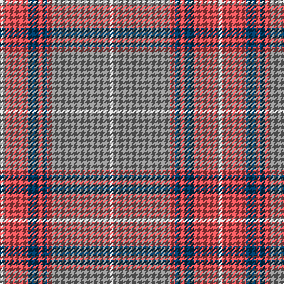

**Bands:** [WRBRBRRW](/stripes/wrbrbrrw/) · **Stripes:** [LB R DT R DT R O LB](/stripes/stripes8/) LB R DT R DT R O LB

This was sourced from register-of-tartans.  It is a [8 band tartan](/bands/bands8/).

Original link https://www.tartanregister.gov.uk/tartanDetails.aspx?ref=4087

## Attestations

This cloth appears in 2 source records; the oldest owns this page.

- 01/01/1996 — Tenmaya Check (register-of-tartans, [record](https://www.tartanregister.gov.uk/tartanDetails.aspx?ref=4087))
- 1996 — Tenmaya Check (Corporate) (tartans-authority, [record](http://www.tartansauthority.com/tartan-ferret/display/2346/))

## Register references

External register numbers recorded for this tartan.

- Scottish Register of Tartans: [4087](https://www.tartanregister.gov.uk/tartanDetails.aspx?ref=4087)
- Scottish Tartans Authority (ITI): 2346
- Scottish Tartans World Register: 2346

## Thread count
N/4 DO20 DB8 DO4 DB4 DO4 Na48 N/4

## Palette
Each colour and its ΔE from the base-6 reference it is a variant of.

| Colour | Shade | Base | ΔE (OKLab) |
|---|---|---|---|
| DB | <code style="background-color:#003C64;">#003C64</code> `#003C64` | B <code style="background-color:#2A418A;">#2A418A</code> | 0.08 |
| DO | <code style="background-color:#D05054;">#D05054</code> `#D05054` | R <code style="background-color:#CC0000;">#CC0000</code> | 0.09 |
| N | <code style="background-color:#C0C0C0;">#C0C0C0</code> `#C0C0C0` | W <code style="background-color:#F7F7F7;">#F7F7F7</code> | 0.17 |
| Na | <code style="background-color:#888888;">#888888</code> `#888888` | R <code style="background-color:#CC0000;">#CC0000</code> | 0.24 |

# Sample pattern

## Nearest tartans

The nearest existing variants by ΔTartan distance.

1. [Tenmaya Corporate Tartan Tartan Number: 2346. Earliest known date: 1996 May 1996 for Tenmaya Department Store Ltd in Okayama, Japan. Sample in STA Johnston Collection. Designed for British promotion October/November 1996 which demonstrated weaving and woven by Archie Snmall from Selkirk who was sent to Fukuoka to demonstrate weaving. See products available Copyright © Blair Urquhart, Comrie, 2015](/setts/s8/lb1n12r1dt1r1dt2r5lb1~x4/) — ΔT 0.71
1. [Dama Classic (Fashion)](/setts/s8/lr30w3lr3w3lr12n30o3n5~x2/) — ΔT 1.20
1. [Qatar Airways](/setts/s12/m3o2m6o21lr2o4lr3o3lr4o2lr13w2~x2/) — ΔT 1.25
1. [Clyde Trade Tartan Tartan Number: 1296. Earliest known date: pre 1992 See Strathclyde District See products available Copyright © Blair Urquhart, Comrie, 2015](/setts/s10/lb4n2lb18r2n5o16r2o2r2o2~x2/) — ΔT 1.34
1. [Clyde](/setts/s10/lb4n2lb18r2n5y16r2y2r2y2~x2/) — ΔT 1.42
1. [Hebridean Granite Fashion Tartan Tartan Number: 6821. Earliest known date: 2005 For a new House of Edgar collection. Intended to emulate the gray morning suit perhaps. See products available Copyright © Blair Urquhart, Comrie, 2015](/setts/s8/o3lr4o4do4o18do3n36w3~x2/) — ΔT 1.49
1. [Gammell (Personal)](/setts/s8/t32r3t3r3t3r10g24r3~x2/) — ΔT 1.53
1. [Dundhuin Gold](/setts/s6/o59t28ly5dg3w4ly5~x2/) — ΔT 1.53
1. [Lochnagar Plaid (District)](/setts/s6/w1dp1o7n4o1w1~x4/) — ΔT 1.54
1. [Titanium (Fashion)](/setts/s9/n44o8n8o22lb4o4lb11o2lb2~x2/) — ΔT 1.55

## Neighbour map

Every grey dot is one of 14313 variants placed by the first two principal components of the ΔTartan feature space (44% of its variance). Red is this tartan; blue dots are its nearest — click one to open its page.

<svg viewBox="0 0 640 380" role="img" style="max-width:100%;height:auto;border:1px solid #e0e0e0;border-radius:4px;display:block" xmlns="http://www.w3.org/2000/svg"><image href="/nn/cloud.v1.png" width="640" height="380"/><a href="/setts/s8/lb1n12r1dt1r1dt2r5lb1~x4/"><circle cx="337.2" cy="182.1" r="4" fill="#3465a4"><title>Tenmaya Corporate Tartan Tartan Number: 2346. Earliest known date: 1996 May 1996 for Tenmaya Department Store Ltd in Okayama, Japan. Sample in STA Johnston Collection. Designed for British promotion October/November 1996 which demonstrated weaving and woven by Archie Snmall from Selkirk who was sent to Fukuoka to demonstrate weaving. See products available Copyright © Blair Urquhart, Comrie, 2015</title></circle></a><a href="/setts/s8/lr30w3lr3w3lr12n30o3n5~x2/"><circle cx="344.3" cy="207.8" r="4" fill="#3465a4"><title>Dama Classic (Fashion)</title></circle></a><a href="/setts/s12/m3o2m6o21lr2o4lr3o3lr4o2lr13w2~x2/"><circle cx="307.8" cy="176.9" r="4" fill="#3465a4"><title>Qatar Airways</title></circle></a><a href="/setts/s10/lb4n2lb18r2n5o16r2o2r2o2~x2/"><circle cx="263.9" cy="186.8" r="4" fill="#3465a4"><title>Clyde Trade Tartan Tartan Number: 1296. Earliest known date: pre 1992 See Strathclyde District See products available Copyright © Blair Urquhart, Comrie, 2015</title></circle></a><a href="/setts/s10/lb4n2lb18r2n5y16r2y2r2y2~x2/"><circle cx="250.5" cy="180.2" r="4" fill="#3465a4"><title>Clyde</title></circle></a><a href="/setts/s8/o3lr4o4do4o18do3n36w3~x2/"><circle cx="303.2" cy="173.3" r="4" fill="#3465a4"><title>Hebridean Granite Fashion Tartan Tartan Number: 6821. Earliest known date: 2005 For a new House of Edgar collection. Intended to emulate the gray morning suit perhaps. See products available Copyright © Blair Urquhart, Comrie, 2015</title></circle></a><a href="/setts/s8/t32r3t3r3t3r10g24r3~x2/"><circle cx="304.0" cy="201.7" r="4" fill="#3465a4"><title>Gammell (Personal)</title></circle></a><a href="/setts/s6/o59t28ly5dg3w4ly5~x2/"><circle cx="375.1" cy="160.3" r="4" fill="#3465a4"><title>Dundhuin Gold</title></circle></a><a href="/setts/s6/w1dp1o7n4o1w1~x4/"><circle cx="311.4" cy="230.7" r="4" fill="#3465a4"><title>Lochnagar Plaid (District)</title></circle></a><a href="/setts/s9/n44o8n8o22lb4o4lb11o2lb2~x2/"><circle cx="379.8" cy="181.4" r="4" fill="#3465a4"><title>Titanium (Fashion)</title></circle></a><circle cx="342.0" cy="181.7" r="5" fill="#c00000"/></svg>

ID: /setts/s8/lb1o12r1dt1r1dt2r5lb1~x4/
