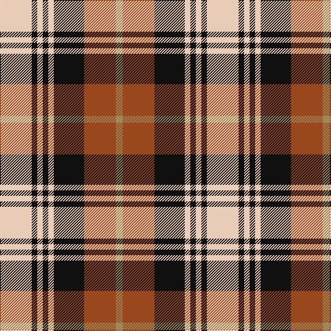

This page is one **sett** — a single exact thread-count. It belongs to the [tartan](/tartans/lb23k4lb4k4lb4k22o23lo5/)
(the same proportion at any scale), whose colour order is pattern [WKWKWKRY](/stripes/wkwkwkry/).

Sourced from register-of-tartans.  It is a [8 stripe tartan](/stripes/stripes8/).

Original link https://www.tartanregister.gov.uk/tartanDetails.aspx?ref=21

2 attestations — the source records this cloth was collapsed from (oldest owns this page)

<ul>
<li>01/07/2001 — Aberlour (register-of-tartans, <a href="https://www.tartanregister.gov.uk/tartanDetails.aspx?ref=21">record</a>)</li>
<li>pre 2003 — Aberlour (Corporate) (tartans-authority, <a href="http://www.tartansauthority.com/tartan-ferret/display/5982/">record</a>)</li>
</ul>

## Register references

External register numbers recorded for this tartan.

- Scottish Register of Tartans: [21](https://www.tartanregister.gov.uk/tartanDetails.aspx?ref=21)
- Scottish Tartans Authority (ITI): 5982
- Scottish Tartans World Register: 3266

## Thread count
LR/46 K8 LR8 K8 LR8 K44 T46 LT/10

## Palette

Palette: <strong>Tartan Register</strong> <small style="color:#888">(5 of 7 colours)</small>
<table><thead><tr><th>Colour</th><th>Threads</th><th>Shade</th><th>Base</th><th>OKLCh</th></tr></thead><tbody><tr><td>LR/</td><td style="text-align:right;font-variant-numeric:tabular-nums">46</td><td><code style="background-color:#E8CCB8;">#E8CCB8</code> <small style="color:#888">#E8CCB8</small></td><td>W <code style="background-color:#F7F7F7;">#F7F7F7</code></td><td><small style="color:#888">oklch(86.3% 0.042 57.7)</small></td></tr><tr><td>K</td><td style="text-align:right;font-variant-numeric:tabular-nums">8</td><td><code style="background-color:#101010;">#101010</code> <small style="color:#888">#101010</small></td><td>K <code style="background-color:#000000;">#000000</code></td><td><small style="color:#888">oklch(17.3% 0.000 89.9)</small></td></tr><tr><td>LR</td><td style="text-align:right;font-variant-numeric:tabular-nums">8</td><td><code style="background-color:#E8CCB8;">#E8CCB8</code> <small style="color:#888">#E8CCB8</small></td><td>W <code style="background-color:#F7F7F7;">#F7F7F7</code></td><td><small style="color:#888">oklch(86.3% 0.042 57.7)</small></td></tr><tr><td>K</td><td style="text-align:right;font-variant-numeric:tabular-nums">8</td><td><code style="background-color:#101010;">#101010</code> <small style="color:#888">#101010</small></td><td>K <code style="background-color:#000000;">#000000</code></td><td><small style="color:#888">oklch(17.3% 0.000 89.9)</small></td></tr><tr><td>LR</td><td style="text-align:right;font-variant-numeric:tabular-nums">8</td><td><code style="background-color:#E8CCB8;">#E8CCB8</code> <small style="color:#888">#E8CCB8</small></td><td>W <code style="background-color:#F7F7F7;">#F7F7F7</code></td><td><small style="color:#888">oklch(86.3% 0.042 57.7)</small></td></tr><tr><td>K</td><td style="text-align:right;font-variant-numeric:tabular-nums">44</td><td><code style="background-color:#101010;">#101010</code> <small style="color:#888">#101010</small></td><td>K <code style="background-color:#000000;">#000000</code></td><td><small style="color:#888">oklch(17.3% 0.000 89.9)</small></td></tr><tr><td>T</td><td style="text-align:right;font-variant-numeric:tabular-nums">46</td><td><code style="background-color:#98481C;">#98481C</code> <small style="color:#888">#98481C</small></td><td>R <code style="background-color:#CC0000;">#CC0000</code></td><td><small style="color:#888">oklch(49.6% 0.121 46.1)</small></td></tr><tr><td>LT/</td><td style="text-align:right;font-variant-numeric:tabular-nums">10</td><td><code style="background-color:#A08858;">#A08858</code> <small style="color:#888">#A08858</small></td><td>Y <code style="background-color:#F2BF00;">#F2BF00</code></td><td><small style="color:#888">oklch(63.7% 0.071 84.0)</small></td></tr></tbody></table>

# Sample pattern

## Nearest tartans

The nearest existing variants by ΔTartan distance, with this tartan at the top so the swatches line up against it.

ΔTartan

Tartan

Sett

—

<a href="/ttd/edit/#slug=lb23k4lb4k4lb4k22o23lo5~x2">Aberlour</a> <a class="nn-out" href="/setts/s8/lb23k4lb4k4lb4k22o23lo5~x2/" title="open its dictionary page">↗</a>

0.31

<a href="/ttd/edit/#slug=lb13k3lb3k3lb3k15lo18r3~x2">Holden Beige (Corporate)</a> <a class="nn-out" href="/setts/s8/lb13k3lb3k3lb3k15lo18r3~x2/" title="open its dictionary page">↗</a>

0.48

<a href="/ttd/edit/#slug=lb13k3lb3k3lb3k15dy18r3~x2">Holden Brown (Corporate)</a> <a class="nn-out" href="/setts/s8/lb13k3lb3k3lb3k15dy18r3~x2/" title="open its dictionary page">↗</a>

0.95

<a href="/ttd/edit/#slug=lb10k3w3k3w3k3lb10r6k15r3~x2">Edinburgh, City of</a> <a class="nn-out" href="/setts/s10/lb10k3w3k3w3k3lb10r6k15r3~x2/" title="open its dictionary page">↗</a>

1.03

<a href="/ttd/edit/#slug=r6k14r6dg14w27k4">Fraser Dress</a> <a class="nn-out" href="/setts/s6/r6k14r6dg14w27k4/" title="open its dictionary page">↗</a>

1.03

<a href="/ttd/edit/#slug=r1o6k1w3k3r1~x8">Thompson Grey Dress</a> <a class="nn-out" href="/setts/s6/r1o6k1w3k3r1~x8/" title="open its dictionary page">↗</a>

1.05

<a href="/ttd/edit/#slug=w23t6w6r5k35r10~x2">Merrilees</a> <a class="nn-out" href="/setts/s6/w23t6w6r5k35r10~x2/" title="open its dictionary page">↗</a>

1.09

<a href="/ttd/edit/#slug=w2r7dg7k7r2dg2k2w1~x5">Al Suwaidi of Abu Dhabi (Personal)</a> <a class="nn-out" href="/setts/s8/w2r7dg7k7r2dg2k2w1~x5/" title="open its dictionary page">↗</a>

1.09

<a href="/ttd/edit/#slug=dy3k7dy2w2lo12k2lo2dy3~x2">Daks (Brown)</a> <a class="nn-out" href="/setts/s8/dy3k7dy2w2lo12k2lo2dy3~x2/" title="open its dictionary page">↗</a>

1.13

<a href="/ttd/edit/#slug=r3w8db4dg14r4db2~x4">MacKintosh Dress (Scott Adie)</a> <a class="nn-out" href="/setts/s6/r3w8db4dg14r4db2~x4/" title="open its dictionary page">↗</a>

1.14

<a href="/ttd/edit/#slug=o20db2o2db2lo3db12w18db3~x2">Heriot</a> <a class="nn-out" href="/setts/s8/o20db2o2db2lo3db12w18db3~x2/" title="open its dictionary page">↗</a>

## Neighbour map

Every grey dot is one of 14299 variants placed by the first two principal components of the ΔTartan feature space (44% of its variance). Red is this tartan; blue dots are its nearest — click one to open its page.

<svg viewBox="0 0 640 380" role="img" style="max-width:100%;height:auto;border:1px solid #e0e0e0;border-radius:4px;display:block" xmlns="http://www.w3.org/2000/svg"><image href="/nn/cloud.v1.png" width="640" height="380"/><a href="/setts/s8/lb13k3lb3k3lb3k15lo18r3~x2/"><circle cx="128.9" cy="191.2" r="4" fill="#3465a4"><title>Holden Beige (Corporate)</title></circle></a><a href="/setts/s8/lb13k3lb3k3lb3k15dy18r3~x2/"><circle cx="133.0" cy="195.5" r="4" fill="#3465a4"><title>Holden Brown (Corporate)</title></circle></a><a href="/setts/s10/lb10k3w3k3w3k3lb10r6k15r3~x2/"><circle cx="126.0" cy="195.8" r="4" fill="#3465a4"><title>Edinburgh, City of</title></circle></a><a href="/setts/s6/r6k14r6dg14w27k4/"><circle cx="120.4" cy="207.7" r="4" fill="#3465a4"><title>Fraser Dress</title></circle></a><a href="/setts/s6/r1o6k1w3k3r1~x8/"><circle cx="144.8" cy="214.2" r="4" fill="#3465a4"><title>Thompson Grey Dress</title></circle></a><a href="/setts/s6/w23t6w6r5k35r10~x2/"><circle cx="157.3" cy="193.5" r="4" fill="#3465a4"><title>Merrilees</title></circle></a><a href="/setts/s8/w2r7dg7k7r2dg2k2w1~x5/"><circle cx="111.6" cy="203.7" r="4" fill="#3465a4"><title>Al Suwaidi of Abu Dhabi (Personal)</title></circle></a><a href="/setts/s8/dy3k7dy2w2lo12k2lo2dy3~x2/"><circle cx="179.3" cy="204.2" r="4" fill="#3465a4"><title>Daks (Brown)</title></circle></a><a href="/setts/s6/r3w8db4dg14r4db2~x4/"><circle cx="150.6" cy="213.9" r="4" fill="#3465a4"><title>MacKintosh Dress (Scott Adie)</title></circle></a><a href="/setts/s8/o20db2o2db2lo3db12w18db3~x2/"><circle cx="168.6" cy="161.4" r="4" fill="#3465a4"><title>Heriot</title></circle></a><circle cx="131.0" cy="191.8" r="5" fill="#c00000"/></svg>

ID: /setts/s8/lb23k4lb4k4lb4k22o23lo5~x2/
