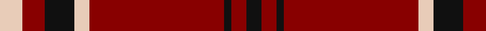
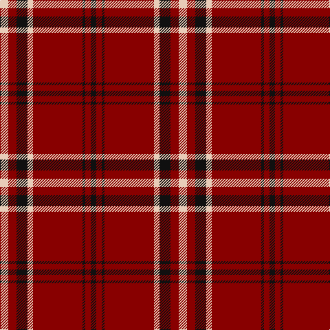

In pattern [KRKRWKRW](/stripes/krkrwkrw/).

This was sourced from register-of-tartans.  It is a [8 stripe tartan](/stripes/stripes8/).

Original link https://www.tartanregister.gov.uk/tartanDetails.aspx?ref=2228

## Attestations

This cloth appears in 2 source records; the oldest owns this page.

- 01/01/2003 — Lougheed (register-of-tartans, [record](https://www.tartanregister.gov.uk/tartanDetails.aspx?ref=2228))
- pre 2003 — Lougheed (Name?) (tartans-authority, [record](http://www.tartansauthority.com/tartan-ferret/display/5932/))

## Register references

External register numbers recorded for this tartan.

- Scottish Register of Tartans: [2228](https://www.tartanregister.gov.uk/tartanDetails.aspx?ref=2228)
- Scottish Tartans Authority (ITI): 5932

## Thread count
LR/12 DR12 K16 LR8 DR72 K4 DR8 K/8

## Palette
Each colour and its ΔE from the base-6 reference it is a variant of.

| Colour | Shade | Base | ΔE (OKLab) |
|---|---|---|---|
| DR | <code style="background-color:#880000;">#880000</code> `#880000` | R <code style="background-color:#CC0000;">#CC0000</code> | 0.15 |
| K | <code style="background-color:#101010;">#101010</code> `#101010` | K <code style="background-color:#000000;">#000000</code> | 0.17 |
| LR | <code style="background-color:#E8CCB8;">#E8CCB8</code> `#E8CCB8` | W <code style="background-color:#F7F7F7;">#F7F7F7</code> | 0.12 |

# Sample pattern

## Nearest tartans

The nearest existing variants by ΔTartan distance.

1. [University of South Carolina (Corp)](/setts/s10/r4k4r3k8w3r3k20r40w2r4/) — ΔT 0.79
1. [Forget Family (Red)](/setts/s6/r42k2w2k18w2k5~x2/) — ΔT 0.98
1. [Stuart of Bute](/setts/s9/r12dg6k1dg2k1dg1k6r24lr2~x2/) — ΔT 1.07
1. [MacKintosh D](/setts/s6/r22db5r2dg11r3db1/) — ΔT 1.10
1. [Anthony Plaid Red](/setts/s9/r18k1ly3k1lr1r3k2r2lr2~x4/) — ΔT 1.13
1. [Auld Reekie](/setts/s6/db4r3db3r22dg8r2~x2/) — ΔT 1.16
1. [South Carolina, University of](/setts/s10/r4w4r3k8w3r3k20r40w2r4/) — ΔT 1.16
1. [Stuart of Bute](/setts/s9/r12dg6k1dg2k1dg1k6r24lb2~x2/) — ΔT 1.18
1. [Highlands of Wyomissing (Corporate)](/setts/s8/r35lb3r8ly2dg11~x2/) — ΔT 1.20
1. [MacKintosh](/setts/s6/r24db6r3dg12r4db1/) — ΔT 1.20

## Neighbour map

Every grey dot is one of 14299 variants placed by the first two principal components of the ΔTartan feature space (44% of its variance). Red is this tartan; blue dots are its nearest — click one to open its page.

<svg viewBox="0 0 640 380" role="img" style="max-width:100%;height:auto;border:1px solid #e0e0e0;border-radius:4px;display:block" xmlns="http://www.w3.org/2000/svg"><image href="/nn/cloud.v1.png" width="640" height="380"/><a href="/setts/s10/r4k4r3k8w3r3k20r40w2r4/"><circle cx="402.7" cy="141.4" r="4" fill="#3465a4"><title>University of South Carolina (Corp)</title></circle></a><a href="/setts/s6/r42k2w2k18w2k5~x2/"><circle cx="401.4" cy="150.9" r="4" fill="#3465a4"><title>Forget Family (Red)</title></circle></a><a href="/setts/s9/r12dg6k1dg2k1dg1k6r24lr2~x2/"><circle cx="414.1" cy="129.7" r="4" fill="#3465a4"><title>Stuart of Bute</title></circle></a><a href="/setts/s6/r22db5r2dg11r3db1/"><circle cx="408.7" cy="177.4" r="4" fill="#3465a4"><title>MacKintosh D</title></circle></a><a href="/setts/s9/r18k1ly3k1lr1r3k2r2lr2~x4/"><circle cx="442.3" cy="126.0" r="4" fill="#3465a4"><title>Anthony Plaid Red</title></circle></a><a href="/setts/s6/db4r3db3r22dg8r2~x2/"><circle cx="400.1" cy="201.9" r="4" fill="#3465a4"><title>Auld Reekie</title></circle></a><a href="/setts/s10/r4w4r3k8w3r3k20r40w2r4/"><circle cx="383.9" cy="138.6" r="4" fill="#3465a4"><title>South Carolina, University of</title></circle></a><a href="/setts/s9/r12dg6k1dg2k1dg1k6r24lb2~x2/"><circle cx="400.2" cy="118.2" r="4" fill="#3465a4"><title>Stuart of Bute</title></circle></a><a href="/setts/s8/r35lb3r8ly2dg11~x2/"><circle cx="448.2" cy="151.1" r="4" fill="#3465a4"><title>Highlands of Wyomissing (Corporate)</title></circle></a><a href="/setts/s6/r24db6r3dg12r4db1/"><circle cx="411.0" cy="178.6" r="4" fill="#3465a4"><title>MacKintosh</title></circle></a><circle cx="423.4" cy="155.6" r="5" fill="#c00000"/></svg>

ID: /setts/s8/lb3r3k4lb2r18k1r2k2~x4/
