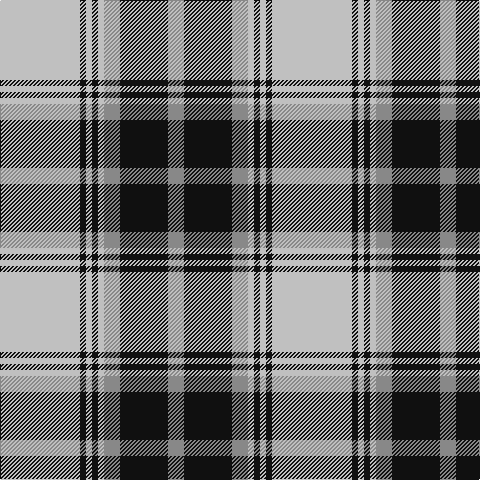

This page is one **sett** — a single exact thread-count. It belongs to the [tartan](/tartans/n40k3n3k3n3na8k24na8/)
(the same proportion at any scale), whose colour order is pattern [RKRWKWKW](/stripes/rkrwkwkw/).

Sourced from tartans-authority.  It is a [8 stripe tartan](/stripes/stripes8/).

Original link http://www.tartansauthority.com/tartan-ferret/display/5883/

## Thread count
N/80 K6 N6 K6 N6 Na16 K48 Na/16

## Palette
Each colour and the base-6 reference it is a variant of.

| Colour | Shade | Base |
|---|---|---|
| K | <code style="background-color:#101010;">#101010</code> `oklch(17.3% 0.000 89.9)` <small>#101010</small> | K <code style="background-color:#000000;">#000000</code> |
| N | <code style="background-color:#C0C0C0;">#C0C0C0</code> `oklch(80.8% 0.000 89.9)` <small>#C0C0C0</small> | W <code style="background-color:#F7F7F7;">#F7F7F7</code> |
| Na | <code style="background-color:#888888;">#888888</code> `oklch(62.7% 0.000 89.9)` <small>#888888</small> | R <code style="background-color:#CC0000;">#CC0000</code> |

# Sample pattern

## Nearest tartans

The nearest existing variants by ΔTartan distance, with this tartan at the top so the swatches line up against it.

ΔTartan

Tartan

Sett

—

<a href="/ttd/edit/#slug=lb40k3lb3k3lb3o8k24o8~x2">O'Sullivan-Beare (Family)</a> <a class="nn-out" href="/setts/s8/lb40k3lb3k3lb3o8k24o8~x2/" title="open its dictionary page">↗</a>

0.79

<a href="/ttd/edit/#slug=k4ly18n44k3ly10k4">Stutterheim</a> <a class="nn-out" href="/setts/s6/k4ly18n44k3ly10k4/" title="open its dictionary page">↗</a>

0.81

<a href="/ttd/edit/#slug=db19w1db6w1db2w2ly2w1ly18~x4">Highland Park High School (Texas)</a> <a class="nn-out" href="/setts/s9/db19w1db6w1db2w2ly2w1ly18~x4/" title="open its dictionary page">↗</a>

0.90

<a href="/ttd/edit/#slug=w30o5k6o2k2w2k13o5k2o2w2~x2">Stewart Grey Dress Tartan Tartan Number: 17911. Earliest known date: Estimated Threadcount. See products available Copyright © Blair Urquhart, Comrie, 2015</a> <a class="nn-out" href="/setts/s11/w30o5k6o2k2w2k13o5k2o2w2~x2/" title="open its dictionary page">↗</a>

0.98

<a href="/ttd/edit/#slug=k4ly18db44k3ly10k4">Stutterheim (Corporate)</a> <a class="nn-out" href="/setts/s6/k4ly18db44k3ly10k4/" title="open its dictionary page">↗</a>

0.99

<a href="/ttd/edit/#slug=db19w1db6w1db2w2lo2w1lo18~x4">Highland Park High School (Texas)</a> <a class="nn-out" href="/setts/s9/db19w1db6w1db2w2lo2w1lo18~x4/" title="open its dictionary page">↗</a>

1.03

<a href="/ttd/edit/#slug=w6b3w20k2w3k25w3~x2">Forbes Dress (Clans Originaux)</a> <a class="nn-out" href="/setts/s7/w6b3w20k2w3k25w3~x2/" title="open its dictionary page">↗</a>

1.12

<a href="/ttd/edit/#slug=k9lb4k2lb4k2lb30k9lb4b14lo2~x2">Hannay (Clan)</a> <a class="nn-out" href="/setts/s10/k9lb4k2lb4k2lb30k9lb4b14lo2~x2/" title="open its dictionary page">↗</a>

1.17

<a href="/ttd/edit/#slug=dt14w2dt3w2dr10w32dr10dt10w2dt3~x2">Fraser Arisaid #2</a> <a class="nn-out" href="/setts/s10/dt14w2dt3w2dr10w32dr10dt10w2dt3~x2/" title="open its dictionary page">↗</a>

1.18

<a href="/ttd/edit/#slug=k9w4k2w4k2w30k9w4db14ly2~x2">Hannay</a> <a class="nn-out" href="/setts/s10/k9w4k2w4k2w30k9w4db14ly2~x2/" title="open its dictionary page">↗</a>

1.20

<a href="/ttd/edit/#slug=w1m2w17k11w2k4ly1~x4">MacPherson - 1842 (VS) Dress</a> <a class="nn-out" href="/setts/s7/w1m2w17k11w2k4ly1~x4/" title="open its dictionary page">↗</a>

## Neighbour map

Every grey dot is one of 14299 variants placed by the first two principal components of the ΔTartan feature space (44% of its variance). Red is this tartan; blue dots are its nearest — click one to open its page.

<svg viewBox="0 0 640 380" role="img" style="max-width:100%;height:auto;border:1px solid #e0e0e0;border-radius:4px;display:block" xmlns="http://www.w3.org/2000/svg"><image href="/nn/cloud.v1.png" width="640" height="380"/><a href="/setts/s6/k4ly18n44k3ly10k4/"><circle cx="305.9" cy="177.5" r="4" fill="#3465a4"><title>Stutterheim</title></circle></a><a href="/setts/s9/db19w1db6w1db2w2ly2w1ly18~x4/"><circle cx="306.4" cy="136.1" r="4" fill="#3465a4"><title>Highland Park High School (Texas)</title></circle></a><a href="/setts/s11/w30o5k6o2k2w2k13o5k2o2w2~x2/"><circle cx="257.7" cy="127.6" r="4" fill="#3465a4"><title>Stewart Grey Dress Tartan Tartan Number: 17911. Earliest known date: Estimated Threadcount. See products available Copyright © Blair Urquhart, Comrie, 2015</title></circle></a><a href="/setts/s6/k4ly18db44k3ly10k4/"><circle cx="298.4" cy="176.7" r="4" fill="#3465a4"><title>Stutterheim (Corporate)</title></circle></a><a href="/setts/s9/db19w1db6w1db2w2lo2w1lo18~x4/"><circle cx="315.8" cy="139.8" r="4" fill="#3465a4"><title>Highland Park High School (Texas)</title></circle></a><a href="/setts/s7/w6b3w20k2w3k25w3~x2/"><circle cx="282.1" cy="169.7" r="4" fill="#3465a4"><title>Forbes Dress (Clans Originaux)</title></circle></a><a href="/setts/s10/k9lb4k2lb4k2lb30k9lb4b14lo2~x2/"><circle cx="252.5" cy="131.2" r="4" fill="#3465a4"><title>Hannay (Clan)</title></circle></a><a href="/setts/s10/dt14w2dt3w2dr10w32dr10dt10w2dt3~x2/"><circle cx="226.4" cy="142.4" r="4" fill="#3465a4"><title>Fraser Arisaid #2</title></circle></a><a href="/setts/s10/k9w4k2w4k2w30k9w4db14ly2~x2/"><circle cx="243.1" cy="130.9" r="4" fill="#3465a4"><title>Hannay</title></circle></a><a href="/setts/s7/w1m2w17k11w2k4ly1~x4/"><circle cx="281.9" cy="139.9" r="4" fill="#3465a4"><title>MacPherson - 1842 (VS) Dress</title></circle></a><circle cx="273.8" cy="161.4" r="5" fill="#c00000"/></svg>

ID: /setts/s8/lb40k3lb3k3lb3o8k24o8~x2/
