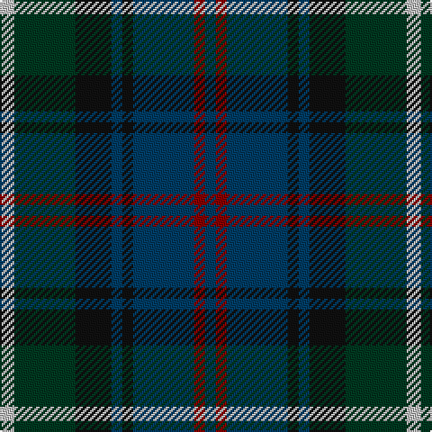

In pattern [BRBKBKGW](/stripes/brbkbkgw/).

This was sourced from register-of-tartans.  It is a [8 stripe tartan](/stripes/stripes8/).

Original link https://www.tartanregister.gov.uk/tartanDetails.aspx?ref=3601

## Register references

External register numbers recorded for this tartan.

- Scottish Register of Tartans: [3601](https://www.tartanregister.gov.uk/tartanDetails.aspx?ref=3601)
- Scottish Tartans Authority (ITI): 2054
- Scottish Tartans World Register: 2054

## Thread count
N/8 DG34 K20 DB6 K6 DB34 DR6 DB/6

## Palette
Each colour and its ΔE from the base-6 reference it is a variant of.

| Colour | Shade | Base | ΔE (OKLab) |
|---|---|---|---|
| DB | <code style="background-color:#003C64;">#003C64</code> `#003C64` | B <code style="background-color:#2A418A;">#2A418A</code> | 0.08 |
| DG | <code style="background-color:#003820;">#003820</code> `#003820` | G <code style="background-color:#006100;">#006100</code> | 0.15 |
| DR | <code style="background-color:#880000;">#880000</code> `#880000` | R <code style="background-color:#CC0000;">#CC0000</code> | 0.15 |
| K | <code style="background-color:#101010;">#101010</code> `#101010` | K <code style="background-color:#000000;">#000000</code> | 0.17 |
| N | <code style="background-color:#C0C0C0;">#C0C0C0</code> `#C0C0C0` | W <code style="background-color:#F7F7F7;">#F7F7F7</code> | 0.17 |

# Sample pattern

## Nearest tartans

The nearest existing variants by ΔTartan distance.

1. [Royal Highland Society (Corporate)](/setts/s8/ly4dg17k10dt3k3dt17r3dt3~x2/) — ΔT 0.32
1. [Heritage (Corporate)](/setts/s7/r5db8k5db24k24y24y5~x2/) — ΔT 1.07
1. [Holland & Sherry (Corporate)](/setts/s9/dt20b3dt4r3dt3k10g21k4r20~x2/) — ΔT 1.17
1. [Wood (Personal)](/setts/s8/g11t3g5r3g5k22db22k5~x2/) — ΔT 1.18
1. [Skene](/setts/s7/db24k4r3k4dg24k4r4~x2/) — ΔT 1.23
1. [McEwan '1856', The](/setts/s7/db2dy3db16k18g18k2r2~x2/) — ΔT 1.23
1. [Murray #3](/setts/s6/db2k2db12k8dg11r2~x2/) — ΔT 1.24
1. [McWilliams Dress (2014)](/setts/s12/dt3r2dt13k9do3k2do14k2do3k9dt15lb3~x2/) — ΔT 1.24
1. [Scottish Women's Rural Institutes, The](/setts/s12/db4lo3db24k18dg24t3dg4lo3dg24k18db24t3~x2/) — ΔT 1.25
1. [Haughfoot (Commemorative)](/setts/s6/r4k15t4dt15dg24y4~x2/) — ΔT 1.27

## Neighbour map

Every grey dot is one of 14299 variants placed by the first two principal components of the ΔTartan feature space (44% of its variance). Red is this tartan; blue dots are its nearest — click one to open its page.

<svg viewBox="0 0 640 380" role="img" style="max-width:100%;height:auto;border:1px solid #e0e0e0;border-radius:4px;display:block" xmlns="http://www.w3.org/2000/svg"><image href="/nn/cloud.v1.png" width="640" height="380"/><a href="/setts/s8/ly4dg17k10dt3k3dt17r3dt3~x2/"><circle cx="197.4" cy="245.0" r="4" fill="#3465a4"><title>Royal Highland Society (Corporate)</title></circle></a><a href="/setts/s7/r5db8k5db24k24y24y5~x2/"><circle cx="154.4" cy="254.9" r="4" fill="#3465a4"><title>Heritage (Corporate)</title></circle></a><a href="/setts/s9/dt20b3dt4r3dt3k10g21k4r20~x2/"><circle cx="157.2" cy="217.8" r="4" fill="#3465a4"><title>Holland &amp; Sherry (Corporate)</title></circle></a><a href="/setts/s8/g11t3g5r3g5k22db22k5~x2/"><circle cx="172.4" cy="216.8" r="4" fill="#3465a4"><title>Wood (Personal)</title></circle></a><a href="/setts/s7/db24k4r3k4dg24k4r4~x2/"><circle cx="200.9" cy="207.8" r="4" fill="#3465a4"><title>Skene</title></circle></a><a href="/setts/s7/db2dy3db16k18g18k2r2~x2/"><circle cx="186.6" cy="214.4" r="4" fill="#3465a4"><title>McEwan '1856', The</title></circle></a><a href="/setts/s6/db2k2db12k8dg11r2~x2/"><circle cx="217.4" cy="272.4" r="4" fill="#3465a4"><title>Murray #3</title></circle></a><a href="/setts/s12/dt3r2dt13k9do3k2do14k2do3k9dt15lb3~x2/"><circle cx="222.8" cy="224.9" r="4" fill="#3465a4"><title>McWilliams Dress (2014)</title></circle></a><a href="/setts/s12/db4lo3db24k18dg24t3dg4lo3dg24k18db24t3~x2/"><circle cx="201.4" cy="226.1" r="4" fill="#3465a4"><title>Scottish Women's Rural Institutes, The</title></circle></a><a href="/setts/s6/r4k15t4dt15dg24y4~x2/"><circle cx="157.6" cy="244.8" r="4" fill="#3465a4"><title>Haughfoot (Commemorative)</title></circle></a><circle cx="188.7" cy="240.6" r="5" fill="#c00000"/></svg>

ID: /setts/s8/lb4dg17k10dt3k3dt17r3dt3~x2/
