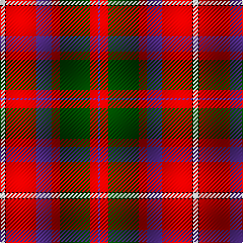

This page is one **sett** — a single exact thread-count. It belongs to the [tartan](/tartans/n5k1r30p15r8g30r8p2/)
(the same proportion at any scale), whose colour order is pattern [BRGRBRKW](/stripes/brgrbrkw/).

Sourced from weddslist.  It is a [8 stripe tartan](/stripes/stripes8/).

Original link http://www.weddslist.com/cgi-bin/tartans/pg.pl?source=rb

## Thread count
N/5 K1 R30 P15 R8 G30 R8 P/2

## Palette
Each colour and the base-6 reference it is a variant of.

| Colour | Shade | Base |
|---|---|---|
| G | <code style="background-color:#004C00;">#004C00</code> `oklch(36.1% 0.123 142.5)` <small>#004C00</small> | G <code style="background-color:#006100;">#006100</code> |
| K | <code style="background-color:#000000;">#000000</code> `oklch(0.0% 0.000 0.0)` <small>#000000</small> | K <code style="background-color:#000000;">#000000</code> |
| N | <code style="background-color:#D0D0D0;">#D0D0D0</code> `oklch(85.8% 0.000 89.9)` <small>#D0D0D0</small> | W <code style="background-color:#F7F7F7;">#F7F7F7</code> |
| P | <code style="background-color:#5A3094;">#5A3094</code> `oklch(41.8% 0.156 298.7)` <small>#5A3094</small> | B <code style="background-color:#2A418A;">#2A418A</code> |
| R | <code style="background-color:#C80000;">#C80000</code> `oklch(52.3% 0.215 29.2)` <small>#C80000</small> | R <code style="background-color:#CC0000;">#CC0000</code> |

# Sample pattern

## Nearest tartans

The nearest existing variants by ΔTartan distance, with this tartan at the top so the swatches line up against it.

ΔTartan

Tartan

Sett

—

<a href="/ttd/edit/#slug=lb5k1r30dp15r8dg30r8dp2">Shaw</a> <a class="nn-out" href="/setts/s8/lb5k1r30dp15r8dg30r8dp2/" title="open its dictionary page">↗</a>

0.44

<a href="/ttd/edit/#slug=t5k1r30dp15r8g30r8dp2~x2">Shaw Red of Tordarroch Dress (Clan 2</a> <a class="nn-out" href="/setts/s8/t5k1r30dp15r8g30r8dp2~x2/" title="open its dictionary page">↗</a>

0.50

<a href="/ttd/edit/#slug=t5k1r30p15r8g30r8p2~x2">Shaw of Tordarroch</a> <a class="nn-out" href="/setts/s8/t5k1r30p15r8g30r8p2~x2/" title="open its dictionary page">↗</a>

0.69

<a href="/ttd/edit/#slug=t5k1r30dp15r8g30r8dp2">Shaw of Tordarroch Clan Tartan Tartan Number: 352. Earliest known date: 1969 When Major C.J. Shaw of Tordarroch, matriculated and became the first chief of the Clan for some 400 years, he had a new tartan designed, which reflects the Clan's Mackintosh ancestry. He specifically states that the old design is still perfectly acceptable and approves its continued use by all members of the Clan. Donald Stewart, who designed the new sett, is the author of 'The Setts of the Scottish Tartans', the first comprehensive record of tartan patterns, published in 1950. See products available Copyright © Blair Urquhart, Comrie, 2015</a> <a class="nn-out" href="/setts/s8/t5k1r30dp15r8g30r8dp2/" title="open its dictionary page">↗</a>

1.00

<a href="/ttd/edit/#slug=r64k30g30db18w4db2w3">Clyde Family (Hurleford) (Personal)</a> <a class="nn-out" href="/setts/s7/r64k30g30db18w4db2w3/" title="open its dictionary page">↗</a>

1.03

<a href="/ttd/edit/#slug=ly3g9db9k1ly2k15r37g2~x2">Mensah</a> <a class="nn-out" href="/setts/s8/ly3g9db9k1ly2k15r37g2~x2/" title="open its dictionary page">↗</a>

1.05

<a href="/ttd/edit/#slug=lo1dg14r1y14r28db14lo1~x2">Abernethy (Colerain, USA)</a> <a class="nn-out" href="/setts/s7/lo1dg14r1y14r28db14lo1~x2/" title="open its dictionary page">↗</a>

1.06

<a href="/ttd/edit/#slug=r64k30g30b18w4b2w3">Clyde (Personal)</a> <a class="nn-out" href="/setts/s7/r64k30g30b18w4b2w3/" title="open its dictionary page">↗</a>

1.06

<a href="/ttd/edit/#slug=db26dg11r8k2r2w2r4w1r15~x2">Royal Scottish Assurance</a> <a class="nn-out" href="/setts/s9/db26dg11r8k2r2w2r4w1r15~x2/" title="open its dictionary page">↗</a>

1.11

<a href="/ttd/edit/#slug=r27g4k4g4k4db6lo1~x4">MacLeay (Clan)</a> <a class="nn-out" href="/setts/s7/r27g4k4g4k4db6lo1~x4/" title="open its dictionary page">↗</a>

1.14

<a href="/ttd/edit/#slug=db26g11r8k2r2w2r4w1r15~x2">Royal Scottish Assurance (Corporate)</a> <a class="nn-out" href="/setts/s9/db26g11r8k2r2w2r4w1r15~x2/" title="open its dictionary page">↗</a>

## Neighbour map

Every grey dot is one of 14299 variants placed by the first two principal components of the ΔTartan feature space (44% of its variance). Red is this tartan; blue dots are its nearest — click one to open its page.

<svg viewBox="0 0 640 380" role="img" style="max-width:100%;height:auto;border:1px solid #e0e0e0;border-radius:4px;display:block" xmlns="http://www.w3.org/2000/svg"><image href="/nn/cloud.v1.png" width="640" height="380"/><a href="/setts/s8/t5k1r30dp15r8g30r8dp2~x2/"><circle cx="286.1" cy="135.6" r="4" fill="#3465a4"><title>Shaw Red of Tordarroch Dress (Clan 2</title></circle></a><a href="/setts/s8/t5k1r30p15r8g30r8p2~x2/"><circle cx="285.1" cy="133.7" r="4" fill="#3465a4"><title>Shaw of Tordarroch</title></circle></a><a href="/setts/s8/t5k1r30dp15r8g30r8dp2/"><circle cx="294.4" cy="137.7" r="4" fill="#3465a4"><title>Shaw of Tordarroch Clan Tartan Tartan Number: 352. Earliest known date: 1969 When Major C.J. Shaw of Tordarroch, matriculated and became the first chief of the Clan for some 400 years, he had a new tartan designed, which reflects the Clan's Mackintosh ancestry. He specifically states that the old design is still perfectly acceptable and approves its continued use by all members of the Clan. Donald Stewart, who designed the new sett, is the author of 'The Setts of the Scottish Tartans', the first comprehensive record of tartan patterns, published in 1950. See products available Copyright © Blair Urquhart, Comrie, 2015</title></circle></a><a href="/setts/s7/r64k30g30db18w4db2w3/"><circle cx="230.8" cy="117.4" r="4" fill="#3465a4"><title>Clyde Family (Hurleford) (Personal)</title></circle></a><a href="/setts/s8/ly3g9db9k1ly2k15r37g2~x2/"><circle cx="280.4" cy="97.3" r="4" fill="#3465a4"><title>Mensah</title></circle></a><a href="/setts/s7/lo1dg14r1y14r28db14lo1~x2/"><circle cx="221.4" cy="133.6" r="4" fill="#3465a4"><title>Abernethy (Colerain, USA)</title></circle></a><a href="/setts/s7/r64k30g30b18w4b2w3/"><circle cx="230.0" cy="119.5" r="4" fill="#3465a4"><title>Clyde (Personal)</title></circle></a><a href="/setts/s9/db26dg11r8k2r2w2r4w1r15~x2/"><circle cx="252.3" cy="125.7" r="4" fill="#3465a4"><title>Royal Scottish Assurance</title></circle></a><a href="/setts/s7/r27g4k4g4k4db6lo1~x4/"><circle cx="325.9" cy="120.6" r="4" fill="#3465a4"><title>MacLeay (Clan)</title></circle></a><a href="/setts/s9/db26g11r8k2r2w2r4w1r15~x2/"><circle cx="243.0" cy="119.7" r="4" fill="#3465a4"><title>Royal Scottish Assurance (Corporate)</title></circle></a><circle cx="275.5" cy="129.9" r="5" fill="#c00000"/></svg>

ID: /setts/s8/lb5k1r30dp15r8dg30r8dp2/
