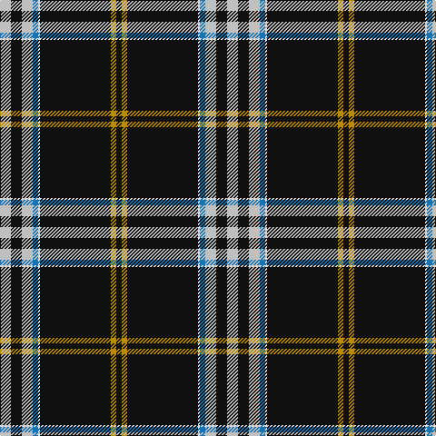

In pattern [KYKWBWKW](/stripes/kykwbwkw/).

This was sourced from tartans-authority.  It is a [8 stripe tartan](/stripes/stripes8/).

Original link http://www.tartansauthority.com/tartan-ferret/display/10361/

## Thread count
N/12 K12 N12 B6 LN2 K78 DY6 K/6

## Palette
Each colour and the base-6 reference it is a variant of.

| Colour | Shade | Base |
|---|---|---|
| B | <code style="background-color:#1474B4;">#1474B4</code> `oklch(54.0% 0.129 245.1)` <small>#1474B4</small> | B <code style="background-color:#2A418A;">#2A418A</code> |
| DY | <code style="background-color:#BC8C00;">#BC8C00</code> `oklch(66.8% 0.137 84.1)` <small>#BC8C00</small> | Y <code style="background-color:#F2BF00;">#F2BF00</code> |
| K | <code style="background-color:#101010;">#101010</code> `oklch(17.3% 0.000 89.9)` <small>#101010</small> | K <code style="background-color:#000000;">#000000</code> |
| LN | <code style="background-color:#E0E0E0;">#E0E0E0</code> `oklch(90.7% 0.000 89.9)` <small>#E0E0E0</small> | W <code style="background-color:#F7F7F7;">#F7F7F7</code> |
| N | <code style="background-color:#C0C0C0;">#C0C0C0</code> `oklch(80.8% 0.000 89.9)` <small>#C0C0C0</small> | W <code style="background-color:#F7F7F7;">#F7F7F7</code> |

# Sample pattern

## Nearest tartans

The nearest existing variants by ΔTartan distance, with this tartan at the top so the swatches line up against it.

ΔTartan

Tartan

Sett

—

<a href="/ttd/edit/#slug=lb6k6lb6b3w1k39lo3k3~x2">Washington County Sheriff's Office</a> <a class="nn-out" href="/setts/s8/lb6k6lb6b3w1k39lo3k3~x2/" title="open its dictionary page">↗</a>

0.44

<a href="/ttd/edit/#slug=t6k6t6db3w1k39ly3k3~x2">Washington County Sheriff’s Office (Oregon)</a> <a class="nn-out" href="/setts/s8/t6k6t6db3w1k39ly3k3~x2/" title="open its dictionary page">↗</a>

0.99

<a href="/ttd/edit/#slug=r5k1w3k6t5k2ly3k45t4k2ly3~x2">Williams Dress (Carolinas) (Personal)</a> <a class="nn-out" href="/setts/s11/r5k1w3k6t5k2ly3k45t4k2ly3~x2/" title="open its dictionary page">↗</a>

1.03

<a href="/ttd/edit/#slug=r5k1w3k6n5k2ly3k45n4k2ly3~x2">Williams Dress (Personal)</a> <a class="nn-out" href="/setts/s11/r5k1w3k6n5k2ly3k45n4k2ly3~x2/" title="open its dictionary page">↗</a>

1.09

<a href="/ttd/edit/#slug=k31w1k2w2dt3k2t4w2~x4">Capco</a> <a class="nn-out" href="/setts/s8/k31w1k2w2dt3k2t4w2~x4/" title="open its dictionary page">↗</a>

1.21

<a href="/ttd/edit/#slug=k49r1lp4db5dg5ly5~x2">CREATeGlasgow</a> <a class="nn-out" href="/setts/s6/k49r1lp4db5dg5ly5~x2/" title="open its dictionary page">↗</a>

1.28

<a href="/ttd/edit/#slug=k75r10g7ly3db2w5~x2">Charlotte Fire Department</a> <a class="nn-out" href="/setts/s6/k75r10g7ly3db2w5~x2/" title="open its dictionary page">↗</a>

1.28

<a href="/ttd/edit/#slug=k78r10dg7ly3t2w5~x2">Charlotte Fire Department</a> <a class="nn-out" href="/setts/s6/k78r10dg7ly3t2w5~x2/" title="open its dictionary page">↗</a>

1.38

<a href="/ttd/edit/#slug=k74o4k7o4k9o40k2o4k2">Llewellyn (Welsh Name)</a> <a class="nn-out" href="/setts/s9/k74o4k7o4k9o40k2o4k2/" title="open its dictionary page">↗</a>

1.44

<a href="/ttd/edit/#slug=db5ly1g7r1db45r5ly3db4ly3~x2">Brooks Brothers Signature</a> <a class="nn-out" href="/setts/s9/db5ly1g7r1db45r5ly3db4ly3~x2/" title="open its dictionary page">↗</a>

1.45

<a href="/ttd/edit/#slug=lb4n6k4r2r10k44n1k1lb2~x2">Calgary HOG (Corporate)</a> <a class="nn-out" href="/setts/s9/lb4n6k4r2r10k44n1k1lb2~x2/" title="open its dictionary page">↗</a>

## Neighbour map

Every grey dot is one of 14299 variants placed by the first two principal components of the ΔTartan feature space (44% of its variance). Red is this tartan; blue dots are its nearest — click one to open its page.

<svg viewBox="0 0 640 380" role="img" style="max-width:100%;height:auto;border:1px solid #e0e0e0;border-radius:4px;display:block" xmlns="http://www.w3.org/2000/svg"><image href="/nn/cloud.v1.png" width="640" height="380"/><a href="/setts/s8/t6k6t6db3w1k39ly3k3~x2/"><circle cx="447.3" cy="105.5" r="4" fill="#3465a4"><title>Washington County Sheriff’s Office (Oregon)</title></circle></a><a href="/setts/s11/r5k1w3k6t5k2ly3k45t4k2ly3~x2/"><circle cx="436.0" cy="63.5" r="4" fill="#3465a4"><title>Williams Dress (Carolinas) (Personal)</title></circle></a><a href="/setts/s11/r5k1w3k6n5k2ly3k45n4k2ly3~x2/"><circle cx="445.7" cy="69.0" r="4" fill="#3465a4"><title>Williams Dress (Personal)</title></circle></a><a href="/setts/s8/k31w1k2w2dt3k2t4w2~x4/"><circle cx="484.1" cy="117.0" r="4" fill="#3465a4"><title>Capco</title></circle></a><a href="/setts/s6/k49r1lp4db5dg5ly5~x2/"><circle cx="433.9" cy="90.3" r="4" fill="#3465a4"><title>CREATeGlasgow</title></circle></a><a href="/setts/s6/k75r10g7ly3db2w5~x2/"><circle cx="455.5" cy="96.9" r="4" fill="#3465a4"><title>Charlotte Fire Department</title></circle></a><a href="/setts/s6/k78r10dg7ly3t2w5~x2/"><circle cx="461.2" cy="93.4" r="4" fill="#3465a4"><title>Charlotte Fire Department</title></circle></a><a href="/setts/s9/k74o4k7o4k9o40k2o4k2/"><circle cx="422.9" cy="116.1" r="4" fill="#3465a4"><title>Llewellyn (Welsh Name)</title></circle></a><a href="/setts/s9/db5ly1g7r1db45r5ly3db4ly3~x2/"><circle cx="481.9" cy="103.5" r="4" fill="#3465a4"><title>Brooks Brothers Signature</title></circle></a><a href="/setts/s9/lb4n6k4r2r10k44n1k1lb2~x2/"><circle cx="430.8" cy="88.9" r="4" fill="#3465a4"><title>Calgary HOG (Corporate)</title></circle></a><circle cx="438.3" cy="99.0" r="5" fill="#c00000"/></svg>

ID: /setts/s8/lb6k6lb6b3w1k39lo3k3~x2/
