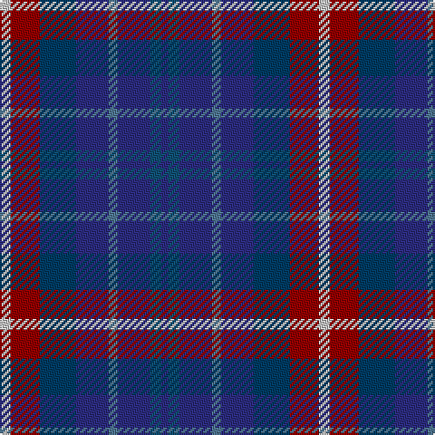

This page is one **sett** — a single exact thread-count. It belongs to the [tartan](/tartans/n6dr16dba20db18b5db18dbb6db4/)
(the same proportion at any scale), whose colour order is pattern [BBBBBBRW](/stripes/bbbbbbrw/).

Sourced from tartans-authority.  It is a [8 stripe tartan](/stripes/stripes8/).

Original link http://www.tartansauthority.com/tartan-ferret/display/2649/

## Thread count
N/6 DR16 DBa20 DB18 B5 DB18 DBb6 DB/4

## Palette
Each colour and the base-6 reference it is a variant of.

| Colour | Shade | Base |
|---|---|---|
| B | <code style="background-color:#507894;">#507894</code> `oklch(55.4% 0.063 239.9)` <small>#507894</small> | B <code style="background-color:#2A418A;">#2A418A</code> |
| DB | <code style="background-color:#2C2C80;">#2C2C80</code> `oklch(35.0% 0.138 276.6)` <small>#2C2C80</small> | B <code style="background-color:#2A418A;">#2A418A</code> |
| DBa | <code style="background-color:#003C64;">#003C64</code> `oklch(34.5% 0.089 246.0)` <small>#003C64</small> | B <code style="background-color:#2A418A;">#2A418A</code> |
| DBb | <code style="background-color:#105074;">#105074</code> `oklch(41.1% 0.086 239.6)` <small>#105074</small> | B <code style="background-color:#2A418A;">#2A418A</code> |
| DR | <code style="background-color:#940000;">#940000</code> `oklch(41.9% 0.172 29.2)` <small>#940000</small> | R <code style="background-color:#CC0000;">#CC0000</code> |
| N | <code style="background-color:#C4C4C4;">#C4C4C4</code> `oklch(82.0% 0.000 89.9)` <small>#C4C4C4</small> | W <code style="background-color:#F7F7F7;">#F7F7F7</code> |

# Sample pattern

## Nearest tartans

The nearest existing variants by ΔTartan distance, with this tartan at the top so the swatches line up against it.

ΔTartan

Tartan

Sett

—

<a href="/ttd/edit/#slug=lb6r16dt20db18t5db18n6db4">Queen of the South F.C. (Sports)</a> <a class="nn-out" href="/setts/s8/lb6r16dt20db18t5db18n6db4/" title="open its dictionary page">↗</a>

1.33

<a href="/ttd/edit/#slug=db16g8b8g8db16r3do3y3~x2">Glen Erin</a> <a class="nn-out" href="/setts/s8/db16g8b8g8db16r3do3y3~x2/" title="open its dictionary page">↗</a>

1.44

<a href="/ttd/edit/#slug=db16g8db8g8db16r3dy3g3~x2">Glen Erin Canadian Tartan Tartan Number: 1909. Earliest known date: pre 2003 Many new designs have been given district names to promote their Scottish connections. However, these names should not be confused with the District tartans which have earned their title through 'use and wont' and not a little history. See products available Copyright © Blair Urquhart, Comrie, 2015</a> <a class="nn-out" href="/setts/s8/db16g8db8g8db16r3dy3g3~x2/" title="open its dictionary page">↗</a>

1.49

<a href="/ttd/edit/#slug=db4db3n7k9n13r2db13db9n7k3n4~x2">Paul Henry (Personal)</a> <a class="nn-out" href="/setts/s11/db4db3n7k9n13r2db13db9n7k3n4~x2/" title="open its dictionary page">↗</a>

1.61

<a href="/ttd/edit/#slug=dp3dt12db2dt2db11dp2db11r2db2r10w3~x2">United Scots American</a> <a class="nn-out" href="/setts/s11/dp3dt12db2dt2db11dp2db11r2db2r10w3~x2/" title="open its dictionary page">↗</a>

1.69

<a href="/ttd/edit/#slug=r2db11r3db11t12db10w2~x2">Blue</a> <a class="nn-out" href="/setts/s7/r2db11r3db11t12db10w2~x2/" title="open its dictionary page">↗</a>

1.73

<a href="/ttd/edit/#slug=lg11db19dt38r7k7~x2">Rose, Danny and Hanna (Personal)</a> <a class="nn-out" href="/setts/s5/lg11db19dt38r7k7~x2/" title="open its dictionary page">↗</a>

1.73

<a href="/ttd/edit/#slug=k4dt4dy1dt4r4db4lr1~x8">Blackdown Hills (Corporate)</a> <a class="nn-out" href="/setts/s7/k4dt4dy1dt4r4db4lr1~x8/" title="open its dictionary page">↗</a>

1.74

<a href="/ttd/edit/#slug=b2db3k1db3o3g4r1~x8">New York City</a> <a class="nn-out" href="/setts/s7/b2db3k1db3o3g4r1~x8/" title="open its dictionary page">↗</a>

1.77

<a href="/ttd/edit/#slug=k4dt4dy1dt4r4db4w1~x8">Blackdown Hills</a> <a class="nn-out" href="/setts/s7/k4dt4dy1dt4r4db4w1~x8/" title="open its dictionary page">↗</a>

1.79

<a href="/ttd/edit/#slug=r5db8k5db24k24y24y5~x2">Heritage (Corporate)</a> <a class="nn-out" href="/setts/s7/r5db8k5db24k24y24y5~x2/" title="open its dictionary page">↗</a>

## Neighbour map

Every grey dot is one of 14299 variants placed by the first two principal components of the ΔTartan feature space (44% of its variance). Red is this tartan; blue dots are its nearest — click one to open its page.

<svg viewBox="0 0 640 380" role="img" style="max-width:100%;height:auto;border:1px solid #e0e0e0;border-radius:4px;display:block" xmlns="http://www.w3.org/2000/svg"><image href="/nn/cloud.v1.png" width="640" height="380"/><a href="/setts/s8/db16g8b8g8db16r3do3y3~x2/"><circle cx="202.8" cy="239.0" r="4" fill="#3465a4"><title>Glen Erin</title></circle></a><a href="/setts/s8/db16g8db8g8db16r3dy3g3~x2/"><circle cx="200.5" cy="239.5" r="4" fill="#3465a4"><title>Glen Erin Canadian Tartan Tartan Number: 1909. Earliest known date: pre 2003 Many new designs have been given district names to promote their Scottish connections. However, these names should not be confused with the District tartans which have earned their title through 'use and wont' and not a little history. See products available Copyright © Blair Urquhart, Comrie, 2015</title></circle></a><a href="/setts/s11/db4db3n7k9n13r2db13db9n7k3n4~x2/"><circle cx="202.2" cy="251.8" r="4" fill="#3465a4"><title>Paul Henry (Personal)</title></circle></a><a href="/setts/s11/dp3dt12db2dt2db11dp2db11r2db2r10w3~x2/"><circle cx="195.4" cy="211.8" r="4" fill="#3465a4"><title>United Scots American</title></circle></a><a href="/setts/s7/r2db11r3db11t12db10w2~x2/"><circle cx="163.1" cy="237.8" r="4" fill="#3465a4"><title>Blue</title></circle></a><a href="/setts/s5/lg11db19dt38r7k7~x2/"><circle cx="219.1" cy="262.9" r="4" fill="#3465a4"><title>Rose, Danny and Hanna (Personal)</title></circle></a><a href="/setts/s7/k4dt4dy1dt4r4db4lr1~x8/"><circle cx="118.6" cy="282.9" r="4" fill="#3465a4"><title>Blackdown Hills (Corporate)</title></circle></a><a href="/setts/s7/b2db3k1db3o3g4r1~x8/"><circle cx="76.4" cy="263.7" r="4" fill="#3465a4"><title>New York City</title></circle></a><a href="/setts/s7/k4dt4dy1dt4r4db4w1~x8/"><circle cx="90.1" cy="267.6" r="4" fill="#3465a4"><title>Blackdown Hills</title></circle></a><a href="/setts/s7/r5db8k5db24k24y24y5~x2/"><circle cx="154.4" cy="254.9" r="4" fill="#3465a4"><title>Heritage (Corporate)</title></circle></a><circle cx="159.8" cy="245.3" r="5" fill="#c00000"/></svg>

ID: /setts/s8/lb6r16dt20db18t5db18n6db4/
