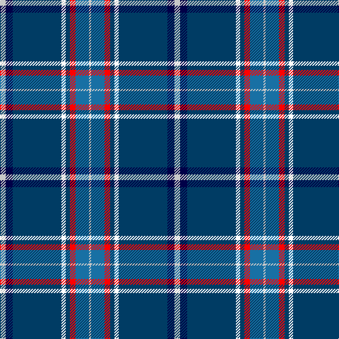

In pattern [WBBWBRBW](/stripes/wbbwbrbw/).

This was sourced from register-of-tartans.  It is a [8 stripe tartan](/stripes/stripes8/).

Original link https://www.tartanregister.gov.uk/tartanDetails.aspx?ref=10987

## Register references

External register numbers recorded for this tartan.

- Scottish Register of Tartans: [10987](https://www.tartanregister.gov.uk/tartanDetails.aspx?ref=10987)

## Thread count
N/8 DB10 DBa69 W6 DBa6 R8 B19 N/3

## Palette
Each colour and its ΔE from the base-6 reference it is a variant of.

| Colour | Shade | Base | ΔE (OKLab) |
|---|---|---|---|
| B | <code style="background-color:#1870A4;">#1870A4</code> `#1870A4` | B <code style="background-color:#2A418A;">#2A418A</code> | 0.13 |
| DB | <code style="background-color:#000048;">#000048</code> `#000048` | B <code style="background-color:#2A418A;">#2A418A</code> | 0.22 |
| DBa | <code style="background-color:#003C64;">#003C64</code> `#003C64` | B <code style="background-color:#2A418A;">#2A418A</code> | 0.08 |
| N | <code style="background-color:#C8C8C8;">#C8C8C8</code> `#C8C8C8` | W <code style="background-color:#F7F7F7;">#F7F7F7</code> | 0.14 |
| R | <code style="background-color:#FF0000;">#FF0000</code> `#FF0000` | R <code style="background-color:#CC0000;">#CC0000</code> | 0.11 |
| W | <code style="background-color:#FFFFFF;">#FFFFFF</code> `#FFFFFF` | W <code style="background-color:#F7F7F7;">#F7F7F7</code> | 0.02 |

# Sample pattern

## Nearest tartans

The nearest existing variants by ΔTartan distance.

1. [MacCormick Festive](/setts/s9/w3db3k1t16k1db8r3db24ly3~x2/) — ΔT 0.87
1. [Scotia](/setts/s9/w4db58g28o4w18db14r3db8ly4/) — ΔT 1.07
1. [Stewart Blue MINI Tartan Tartan Number: 5566. Earliest known date: Generated for display purpose only for Dupion Silk. reduced copy of the 556 Stewart Blue. See products available Copyright © Blair Urquhart, Comrie, 2015](/setts/s9/db20k3ly1w1g3r3k1r2w1~x2/) — ΔT 1.14
1. [Los Angeles](/setts/s8/ly4db24t5g2db3k5t33r2~x2/) — ΔT 1.18
1. [U.S. Forces Thurso (Military)](/setts/s7/db40r3k10lo2lr15w2lr4~x2/) — ΔT 1.18
1. [Wiegratz Alba (Personal)](/setts/s9/w3k2t30k5r5ly5t5db12w1~x2/) — ΔT 1.20
1. [Tartan Day SA (Corporate)](/setts/s8/w2db40g22ly3g2r3g2w2~x2/) — ΔT 1.22
1. [Shearer (2016)](/setts/s6/k4n4dt32r4t17w2~x2/) — ΔT 1.25
1. [Yukon (asymmetric)](/setts/s10/dp4db20ly1db2ly1db4ly4dg4w4r4~x2/) — ΔT 1.26
1. [Summerwood (School)](/setts/s12/db76w3r4w3g4w3dg8db19t20db3t8w10/) — ΔT 1.29

## Neighbour map

Every grey dot is one of 14299 variants placed by the first two principal components of the ΔTartan feature space (44% of its variance). Red is this tartan; blue dots are its nearest — click one to open its page.

<svg viewBox="0 0 640 380" role="img" style="max-width:100%;height:auto;border:1px solid #e0e0e0;border-radius:4px;display:block" xmlns="http://www.w3.org/2000/svg"><image href="/nn/cloud.v1.png" width="640" height="380"/><a href="/setts/s9/w3db3k1t16k1db8r3db24ly3~x2/"><circle cx="297.7" cy="114.6" r="4" fill="#3465a4"><title>MacCormick Festive</title></circle></a><a href="/setts/s9/w4db58g28o4w18db14r3db8ly4/"><circle cx="274.1" cy="116.9" r="4" fill="#3465a4"><title>Scotia</title></circle></a><a href="/setts/s9/db20k3ly1w1g3r3k1r2w1~x2/"><circle cx="305.8" cy="96.8" r="4" fill="#3465a4"><title>Stewart Blue MINI Tartan Tartan Number: 5566. Earliest known date: Generated for display purpose only for Dupion Silk. reduced copy of the 556 Stewart Blue. See products available Copyright © Blair Urquhart, Comrie, 2015</title></circle></a><a href="/setts/s8/ly4db24t5g2db3k5t33r2~x2/"><circle cx="251.2" cy="128.4" r="4" fill="#3465a4"><title>Los Angeles</title></circle></a><a href="/setts/s7/db40r3k10lo2lr15w2lr4~x2/"><circle cx="259.8" cy="120.5" r="4" fill="#3465a4"><title>U.S. Forces Thurso (Military)</title></circle></a><a href="/setts/s9/w3k2t30k5r5ly5t5db12w1~x2/"><circle cx="245.3" cy="93.4" r="4" fill="#3465a4"><title>Wiegratz Alba (Personal)</title></circle></a><a href="/setts/s8/w2db40g22ly3g2r3g2w2~x2/"><circle cx="303.8" cy="124.7" r="4" fill="#3465a4"><title>Tartan Day SA (Corporate)</title></circle></a><a href="/setts/s6/k4n4dt32r4t17w2~x2/"><circle cx="249.5" cy="150.3" r="4" fill="#3465a4"><title>Shearer (2016)</title></circle></a><a href="/setts/s10/dp4db20ly1db2ly1db4ly4dg4w4r4~x2/"><circle cx="248.8" cy="104.7" r="4" fill="#3465a4"><title>Yukon (asymmetric)</title></circle></a><a href="/setts/s12/db76w3r4w3g4w3dg8db19t20db3t8w10/"><circle cx="334.3" cy="82.2" r="4" fill="#3465a4"><title>Summerwood (School)</title></circle></a><circle cx="299.5" cy="110.2" r="5" fill="#c00000"/></svg>

ID: /setts/s8/lb8db10dt69w6dt6r8b19lb3/
