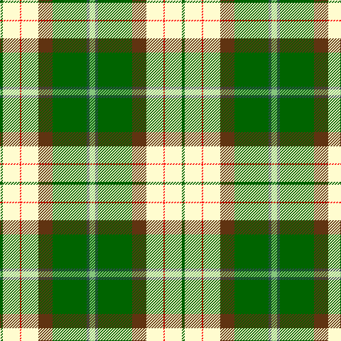

**Bands:** [GWRWGGBY](/stripes/gwrwggby/) · **Stripes:** [G W R W DY G N LG](/stripes/stripes8/) G W R W DY G N LG

This was sourced from register-of-tartans.  It is a [8 band tartan](/bands/bands8/).

Original link https://www.tartanregister.gov.uk/tartanDetails.aspx?ref=10503

## Register references

External register numbers recorded for this tartan.

- Scottish Register of Tartans: [10503](https://www.tartanregister.gov.uk/tartanDetails.aspx?ref=10503)

## Thread count
G/4 LY24 R2 LY24 T20 G48 N4 LG/8

## Palette
Each colour and its ΔE from the base-6 reference it is a variant of.

| Colour | Shade | Base | ΔE (OKLab) |
|---|---|---|---|
| G | <code style="background-color:#006400;">#006400</code> `#006400` | G <code style="background-color:#006100;">#006100</code> | 0.01 |
| LG | <code style="background-color:#86C67C;">#86C67C</code> `#86C67C` | Y <code style="background-color:#F2BF00;">#F2BF00</code> | 0.15 |
| LY | <code style="background-color:#FFFCCF;">#FFFCCF</code> `#FFFCCF` | W <code style="background-color:#F7F7F7;">#F7F7F7</code> | 0.06 |
| N | <code style="background-color:#2F4F4F;">#2F4F4F</code> `#2F4F4F` | B <code style="background-color:#2A418A;">#2A418A</code> | 0.12 |
| R | <code style="background-color:#FF0000;">#FF0000</code> `#FF0000` | R <code style="background-color:#CC0000;">#CC0000</code> | 0.11 |
| T | <code style="background-color:#603311;">#603311</code> `#603311` | G <code style="background-color:#006100;">#006100</code> | 0.17 |

# Sample pattern

## Nearest tartans

The nearest existing variants by ΔTartan distance.

1. [Taylor, dress](/setts/s9/g9k2r4g14w3lp3w23g5ly3~x2/) — ΔT 1.35
1. [Gillies Dress, Green (Dance)](/setts/s10/ly6k2g12r4g8k10w24b2w3b2~x2/) — ΔT 1.41
1. [Fredericton (District)](/setts/s12/dp6t2w24r15g12t4w4t4w4t4g34ly4/) — ΔT 1.43
1. [Carmen Lau (Hong Kong) (Personal)](/setts/s7/ly8r3b2db1w6g12db2~x2/) — ΔT 1.46
1. [Carmen Lau (Hong Kong) (Personal)](/setts/s7/ly8k3t2do1w6g12do2~x2/) — ΔT 1.47
1. [Kintail Dress](/setts/s8/y3g32y36o12k2w68g3k2~x2/) — ΔT 1.50
1. [Fiander, Julian (Personal)](/setts/s9/r6g2w21ly2k8ly2g32w1k3~x2/) — ΔT 1.53
1. [Gigha, Green (Dance)](/setts/s8/db4w2db1w18dg18g18ly3g4~x2/) — ΔT 1.53
1. [Taylor Dress #2](/setts/s9/dg9k2r4dg14w3lp3w23dg5ly3~x2/) — ΔT 1.54
1. [Gillies, dress Green](/setts/s10/ly6k2g15r6g8k12w25t2w3t2~x2/) — ΔT 1.55

## Neighbour map

Every grey dot is one of 14313 variants placed by the first two principal components of the ΔTartan feature space (44% of its variance). Red is this tartan; blue dots are its nearest — click one to open its page.

<svg viewBox="0 0 640 380" role="img" style="max-width:100%;height:auto;border:1px solid #e0e0e0;border-radius:4px;display:block" xmlns="http://www.w3.org/2000/svg"><image href="/nn/cloud.v1.png" width="640" height="380"/><a href="/setts/s9/g9k2r4g14w3lp3w23g5ly3~x2/"><circle cx="163.7" cy="130.7" r="4" fill="#3465a4"><title>Taylor, dress</title></circle></a><a href="/setts/s10/ly6k2g12r4g8k10w24b2w3b2~x2/"><circle cx="92.8" cy="115.1" r="4" fill="#3465a4"><title>Gillies Dress, Green (Dance)</title></circle></a><a href="/setts/s12/dp6t2w24r15g12t4w4t4w4t4g34ly4/"><circle cx="137.5" cy="93.7" r="4" fill="#3465a4"><title>Fredericton (District)</title></circle></a><a href="/setts/s7/ly8r3b2db1w6g12db2~x2/"><circle cx="89.8" cy="144.4" r="4" fill="#3465a4"><title>Carmen Lau (Hong Kong) (Personal)</title></circle></a><a href="/setts/s7/ly8k3t2do1w6g12do2~x2/"><circle cx="83.6" cy="140.7" r="4" fill="#3465a4"><title>Carmen Lau (Hong Kong) (Personal)</title></circle></a><a href="/setts/s8/y3g32y36o12k2w68g3k2~x2/"><circle cx="227.9" cy="96.2" r="4" fill="#3465a4"><title>Kintail Dress</title></circle></a><a href="/setts/s9/r6g2w21ly2k8ly2g32w1k3~x2/"><circle cx="217.5" cy="86.7" r="4" fill="#3465a4"><title>Fiander, Julian (Personal)</title></circle></a><a href="/setts/s8/db4w2db1w18dg18g18ly3g4~x2/"><circle cx="136.8" cy="140.4" r="4" fill="#3465a4"><title>Gigha, Green (Dance)</title></circle></a><a href="/setts/s9/dg9k2r4dg14w3lp3w23dg5ly3~x2/"><circle cx="159.6" cy="128.3" r="4" fill="#3465a4"><title>Taylor Dress #2</title></circle></a><a href="/setts/s10/ly6k2g15r6g8k12w25t2w3t2~x2/"><circle cx="84.7" cy="116.5" r="4" fill="#3465a4"><title>Gillies, dress Green</title></circle></a><circle cx="157.4" cy="108.3" r="5" fill="#c00000"/></svg>

ID: /setts/s8/lg4n2g24dy10w12r1w12g2~x2/
