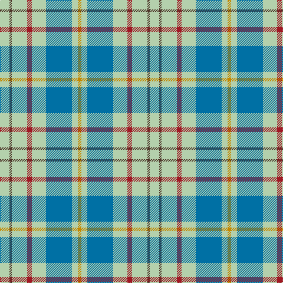

This page is one **sett** — a single exact thread-count. It belongs to the [tartan](/tartans/lg8do2lg13r4lg12t22lg5lo3/)
(the same proportion at any scale), whose colour order is pattern [YBYRYBYY](/stripes/ybyrybyy/).

Sourced from house-of-tartan.  It is a [8 stripe tartan](/stripes/stripes8/).

Original link http://www.house-of-tartan.scotland.net/house/TartanViewjs.asp?colr=Def&tnam=2262

## Thread count
N/16 T4 N26 DR8 N24 B44 N10 DY/6

## Palette

Palette: <strong>Tartan Register</strong> <small style="color:#888">(1 of 6 colours)</small>
<table><thead><tr><th>Colour</th><th>Threads</th><th>Shade</th><th>Base</th><th>OKLCh</th></tr></thead><tbody><tr><td>N/</td><td style="text-align:right;font-variant-numeric:tabular-nums">16</td><td><code style="background-color:#B4D0AC;">#B4D0AC</code> <small style="color:#888">#B4D0AC</small></td><td>Y <code style="background-color:#F2BF00;">#F2BF00</code></td><td><small style="color:#888">oklch(82.7% 0.058 138.8)</small></td></tr><tr><td>T</td><td style="text-align:right;font-variant-numeric:tabular-nums">4</td><td><code style="background-color:#4C3428;">#4C3428</code> <small style="color:#888">#4C3428</small></td><td>B <code style="background-color:#2A418A;">#2A418A</code></td><td><small style="color:#888">oklch(34.9% 0.040 47.5)</small></td></tr><tr><td>N</td><td style="text-align:right;font-variant-numeric:tabular-nums">26</td><td><code style="background-color:#B4D0AC;">#B4D0AC</code> <small style="color:#888">#B4D0AC</small></td><td>Y <code style="background-color:#F2BF00;">#F2BF00</code></td><td><small style="color:#888">oklch(82.7% 0.058 138.8)</small></td></tr><tr><td>DR</td><td style="text-align:right;font-variant-numeric:tabular-nums">8</td><td><code style="background-color:#A01824;">#A01824</code> <small style="color:#888">#A01824</small></td><td>R <code style="background-color:#CC0000;">#CC0000</code></td><td><small style="color:#888">oklch(45.6% 0.169 23.6)</small></td></tr><tr><td>N</td><td style="text-align:right;font-variant-numeric:tabular-nums">24</td><td><code style="background-color:#B4D0AC;">#B4D0AC</code> <small style="color:#888">#B4D0AC</small></td><td>Y <code style="background-color:#F2BF00;">#F2BF00</code></td><td><small style="color:#888">oklch(82.7% 0.058 138.8)</small></td></tr><tr><td>B</td><td style="text-align:right;font-variant-numeric:tabular-nums">44</td><td><code style="background-color:#0070A4;">#0070A4</code> <small style="color:#888">#0070A4</small></td><td>B <code style="background-color:#2A418A;">#2A418A</code></td><td><small style="color:#888">oklch(51.9% 0.117 239.1)</small></td></tr><tr><td>N</td><td style="text-align:right;font-variant-numeric:tabular-nums">10</td><td><code style="background-color:#B4D0AC;">#B4D0AC</code> <small style="color:#888">#B4D0AC</small></td><td>Y <code style="background-color:#F2BF00;">#F2BF00</code></td><td><small style="color:#888">oklch(82.7% 0.058 138.8)</small></td></tr><tr><td>DY/</td><td style="text-align:right;font-variant-numeric:tabular-nums">6</td><td><code style="background-color:#C48800;">#C48800</code> <small style="color:#888">#C48800</small></td><td>Y <code style="background-color:#F2BF00;">#F2BF00</code></td><td><small style="color:#888">oklch(67.0% 0.140 77.5)</small></td></tr></tbody></table>

# Sample pattern

## Nearest tartans

The nearest existing variants by ΔTartan distance, with this tartan at the top so the swatches line up against it.

ΔTartan

Tartan

Sett

—

<a href="/ttd/edit/#slug=lg8do2lg13r4lg12t22lg5lo3~x2">Kildare Irish County Tartan Tartan Number: 2262. Earliest known date: 1996 One of a series of Irish District tartans designed by Polly Wittering of the House of Edgar, with colours reminiscent of the Country with soft warm colours dominating. See products available Copyright © Blair Urquhart, Comrie, 2015</a> <a class="nn-out" href="/setts/s8/lg8do2lg13r4lg12t22lg5lo3~x2/" title="open its dictionary page">↗</a>

1.38

<a href="/ttd/edit/#slug=w5r3w26g21w3g8ly3~x2">MacPherson Dress Blue (Dance) #2</a> <a class="nn-out" href="/setts/s7/w5r3w26g21w3g8ly3~x2/" title="open its dictionary page">↗</a>

1.38

<a href="/setts/s8/k5w2ly36t47r3~x2/">Cornish National Day</a>

1.49

<a href="/ttd/edit/#slug=t4dg16ly2dp7t28w4~x2">Manx Laxey (Blue)</a> <a class="nn-out" href="/setts/s6/t4dg16ly2dp7t28w4~x2/" title="open its dictionary page">↗</a>

1.50

<a href="/ttd/edit/#slug=t60g9r7ly12g33ly33t26">Supporter.com</a> <a class="nn-out" href="/setts/s7/t60g9r7ly12g33ly33t26/" title="open its dictionary page">↗</a>

1.56

<a href="/ttd/edit/#slug=w14t3w14ly1g20w15t3w7dp3~x2">Milne dress green</a> <a class="nn-out" href="/setts/s9/w14t3w14ly1g20w15t3w7dp3~x2/" title="open its dictionary page">↗</a>

1.58

<a href="/ttd/edit/#slug=n10w3lr3g1r1~x10">Bagpipe Shop (Switzerland)</a> <a class="nn-out" href="/setts/s5/n10w3lr3g1r1~x10/" title="open its dictionary page">↗</a>

1.59

<a href="/ttd/edit/#slug=n10w3lb3g1r1~x10">Bagpipe Shop (Corporate)</a> <a class="nn-out" href="/setts/s5/n10w3lb3g1r1~x10/" title="open its dictionary page">↗</a>

1.60

<a href="/ttd/edit/#slug=b4g16ly2p7b28w4~x2">Manx Laxey</a> <a class="nn-out" href="/setts/s6/b4g16ly2p7b28w4~x2/" title="open its dictionary page">↗</a>

1.61

<a href="/ttd/edit/#slug=t8db2t24db5w26k2w8~x2">Lennox Turquoise Dress District Tartan Tartan Number: 8190. Earliest known date: pre 2003 Families with the surname 'Lennox' are usually considered related to Clans Stewart or MacFarlane. Some of this surname also choose to wear the distinctive and ancient 'Lennox' tartan. D W Stewart reproduced the sett from a 'lost' portrait of the Countess of Lennox dating from the 16th century./Threadcount and colours aren't 100% original. Generated manually./ See products available Copyright © Blair Urquhart, Comrie, 2015</a> <a class="nn-out" href="/setts/s7/t8db2t24db5w26k2w8~x2/" title="open its dictionary page">↗</a>

1.62

<a href="/ttd/edit/#slug=k4ly12n3ly3n3ly4lr17ly15dy4~x2">Cotswolds Distillery</a> <a class="nn-out" href="/setts/s9/k4ly12n3ly3n3ly4lr17ly15dy4~x2/" title="open its dictionary page">↗</a>

## Neighbour map

Every grey dot is one of 14299 variants placed by the first two principal components of the ΔTartan feature space (44% of its variance). Red is this tartan; blue dots are its nearest — click one to open its page.

<svg viewBox="0 0 640 380" role="img" style="max-width:100%;height:auto;border:1px solid #e0e0e0;border-radius:4px;display:block" xmlns="http://www.w3.org/2000/svg"><image href="/nn/cloud.v1.png" width="640" height="380"/><a href="/setts/s7/w5r3w26g21w3g8ly3~x2/"><circle cx="262.9" cy="189.6" r="4" fill="#3465a4"><title>MacPherson Dress Blue (Dance) #2</title></circle></a><a href="/setts/s8/k5w2ly36t47r3~x2/"><circle cx="296.5" cy="139.0" r="4" fill="#3465a4"><title>Cornish National Day</title></circle></a><a href="/setts/s6/t4dg16ly2dp7t28w4~x2/"><circle cx="273.9" cy="181.6" r="4" fill="#3465a4"><title>Manx Laxey (Blue)</title></circle></a><a href="/setts/s7/t60g9r7ly12g33ly33t26/"><circle cx="208.7" cy="216.5" r="4" fill="#3465a4"><title>Supporter.com</title></circle></a><a href="/setts/s9/w14t3w14ly1g20w15t3w7dp3~x2/"><circle cx="296.6" cy="141.8" r="4" fill="#3465a4"><title>Milne dress green</title></circle></a><a href="/setts/s5/n10w3lr3g1r1~x10/"><circle cx="277.9" cy="188.2" r="4" fill="#3465a4"><title>Bagpipe Shop (Switzerland)</title></circle></a><a href="/setts/s5/n10w3lb3g1r1~x10/"><circle cx="274.9" cy="187.9" r="4" fill="#3465a4"><title>Bagpipe Shop (Corporate)</title></circle></a><a href="/setts/s6/b4g16ly2p7b28w4~x2/"><circle cx="272.2" cy="175.5" r="4" fill="#3465a4"><title>Manx Laxey</title></circle></a><a href="/setts/s7/t8db2t24db5w26k2w8~x2/"><circle cx="249.7" cy="177.0" r="4" fill="#3465a4"><title>Lennox Turquoise Dress District Tartan Tartan Number: 8190. Earliest known date: pre 2003 Families with the surname 'Lennox' are usually considered related to Clans Stewart or MacFarlane. Some of this surname also choose to wear the distinctive and ancient 'Lennox' tartan. D W Stewart reproduced the sett from a 'lost' portrait of the Countess of Lennox dating from the 16th century./Threadcount and colours aren't 100% original. Generated manually./ See products available Copyright © Blair Urquhart, Comrie, 2015</title></circle></a><a href="/setts/s9/k4ly12n3ly3n3ly4lr17ly15dy4~x2/"><circle cx="202.6" cy="190.7" r="4" fill="#3465a4"><title>Cotswolds Distillery</title></circle></a><circle cx="260.9" cy="183.1" r="5" fill="#c00000"/></svg>

ID: /setts/s8/lg8do2lg13r4lg12t22lg5lo3~x2/
