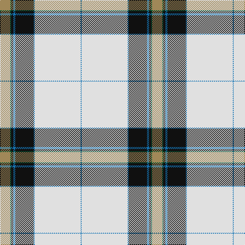

This page is one **sett** — a single exact thread-count. It belongs to the [tartan](/tartans/lt10g1k2ba2k18b1ln45ba1/)
(the same proportion at any scale), whose colour order is pattern [BWBKBKGY](/stripes/bwbkbkgy/).

Sourced from tartans-authority.  It is a [8 stripe tartan](/stripes/stripes8/).

Original link http://www.tartansauthority.com/tartan-ferret/display/7522/

## Thread count
LT/20 G2 K4 Ba4 K36 B2 LN90 Ba/2

## Palette
Each colour and the base-6 reference it is a variant of.

| Colour | Shade | Base |
|---|---|---|
| B | <code style="background-color:#1474B4;">#1474B4</code> `oklch(54.0% 0.129 245.1)` <small>#1474B4</small> | B <code style="background-color:#2A418A;">#2A418A</code> |
| Ba | <code style="background-color:#1474B4;">#1474B4</code> `oklch(54.0% 0.129 245.1)` <small>#1474B4</small> | B <code style="background-color:#2A418A;">#2A418A</code> |
| G | <code style="background-color:#005430;">#005430</code> `oklch(39.2% 0.094 156.7)` <small>#005430</small> | G <code style="background-color:#006100;">#006100</code> |
| K | <code style="background-color:#101010;">#101010</code> `oklch(17.3% 0.000 89.9)` <small>#101010</small> | K <code style="background-color:#000000;">#000000</code> |
| LN | <code style="background-color:#E0E0E0;">#E0E0E0</code> `oklch(90.7% 0.000 89.9)` <small>#E0E0E0</small> | W <code style="background-color:#F7F7F7;">#F7F7F7</code> |
| LT | <code style="background-color:#A08858;">#A08858</code> `oklch(63.7% 0.071 84.0)` <small>#A08858</small> | Y <code style="background-color:#F2BF00;">#F2BF00</code> |

# Sample pattern

## Nearest tartans

The nearest existing variants by ΔTartan distance, with this tartan at the top so the swatches line up against it.

ΔTartan

Tartan

Sett

—

<a href="/ttd/edit/#slug=lo10dg1k2b2k18b1w45b1~x2">Highland Burn (Fashion)</a> <a class="nn-out" href="/setts/s8/lo10dg1k2b2k18b1w45b1~x2/" title="open its dictionary page">↗</a>

1.05

<a href="/ttd/edit/#slug=w52db2k7w3k2dp2k1db9g8k2g3ly2~x2">Canmore Highland Games Dress (Corp)</a> <a class="nn-out" href="/setts/s12/w52db2k7w3k2dp2k1db9g8k2g3ly2~x2/" title="open its dictionary page">↗</a>

1.14

<a href="/ttd/edit/#slug=lb36db5k5ly1k1lb1k1dg8r4k1r2lb1">Stewart Dress</a> <a class="nn-out" href="/setts/s12/lb36db5k5ly1k1lb1k1dg8r4k1r2lb1/" title="open its dictionary page">↗</a>

1.21

<a href="/ttd/edit/#slug=w45r9k2w8k2ly1k10db8dp12w2~x2">Bruce of Kinnaird Dress (Dance)</a> <a class="nn-out" href="/setts/s10/w45r9k2w8k2ly1k10db8dp12w2~x2/" title="open its dictionary page">↗</a>

1.25

<a href="/ttd/edit/#slug=w72db20ly2db3w2db3y16dy6db2dy5w2~x2">Stuart/Stewart Dress Blue</a> <a class="nn-out" href="/setts/s11/w72db20ly2db3w2db3y16dy6db2dy5w2~x2/" title="open its dictionary page">↗</a>

1.26

<a href="/ttd/edit/#slug=w50k3g10g11w1k1r20w3r5~x2">Drummond of Perth Dress (Dance)</a> <a class="nn-out" href="/setts/s9/w50k3g10g11w1k1r20w3r5~x2/" title="open its dictionary page">↗</a>

1.30

<a href="/ttd/edit/#slug=w2k1g6dy11w26r2w1ly2~x2">Saskatchewan Dress (Dance)</a> <a class="nn-out" href="/setts/s8/w2k1g6dy11w26r2w1ly2~x2/" title="open its dictionary page">↗</a>

1.31

<a href="/ttd/edit/#slug=w72db20ly2db3w2db3y16o6db2o5w2~x2">Stewart dress, Blue</a> <a class="nn-out" href="/setts/s11/w72db20ly2db3w2db3y16o6db2o5w2~x2/" title="open its dictionary page">↗</a>

1.32

<a href="/ttd/edit/#slug=w52db2k7w3k2dp2k1db9g8k2g3o2~x2">Canmore Highland Games Dress</a> <a class="nn-out" href="/setts/s12/w52db2k7w3k2dp2k1db9g8k2g3o2~x2/" title="open its dictionary page">↗</a>

1.34

<a href="/ttd/edit/#slug=w64db18lb2db3w2db3n14b8k2b4w2~x2">Bennet Dress (Fashion)</a> <a class="nn-out" href="/setts/s11/w64db18lb2db3w2db3n14b8k2b4w2~x2/" title="open its dictionary page">↗</a>

1.37

<a href="/ttd/edit/#slug=w24db2k2ly1k1w1g6n4g1n1w1~x4">Pritchard</a> <a class="nn-out" href="/setts/s11/w24db2k2ly1k1w1g6n4g1n1w1~x4/" title="open its dictionary page">↗</a>

## Neighbour map

Every grey dot is one of 14299 variants placed by the first two principal components of the ΔTartan feature space (44% of its variance). Red is this tartan; blue dots are its nearest — click one to open its page.

<svg viewBox="0 0 640 380" role="img" style="max-width:100%;height:auto;border:1px solid #e0e0e0;border-radius:4px;display:block" xmlns="http://www.w3.org/2000/svg"><image href="/nn/cloud.v1.png" width="640" height="380"/><a href="/setts/s12/w52db2k7w3k2dp2k1db9g8k2g3ly2~x2/"><circle cx="316.8" cy="14.0" r="4" fill="#3465a4"><title>Canmore Highland Games Dress (Corp)</title></circle></a><a href="/setts/s12/lb36db5k5ly1k1lb1k1dg8r4k1r2lb1/"><circle cx="291.2" cy="25.4" r="4" fill="#3465a4"><title>Stewart Dress</title></circle></a><a href="/setts/s10/w45r9k2w8k2ly1k10db8dp12w2~x2/"><circle cx="267.7" cy="37.2" r="4" fill="#3465a4"><title>Bruce of Kinnaird Dress (Dance)</title></circle></a><a href="/setts/s11/w72db20ly2db3w2db3y16dy6db2dy5w2~x2/"><circle cx="313.3" cy="47.7" r="4" fill="#3465a4"><title>Stuart/Stewart Dress Blue</title></circle></a><a href="/setts/s9/w50k3g10g11w1k1r20w3r5~x2/"><circle cx="290.1" cy="60.5" r="4" fill="#3465a4"><title>Drummond of Perth Dress (Dance)</title></circle></a><a href="/setts/s8/w2k1g6dy11w26r2w1ly2~x2/"><circle cx="281.9" cy="76.3" r="4" fill="#3465a4"><title>Saskatchewan Dress (Dance)</title></circle></a><a href="/setts/s11/w72db20ly2db3w2db3y16o6db2o5w2~x2/"><circle cx="313.8" cy="48.1" r="4" fill="#3465a4"><title>Stewart dress, Blue</title></circle></a><a href="/setts/s12/w52db2k7w3k2dp2k1db9g8k2g3o2~x2/"><circle cx="307.4" cy="14.0" r="4" fill="#3465a4"><title>Canmore Highland Games Dress</title></circle></a><a href="/setts/s11/w64db18lb2db3w2db3n14b8k2b4w2~x2/"><circle cx="276.0" cy="40.9" r="4" fill="#3465a4"><title>Bennet Dress (Fashion)</title></circle></a><a href="/setts/s11/w24db2k2ly1k1w1g6n4g1n1w1~x4/"><circle cx="278.0" cy="41.2" r="4" fill="#3465a4"><title>Pritchard</title></circle></a><circle cx="299.6" cy="46.4" r="5" fill="#c00000"/></svg>

ID: /setts/s8/lo10dg1k2b2k18b1w45b1~x2/
