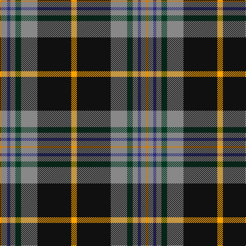

**Bands:** [YKRGRBRY](/stripes/ykrgrbry/) · **Stripes:** [LO K O DG O DB O LO](/stripes/stripes8/) LO K O DG O DB O LO

This was sourced from register-of-tartans.  It is a [8 band tartan](/bands/bands8/).

Original link https://www.tartanregister.gov.uk/tartanDetails.aspx?ref=3595

## Register references

External register numbers recorded for this tartan.

- Scottish Register of Tartans: [3595](https://www.tartanregister.gov.uk/tartanDetails.aspx?ref=3595)
- Scottish Tartans Authority (ITI): 3175
- Scottish Tartans World Register: 2852

## Variants

Other setts woven to the same stripe pattern.

- [Royal College of G.P.s (Corporate)](/setts/s8/lo8k50o15dg6o6db3o6lo2~x2/)

## Thread count
O/4 N10 DB6 N10 DG11 N32 K66 Y/11

## Palette
Each colour and its ΔE from the base-6 reference it is a variant of.

| Colour | Shade | Base | ΔE (OKLab) |
|---|---|---|---|
| DB | <code style="background-color:#2C2C80;">#2C2C80</code> `#2C2C80` | B <code style="background-color:#2A418A;">#2A418A</code> | 0.06 |
| DG | <code style="background-color:#003820;">#003820</code> `#003820` | G <code style="background-color:#006100;">#006100</code> | 0.15 |
| K | <code style="background-color:#101010;">#101010</code> `#101010` | K <code style="background-color:#000000;">#000000</code> | 0.17 |
| N | <code style="background-color:#888888;">#888888</code> `#888888` | R <code style="background-color:#CC0000;">#CC0000</code> | 0.24 |
| O | <code style="background-color:#D87C00;">#D87C00</code> `#D87C00` | Y <code style="background-color:#F2BF00;">#F2BF00</code> | 0.17 |
| Y | <code style="background-color:#FFA500;">#FFA500</code> `#FFA500` | Y <code style="background-color:#F2BF00;">#F2BF00</code> | 0.06 |

# Sample pattern

## Nearest tartans

The nearest existing variants by ΔTartan distance.

1. [Turnbull, Dress Bruce (Personal)](/setts/s8/o11k66y32dg11y10db6y10r4/) — ΔT 0.46
1. [Legion of Frontiersmen (Corporate)](/setts/s8/k45lo10g7r3w4db13w9r6~x2/) — ΔT 0.70
1. [Otago](/setts/s10/y16k2y6k2r2k2db15g1db1w2~x2/) — ΔT 0.78
1. [Vienna Highlander (Fashion)](/setts/s8/lo3k2o15k10dt23r2dt1w2~x2/) — ΔT 0.84
1. [Dublin County Crest (Fashion)](/setts/s11/lo9k8lo30k4lb8k4db24k54r14k4lr8/) — ΔT 0.94
1. [Letter Dress (2014)](/setts/s9/o29k23lo1g9lo2r4k14w2k4~x2/) — ΔT 0.94
1. [Milne-Murtaugh (Personal)](/setts/s7/r5t2k30n26ly2n2db4~x2/) — ΔT 0.96
1. [Roderick Dhu](/setts/s9/b3k2r2k12g10ly1k1g2lb2~x4/) — ΔT 0.98
1. [Minnesota (District)](/setts/s8/k6w3k2db30r9k4g20ly3~x2/) — ΔT 0.99
1. [Kleto, Susan (Personal)](/setts/s9/w1db16ly1r3ly1g6g2g6w1~x2/) — ΔT 1.03

## Neighbour map

Every grey dot is one of 14313 variants placed by the first two principal components of the ΔTartan feature space (44% of its variance). Red is this tartan; blue dots are its nearest — click one to open its page.

<svg viewBox="0 0 640 380" role="img" style="max-width:100%;height:auto;border:1px solid #e0e0e0;border-radius:4px;display:block" xmlns="http://www.w3.org/2000/svg"><image href="/nn/cloud.v1.png" width="640" height="380"/><a href="/setts/s8/o11k66y32dg11y10db6y10r4/"><circle cx="219.0" cy="133.6" r="4" fill="#3465a4"><title>Turnbull, Dress Bruce (Personal)</title></circle></a><a href="/setts/s8/k45lo10g7r3w4db13w9r6~x2/"><circle cx="182.8" cy="121.3" r="4" fill="#3465a4"><title>Legion of Frontiersmen (Corporate)</title></circle></a><a href="/setts/s10/y16k2y6k2r2k2db15g1db1w2~x2/"><circle cx="206.5" cy="110.9" r="4" fill="#3465a4"><title>Otago</title></circle></a><a href="/setts/s8/lo3k2o15k10dt23r2dt1w2~x2/"><circle cx="201.9" cy="119.3" r="4" fill="#3465a4"><title>Vienna Highlander (Fashion)</title></circle></a><a href="/setts/s11/lo9k8lo30k4lb8k4db24k54r14k4lr8/"><circle cx="174.0" cy="122.7" r="4" fill="#3465a4"><title>Dublin County Crest (Fashion)</title></circle></a><a href="/setts/s9/o29k23lo1g9lo2r4k14w2k4~x2/"><circle cx="233.1" cy="107.0" r="4" fill="#3465a4"><title>Letter Dress (2014)</title></circle></a><a href="/setts/s7/r5t2k30n26ly2n2db4~x2/"><circle cx="235.4" cy="144.2" r="4" fill="#3465a4"><title>Milne-Murtaugh (Personal)</title></circle></a><a href="/setts/s9/b3k2r2k12g10ly1k1g2lb2~x4/"><circle cx="187.3" cy="145.8" r="4" fill="#3465a4"><title>Roderick Dhu</title></circle></a><a href="/setts/s8/k6w3k2db30r9k4g20ly3~x2/"><circle cx="154.7" cy="132.9" r="4" fill="#3465a4"><title>Minnesota (District)</title></circle></a><a href="/setts/s9/w1db16ly1r3ly1g6g2g6w1~x2/"><circle cx="198.8" cy="120.8" r="4" fill="#3465a4"><title>Kleto, Susan (Personal)</title></circle></a><circle cx="206.2" cy="126.4" r="5" fill="#c00000"/></svg>

ID: /setts/s8/lo11k66o32dg11o10db6o10lo4/
