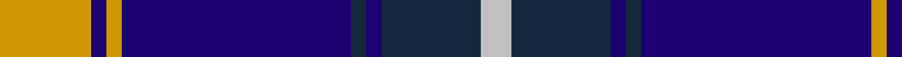
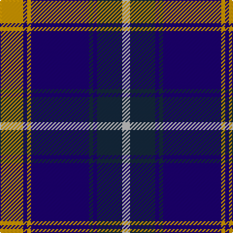

In pattern [WBBBBYBY](/stripes/wbbbbyby/).

This was sourced from register-of-tartans.  It is a [8 stripe tartan](/stripes/stripes8/).

Original link https://www.tartanregister.gov.uk/tartanDetails.aspx?ref=1732

## Attestations

This cloth appears in 2 source records; the oldest owns this page.

- 01/01/1991 — Highlands School (North Carolina) (register-of-tartans, [record](https://www.tartanregister.gov.uk/tartanDetails.aspx?ref=1732))
- pre 2002 — Highlands School (Corporate) (tartans-authority, [record](http://www.tartansauthority.com/tartan-ferret/display/2109/))

## Register references

External register numbers recorded for this tartan.

- Scottish Register of Tartans: [1732](https://www.tartanregister.gov.uk/tartanDetails.aspx?ref=1732)
- Scottish Tartans Authority (ITI): 2109
- Scottish Tartans World Register: 2109

## Thread count
DY/24 DB4 DY4 DB60 DN4 DB4 DN26 N/8

## Palette
Each colour and the base-6 reference it is a variant of.

| Colour | Shade | Base |
|---|---|---|
| DB | <code style="background-color:#1C0070;">#1C0070</code> `oklch(26.3% 0.162 277.1)` <small>#1C0070</small> | B <code style="background-color:#2A418A;">#2A418A</code> |
| DN | <code style="background-color:#14283C;">#14283C</code> `oklch(27.1% 0.046 249.9)` <small>#14283C</small> | B <code style="background-color:#2A418A;">#2A418A</code> |
| DY | <code style="background-color:#D09800;">#D09800</code> `oklch(71.4% 0.147 82.1)` <small>#D09800</small> | Y <code style="background-color:#F2BF00;">#F2BF00</code> |
| N | <code style="background-color:#C0C0C0;">#C0C0C0</code> `oklch(80.8% 0.000 89.9)` <small>#C0C0C0</small> | W <code style="background-color:#F7F7F7;">#F7F7F7</code> |

# Sample pattern

## Nearest tartans

The nearest existing variants by ΔTartan distance, with this tartan at the top so the swatches line up against it.

ΔTartan

Tartan

Sett

—

<a href="/ttd/edit/#slug=lo12db2lo2db30dt2db2dt13lb4~x2">Highlands School (North Carolina)</a> <a class="nn-out" href="/setts/s8/lo12db2lo2db30dt2db2dt13lb4~x2/" title="open its dictionary page">↗</a>

0.65

<a href="/ttd/edit/#slug=ly12db2ly2db30db3db2db13w4~x2">Highlands School (N. Carolina) Corporate Tartan Tartan Number: 2109. Earliest known date: 1990 Highlands in North Carolina is the home of the Scottish Tartans Society's Museum Extension. The school tartan was designed by Bob Martin who is a 'Fellow of the Society'. Blue and Gold are the school colours. See products available Copyright © Blair Urquhart, Comrie, 2015</a> <a class="nn-out" href="/setts/s8/ly12db2ly2db30db3db2db13w4~x2/" title="open its dictionary page">↗</a>

0.66

<a href="/ttd/edit/#slug=r3db20k6lb5k4lb3k2r1db2~x2">Scottish Knights Templar Int. (Corp)</a> <a class="nn-out" href="/setts/s9/r3db20k6lb5k4lb3k2r1db2~x2/" title="open its dictionary page">↗</a>

0.71

<a href="/ttd/edit/#slug=lo6db3lo3db15db7lo7db5lo17db46lo4">Rhys (Welsh Name)</a> <a class="nn-out" href="/setts/s10/lo6db3lo3db15db7lo7db5lo17db46lo4/" title="open its dictionary page">↗</a>

0.73

<a href="/ttd/edit/#slug=y12db2y2db30db3db2db13w4~x2">Highlands School, (North Carolina)</a> <a class="nn-out" href="/setts/s8/y12db2y2db30db3db2db13w4~x2/" title="open its dictionary page">↗</a>

0.95

<a href="/ttd/edit/#slug=r3db20k6w5k4w3k2r1db2~x2">Scottish Knights Templar, of M.T.S. International</a> <a class="nn-out" href="/setts/s9/r3db20k6w5k4w3k2r1db2~x2/" title="open its dictionary page">↗</a>

0.96

<a href="/ttd/edit/#slug=r3db2w2db26k22w3db3w3~x2">DeCloud-McMasters (Personal)</a> <a class="nn-out" href="/setts/s8/r3db2w2db26k22w3db3w3~x2/" title="open its dictionary page">↗</a>

0.96

<a href="/ttd/edit/#slug=k8r1k1r1k4b11ly1b2~x6">Rutherford</a> <a class="nn-out" href="/setts/s8/k8r1k1r1k4b11ly1b2~x6/" title="open its dictionary page">↗</a>

0.96

<a href="/ttd/edit/#slug=k3db30k8w8k2r3~x2">Hydro-Electric</a> <a class="nn-out" href="/setts/s6/k3db30k8w8k2r3~x2/" title="open its dictionary page">↗</a>

1.04

<a href="/ttd/edit/#slug=db30lb2k9w3db6w4k3lb6~x2">Detroit Lions</a> <a class="nn-out" href="/setts/s8/db30lb2k9w3db6w4k3lb6~x2/" title="open its dictionary page">↗</a>

1.05

<a href="/ttd/edit/#slug=db4w1db1w3db24y9k1y9k3~x2">Historic Scotland</a> <a class="nn-out" href="/setts/s9/db4w1db1w3db24y9k1y9k3~x2/" title="open its dictionary page">↗</a>

## Neighbour map

Every grey dot is one of 14299 variants placed by the first two principal components of the ΔTartan feature space (44% of its variance). Red is this tartan; blue dots are its nearest — click one to open its page.

<svg viewBox="0 0 640 380" role="img" style="max-width:100%;height:auto;border:1px solid #e0e0e0;border-radius:4px;display:block" xmlns="http://www.w3.org/2000/svg"><image href="/nn/cloud.v1.png" width="640" height="380"/><a href="/setts/s8/ly12db2ly2db30db3db2db13w4~x2/"><circle cx="260.4" cy="155.7" r="4" fill="#3465a4"><title>Highlands School (N. Carolina) Corporate Tartan Tartan Number: 2109. Earliest known date: 1990 Highlands in North Carolina is the home of the Scottish Tartans Society's Museum Extension. The school tartan was designed by Bob Martin who is a 'Fellow of the Society'. Blue and Gold are the school colours. See products available Copyright © Blair Urquhart, Comrie, 2015</title></circle></a><a href="/setts/s9/r3db20k6lb5k4lb3k2r1db2~x2/"><circle cx="266.3" cy="145.7" r="4" fill="#3465a4"><title>Scottish Knights Templar Int. (Corp)</title></circle></a><a href="/setts/s10/lo6db3lo3db15db7lo7db5lo17db46lo4/"><circle cx="285.4" cy="158.8" r="4" fill="#3465a4"><title>Rhys (Welsh Name)</title></circle></a><a href="/setts/s8/y12db2y2db30db3db2db13w4~x2/"><circle cx="280.3" cy="170.6" r="4" fill="#3465a4"><title>Highlands School, (North Carolina)</title></circle></a><a href="/setts/s9/r3db20k6w5k4w3k2r1db2~x2/"><circle cx="244.6" cy="136.0" r="4" fill="#3465a4"><title>Scottish Knights Templar, of M.T.S. International</title></circle></a><a href="/setts/s8/r3db2w2db26k22w3db3w3~x2/"><circle cx="256.7" cy="161.2" r="4" fill="#3465a4"><title>DeCloud-McMasters (Personal)</title></circle></a><a href="/setts/s8/k8r1k1r1k4b11ly1b2~x6/"><circle cx="261.8" cy="180.2" r="4" fill="#3465a4"><title>Rutherford</title></circle></a><a href="/setts/s6/k3db30k8w8k2r3~x2/"><circle cx="291.8" cy="167.8" r="4" fill="#3465a4"><title>Hydro-Electric</title></circle></a><a href="/setts/s8/db30lb2k9w3db6w4k3lb6~x2/"><circle cx="291.5" cy="153.4" r="4" fill="#3465a4"><title>Detroit Lions</title></circle></a><a href="/setts/s9/db4w1db1w3db24y9k1y9k3~x2/"><circle cx="301.7" cy="137.6" r="4" fill="#3465a4"><title>Historic Scotland</title></circle></a><circle cx="273.2" cy="160.4" r="5" fill="#c00000"/></svg>

ID: /setts/s8/lo12db2lo2db30dt2db2dt13lb4~x2/
