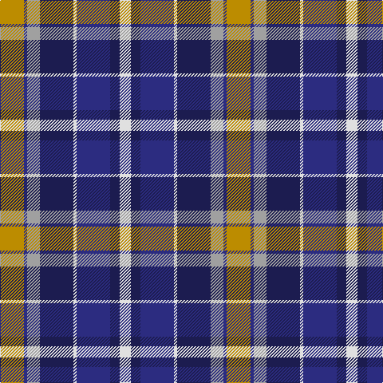

**Bands:** [YBYBWBBW](/stripes/ybybwbbw/) · **Stripes:** [LO DB LR DB W DB DB W](/stripes/stripes8/) LO DB LR DB W DB DB W

This was sourced from tartans-authority.  It is a [8 band tartan](/bands/bands8/).

Original link http://www.tartansauthority.com/tartan-ferret/display/7412/

## Attestations

This cloth appears in 2 source records; the oldest owns this page.

- 2004 — Monaghan County Crest (Fashion) (tartans-authority, [record](http://www.tartansauthority.com/tartan-ferret/display/7412/))
- 01/05/2005 — Monaghan County, Crest Range (register-of-tartans, [record](https://www.tartanregister.gov.uk/tartanDetails.aspx?ref=5041))

## Register references

External register numbers recorded for this tartan.

- Scottish Register of Tartans: [5041](https://www.tartanregister.gov.uk/tartanDetails.aspx?ref=5041)
- Scottish Tartans Authority (ITI): 7412
- Scottish Tartans World Register: 3096

## Thread count
DY/30 DB4 N16 DBa42 LN4 DB42 DBa12 LN/14

## Palette
Each colour and its ΔE from the base-6 reference it is a variant of.

| Colour | Shade | Base | ΔE (OKLab) |
|---|---|---|---|
| DB | <code style="background-color:#2C2C80;">#2C2C80</code> `#2C2C80` | B <code style="background-color:#2A418A;">#2A418A</code> | 0.06 |
| DBa | <code style="background-color:#1C1C50;">#1C1C50</code> `#1C1C50` | B <code style="background-color:#2A418A;">#2A418A</code> | 0.14 |
| DY | <code style="background-color:#BC8C00;">#BC8C00</code> `#BC8C00` | Y <code style="background-color:#F2BF00;">#F2BF00</code> | 0.16 |
| LN | <code style="background-color:#E0E0E0;">#E0E0E0</code> `#E0E0E0` | W <code style="background-color:#F7F7F7;">#F7F7F7</code> | 0.07 |
| N | <code style="background-color:#A0A0A0;">#A0A0A0</code> `#A0A0A0` | Y <code style="background-color:#F2BF00;">#F2BF00</code> | 0.21 |

# Sample pattern

## Nearest tartans

The nearest existing variants by ΔTartan distance.

1. [Caitriot](/setts/s9/w3t2n14lr8t14db16n13t2w3~x2/) — ΔT 0.74
1. [Inverary](/setts/s6/y10k1db13k3lb9lo3~x2/) — ΔT 0.87
1. [de Franck, Matt (Personal)](/setts/s9/n12k2n2k2n2k12lp12t3w1~x2/) — ΔT 0.95
1. [Meeting Professionals International](/setts/s10/o10k3w3k3w3k3o10k7db20r3~x2/) — ΔT 0.98
1. [Soroptimist International (Corporate](/setts/s6/w2k1m10k6b12lo2~x2/) — ΔT 0.98
1. [McEachern, Andrew](/setts/s6/do7w1r6db10g10w1~x4/) — ΔT 1.05
1. [Highfield Dress (Name)](/setts/s11/db10k2g2r2g2k2w2k2w4k1w2~x4/) — ΔT 1.08
1. [Waterford County Crest (Fashion)](/setts/s8/w8db5db30lr4db13lr13g5lo5~x2/) — ΔT 1.12
1. [Antigonish Centennial](/setts/s9/k4lb2db5lb7db9g14o4g1o4~x2/) — ΔT 1.15
1. [Naysmith, William A (Personal)](/setts/s10/lb4r2db14k4lb4k3lb3k2r2lb2~x2/) — ΔT 1.16

## Neighbour map

Every grey dot is one of 14299 variants placed by the first two principal components of the ΔTartan feature space (44% of its variance). Red is this tartan; blue dots are its nearest — click one to open its page.

<svg viewBox="0 0 640 380" role="img" style="max-width:100%;height:auto;border:1px solid #e0e0e0;border-radius:4px;display:block" xmlns="http://www.w3.org/2000/svg"><image href="/nn/cloud.v1.png" width="640" height="380"/><a href="/setts/s9/w3t2n14lr8t14db16n13t2w3~x2/"><circle cx="114.1" cy="193.6" r="4" fill="#3465a4"><title>Caitriot</title></circle></a><a href="/setts/s6/y10k1db13k3lb9lo3~x2/"><circle cx="117.5" cy="184.7" r="4" fill="#3465a4"><title>Inverary</title></circle></a><a href="/setts/s9/n12k2n2k2n2k12lp12t3w1~x2/"><circle cx="150.3" cy="155.7" r="4" fill="#3465a4"><title>de Franck, Matt (Personal)</title></circle></a><a href="/setts/s10/o10k3w3k3w3k3o10k7db20r3~x2/"><circle cx="101.2" cy="177.5" r="4" fill="#3465a4"><title>Meeting Professionals International</title></circle></a><a href="/setts/s6/w2k1m10k6b12lo2~x2/"><circle cx="164.2" cy="188.5" r="4" fill="#3465a4"><title>Soroptimist International (Corporate</title></circle></a><a href="/setts/s6/do7w1r6db10g10w1~x4/"><circle cx="104.6" cy="209.9" r="4" fill="#3465a4"><title>McEachern, Andrew</title></circle></a><a href="/setts/s11/db10k2g2r2g2k2w2k2w4k1w2~x4/"><circle cx="93.7" cy="148.1" r="4" fill="#3465a4"><title>Highfield Dress (Name)</title></circle></a><a href="/setts/s8/w8db5db30lr4db13lr13g5lo5~x2/"><circle cx="99.5" cy="171.8" r="4" fill="#3465a4"><title>Waterford County Crest (Fashion)</title></circle></a><a href="/setts/s9/k4lb2db5lb7db9g14o4g1o4~x2/"><circle cx="100.4" cy="172.5" r="4" fill="#3465a4"><title>Antigonish Centennial</title></circle></a><a href="/setts/s10/lb4r2db14k4lb4k3lb3k2r2lb2~x2/"><circle cx="109.0" cy="166.4" r="4" fill="#3465a4"><title>Naysmith, William A (Personal)</title></circle></a><circle cx="110.1" cy="178.5" r="5" fill="#c00000"/></svg>

ID: /setts/s8/lo15db2lr8db21w2db21db6w7~x2/
