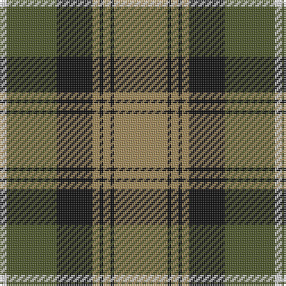

This page is one **sett** — a single exact thread-count. It belongs to the [tartan](/tartans/lo15k1lo2k1lo2k10dy14w2/)
(the same proportion at any scale), whose colour order is pattern [WGKYKYKY](/stripes/wgkykyky/).

Sourced from house-of-tartan.  It is a [8 stripe tartan](/stripes/stripes8/).

Original link http://www.house-of-tartan.scotland.net/house/TartanViewjs.asp?colr=Def&tnam=6009

## Thread count
LT/30 K2 LT4 K2 LT4 K20 G28 LN/4

## Palette

Palette: <strong>Tartan Register</strong> <small style="color:#888">(3 of 4 colours)</small>
<table><thead><tr><th>Colour</th><th>Threads</th><th>Shade</th><th>Base</th><th>OKLCh</th></tr></thead><tbody><tr><td>LT/</td><td style="text-align:right;font-variant-numeric:tabular-nums">30</td><td><code style="background-color:#A08858;">#A08858</code> <small style="color:#888">#A08858</small></td><td>Y <code style="background-color:#F2BF00;">#F2BF00</code></td><td><small style="color:#888">oklch(63.7% 0.071 84.0)</small></td></tr><tr><td>K</td><td style="text-align:right;font-variant-numeric:tabular-nums">2</td><td><code style="background-color:#101010;">#101010</code> <small style="color:#888">#101010</small></td><td>K <code style="background-color:#000000;">#000000</code></td><td><small style="color:#888">oklch(17.3% 0.000 89.9)</small></td></tr><tr><td>LT</td><td style="text-align:right;font-variant-numeric:tabular-nums">4</td><td><code style="background-color:#A08858;">#A08858</code> <small style="color:#888">#A08858</small></td><td>Y <code style="background-color:#F2BF00;">#F2BF00</code></td><td><small style="color:#888">oklch(63.7% 0.071 84.0)</small></td></tr><tr><td>K</td><td style="text-align:right;font-variant-numeric:tabular-nums">2</td><td><code style="background-color:#101010;">#101010</code> <small style="color:#888">#101010</small></td><td>K <code style="background-color:#000000;">#000000</code></td><td><small style="color:#888">oklch(17.3% 0.000 89.9)</small></td></tr><tr><td>LT</td><td style="text-align:right;font-variant-numeric:tabular-nums">4</td><td><code style="background-color:#A08858;">#A08858</code> <small style="color:#888">#A08858</small></td><td>Y <code style="background-color:#F2BF00;">#F2BF00</code></td><td><small style="color:#888">oklch(63.7% 0.071 84.0)</small></td></tr><tr><td>K</td><td style="text-align:right;font-variant-numeric:tabular-nums">20</td><td><code style="background-color:#101010;">#101010</code> <small style="color:#888">#101010</small></td><td>K <code style="background-color:#000000;">#000000</code></td><td><small style="color:#888">oklch(17.3% 0.000 89.9)</small></td></tr><tr><td>G</td><td style="text-align:right;font-variant-numeric:tabular-nums">28</td><td><code style="background-color:#4C5428;">#4C5428</code> <small style="color:#888">#4C5428</small></td><td>G <code style="background-color:#006100;">#006100</code></td><td><small style="color:#888">oklch(42.8% 0.066 117.8)</small></td></tr><tr><td>LN/</td><td style="text-align:right;font-variant-numeric:tabular-nums">4</td><td><code style="background-color:#E0E0E0;">#E0E0E0</code> <small style="color:#888">#E0E0E0</small></td><td>W <code style="background-color:#F7F7F7;">#F7F7F7</code></td><td><small style="color:#888">oklch(90.7% 0.000 89.9)</small></td></tr></tbody></table>

# Sample pattern

## Nearest tartans

The nearest existing variants by ΔTartan distance, with this tartan at the top so the swatches line up against it.

ΔTartan

Tartan

Sett

—

<a href="/ttd/edit/#slug=lo15k1lo2k1lo2k10dy14w2~x2">Buccleuch Weavers Tartan Tartan Number: 6009. Earliest known date: pre 2003 A Fashion tartan from Marton Mills See products available Copyright © Blair Urquhart, Comrie, 2015</a> <a class="nn-out" href="/setts/s8/lo15k1lo2k1lo2k10dy14w2~x2/" title="open its dictionary page">↗</a>

0.19

<a href="/ttd/edit/#slug=lo15k1lo2k1lo2k10y14w2~x2">Buccleuch (Fashion)</a> <a class="nn-out" href="/setts/s8/lo15k1lo2k1lo2k10y14w2~x2/" title="open its dictionary page">↗</a>

0.77

<a href="/ttd/edit/#slug=k1db1g16r16k12db8g16db1k1~x2">MacNett</a> <a class="nn-out" href="/setts/s9/k1db1g16r16k12db8g16db1k1~x2/" title="open its dictionary page">↗</a>

0.78

<a href="/ttd/edit/#slug=g36k2g2k2g3k12t10r20~x2">Georgia, State of</a> <a class="nn-out" href="/setts/s8/g36k2g2k2g3k12t10r20~x2/" title="open its dictionary page">↗</a>

0.80

<a href="/ttd/edit/#slug=dp9lr4dp1lr4g15r4dp1~x4">Logan #3</a> <a class="nn-out" href="/setts/s7/dp9lr4dp1lr4g15r4dp1~x4/" title="open its dictionary page">↗</a>

0.86

<a href="/ttd/edit/#slug=db4o17db4g4db2g4db4g27db4ly4~x2">Cape Breton University</a> <a class="nn-out" href="/setts/s10/db4o17db4g4db2g4db4g27db4ly4~x2/" title="open its dictionary page">↗</a>

0.86

<a href="/ttd/edit/#slug=g12t6g6r15k1r1k2~x4">McCook/Cook (Name)</a> <a class="nn-out" href="/setts/s7/g12t6g6r15k1r1k2~x4/" title="open its dictionary page">↗</a>

0.91

<a href="/ttd/edit/#slug=r15db2r1db2r3db7g13gi3~x2">Cranston Dress</a> <a class="nn-out" href="/setts/s8/r15db2r1db2r3db7g13gi3~x2/" title="open its dictionary page">↗</a>

0.92

<a href="/ttd/edit/#slug=r30db3r2db3r6db14gi26g6">Cranston, dress</a> <a class="nn-out" href="/setts/s8/r30db3r2db3r6db14gi26g6/" title="open its dictionary page">↗</a>

0.92

<a href="/ttd/edit/#slug=r30db3r2db3r6db14g26gi6">Cranston Dress Family Tartan Tartan Number: 753. Earliest known date: pre 2003 Restricted See products available Copyright © Blair Urquhart, Comrie, 2015</a> <a class="nn-out" href="/setts/s8/r30db3r2db3r6db14g26gi6/" title="open its dictionary page">↗</a>

0.96

<a href="/ttd/edit/#slug=k2r7k6g12ly1g1k2~x4">Blackstock Hunting</a> <a class="nn-out" href="/setts/s7/k2r7k6g12ly1g1k2~x4/" title="open its dictionary page">↗</a>

## Neighbour map

Every grey dot is one of 14359 variants placed by the first two principal components of the ΔTartan feature space (44% of its variance). Red is this tartan; blue dots are its nearest — click one to open its page.

<svg viewBox="0 0 640 380" role="img" style="max-width:100%;height:auto;border:1px solid #e0e0e0;border-radius:4px;display:block" xmlns="http://www.w3.org/2000/svg"><image href="/nn/cloud.v1.png" width="640" height="380"/><a href="/setts/s8/lo15k1lo2k1lo2k10y14w2~x2/"><circle cx="229.8" cy="169.6" r="4" fill="#3465a4"><title>Buccleuch (Fashion)</title></circle></a><a href="/setts/s9/k1db1g16r16k12db8g16db1k1~x2/"><circle cx="235.7" cy="178.2" r="4" fill="#3465a4"><title>MacNett</title></circle></a><a href="/setts/s8/g36k2g2k2g3k12t10r20~x2/"><circle cx="273.2" cy="166.1" r="4" fill="#3465a4"><title>Georgia, State of</title></circle></a><a href="/setts/s7/dp9lr4dp1lr4g15r4dp1~x4/"><circle cx="210.4" cy="177.4" r="4" fill="#3465a4"><title>Logan #3</title></circle></a><a href="/setts/s10/db4o17db4g4db2g4db4g27db4ly4~x2/"><circle cx="250.9" cy="159.9" r="4" fill="#3465a4"><title>Cape Breton University</title></circle></a><a href="/setts/s7/g12t6g6r15k1r1k2~x4/"><circle cx="248.7" cy="189.5" r="4" fill="#3465a4"><title>McCook/Cook (Name)</title></circle></a><a href="/setts/s8/r15db2r1db2r3db7g13gi3~x2/"><circle cx="228.6" cy="170.0" r="4" fill="#3465a4"><title>Cranston Dress</title></circle></a><a href="/setts/s8/r30db3r2db3r6db14gi26g6/"><circle cx="242.0" cy="170.7" r="4" fill="#3465a4"><title>Cranston, dress</title></circle></a><a href="/setts/s8/r30db3r2db3r6db14g26gi6/"><circle cx="236.2" cy="167.1" r="4" fill="#3465a4"><title>Cranston Dress Family Tartan Tartan Number: 753. Earliest known date: pre 2003 Restricted See products available Copyright © Blair Urquhart, Comrie, 2015</title></circle></a><a href="/setts/s7/k2r7k6g12ly1g1k2~x4/"><circle cx="229.1" cy="196.0" r="4" fill="#3465a4"><title>Blackstock Hunting</title></circle></a><circle cx="229.4" cy="169.9" r="5" fill="#c00000"/></svg>

ID: /setts/s8/lo15k1lo2k1lo2k10dy14w2~x2/
