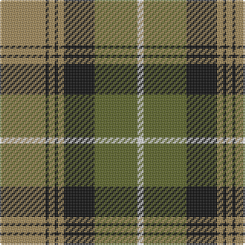

In pattern [WGKYKYKY](/stripes/wgkykyky/).

This was sourced from tartans-authority.  It is a [8 stripe tartan](/stripes/stripes8/).

Original link http://www.tartansauthority.com/tartan-ferret/display/6009/

## Also known as

This cloth is also recorded under:

- Buccleuch

## Thread count
LT/30 K2 LT4 K2 LT4 K20 G28 LN/4

## Palette
Each colour and the base-6 reference it is a variant of.

| Colour | Shade | Base |
|---|---|---|
| G | <code style="background-color:#5C6428;">#5C6428</code> `oklch(48.3% 0.084 116.0)` <small>#5C6428</small> | G <code style="background-color:#006100;">#006100</code> |
| K | <code style="background-color:#101010;">#101010</code> `oklch(17.3% 0.000 89.9)` <small>#101010</small> | K <code style="background-color:#000000;">#000000</code> |
| LN | <code style="background-color:#E0E0E0;">#E0E0E0</code> `oklch(90.7% 0.000 89.9)` <small>#E0E0E0</small> | W <code style="background-color:#F7F7F7;">#F7F7F7</code> |
| LT | <code style="background-color:#A08858;">#A08858</code> `oklch(63.7% 0.071 84.0)` <small>#A08858</small> | Y <code style="background-color:#F2BF00;">#F2BF00</code> |

# Sample pattern

## Nearest tartans

The nearest existing variants by ΔTartan distance, with this tartan at the top so the swatches line up against it.

ΔTartan

Tartan

Sett

—

<a href="/ttd/edit/#slug=lo15k1lo2k1lo2k10y14w2~x2">Buccleuch (Fashion)</a> <a class="nn-out" href="/setts/s8/lo15k1lo2k1lo2k10y14w2~x2/" title="open its dictionary page">↗</a>

0.19

<a href="/ttd/edit/#slug=lo15k1lo2k1lo2k10dy14w2~x2">Buccleuch Weavers Tartan Tartan Number: 6009. Earliest known date: pre 2003 A Fashion tartan from Marton Mills See products available Copyright © Blair Urquhart, Comrie, 2015</a> <a class="nn-out" href="/setts/s8/lo15k1lo2k1lo2k10dy14w2~x2/" title="open its dictionary page">↗</a>

0.82

<a href="/ttd/edit/#slug=g36k2g2k2g3k12t10r20~x2">Georgia, State of</a> <a class="nn-out" href="/setts/s8/g36k2g2k2g3k12t10r20~x2/" title="open its dictionary page">↗</a>

0.84

<a href="/ttd/edit/#slug=g12t6g6r15k1r1k2~x4">McCook/Cook (Name)</a> <a class="nn-out" href="/setts/s7/g12t6g6r15k1r1k2~x4/" title="open its dictionary page">↗</a>

0.84

<a href="/ttd/edit/#slug=db4o17db4g4db2g4db4g27db4ly4~x2">Cape Breton University</a> <a class="nn-out" href="/setts/s10/db4o17db4g4db2g4db4g27db4ly4~x2/" title="open its dictionary page">↗</a>

0.85

<a href="/ttd/edit/#slug=k1db1g16r16k12db8g16db1k1~x2">MacNett</a> <a class="nn-out" href="/setts/s9/k1db1g16r16k12db8g16db1k1~x2/" title="open its dictionary page">↗</a>

0.85

<a href="/ttd/edit/#slug=dp9lr4dp1lr4g15r4dp1~x4">Logan #3</a> <a class="nn-out" href="/setts/s7/dp9lr4dp1lr4g15r4dp1~x4/" title="open its dictionary page">↗</a>

0.85

<a href="/ttd/edit/#slug=r30db3r2db3r6db14g26g6">Cranston, dress</a> <a class="nn-out" href="/setts/s8/r30db3r2db3r6db14g26g6/" title="open its dictionary page">↗</a>

0.92

<a href="/ttd/edit/#slug=r15db2r1db2r3db7g13g3~x2">Cranston Dress</a> <a class="nn-out" href="/setts/s8/r15db2r1db2r3db7g13g3~x2/" title="open its dictionary page">↗</a>

0.95

<a href="/ttd/edit/#slug=p8r3ly1r3g14r3ly1~x4">Logan, with Yellow</a> <a class="nn-out" href="/setts/s7/p8r3ly1r3g14r3ly1~x4/" title="open its dictionary page">↗</a>

0.96

<a href="/ttd/edit/#slug=r16k3r16g44k3g8k3ly20k4~x2">MacMillan Society of Glasgow</a> <a class="nn-out" href="/setts/s9/r16k3r16g44k3g8k3ly20k4~x2/" title="open its dictionary page">↗</a>

## Neighbour map

Every grey dot is one of 14299 variants placed by the first two principal components of the ΔTartan feature space (44% of its variance). Red is this tartan; blue dots are its nearest — click one to open its page.

<svg viewBox="0 0 640 380" role="img" style="max-width:100%;height:auto;border:1px solid #e0e0e0;border-radius:4px;display:block" xmlns="http://www.w3.org/2000/svg"><image href="/nn/cloud.v1.png" width="640" height="380"/><a href="/setts/s8/lo15k1lo2k1lo2k10dy14w2~x2/"><circle cx="229.9" cy="169.1" r="4" fill="#3465a4"><title>Buccleuch Weavers Tartan Tartan Number: 6009. Earliest known date: pre 2003 A Fashion tartan from Marton Mills See products available Copyright © Blair Urquhart, Comrie, 2015</title></circle></a><a href="/setts/s8/g36k2g2k2g3k12t10r20~x2/"><circle cx="273.7" cy="165.5" r="4" fill="#3465a4"><title>Georgia, State of</title></circle></a><a href="/setts/s7/g12t6g6r15k1r1k2~x4/"><circle cx="249.3" cy="188.7" r="4" fill="#3465a4"><title>McCook/Cook (Name)</title></circle></a><a href="/setts/s10/db4o17db4g4db2g4db4g27db4ly4~x2/"><circle cx="251.5" cy="159.3" r="4" fill="#3465a4"><title>Cape Breton University</title></circle></a><a href="/setts/s9/k1db1g16r16k12db8g16db1k1~x2/"><circle cx="236.2" cy="177.4" r="4" fill="#3465a4"><title>MacNett</title></circle></a><a href="/setts/s7/dp9lr4dp1lr4g15r4dp1~x4/"><circle cx="211.1" cy="176.5" r="4" fill="#3465a4"><title>Logan #3</title></circle></a><a href="/setts/s8/r30db3r2db3r6db14g26g6/"><circle cx="242.7" cy="170.0" r="4" fill="#3465a4"><title>Cranston, dress</title></circle></a><a href="/setts/s8/r15db2r1db2r3db7g13g3~x2/"><circle cx="229.4" cy="169.2" r="4" fill="#3465a4"><title>Cranston Dress</title></circle></a><a href="/setts/s7/p8r3ly1r3g14r3ly1~x4/"><circle cx="239.8" cy="174.0" r="4" fill="#3465a4"><title>Logan, with Yellow</title></circle></a><a href="/setts/s9/r16k3r16g44k3g8k3ly20k4~x2/"><circle cx="237.5" cy="159.7" r="4" fill="#3465a4"><title>MacMillan Society of Glasgow</title></circle></a><circle cx="230.3" cy="168.9" r="5" fill="#c00000"/></svg>

ID: /setts/s8/lo15k1lo2k1lo2k10y14w2~x2/
