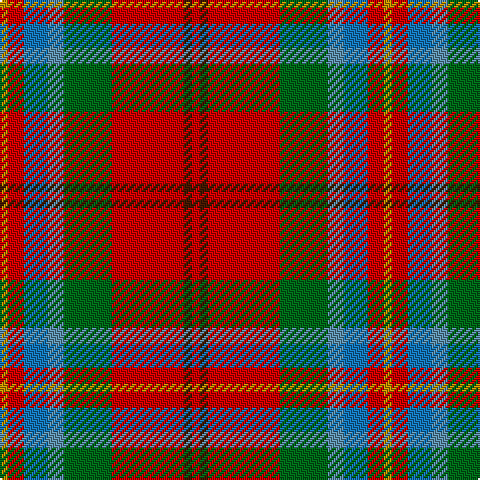

**Bands:** [RBRGBBRY](/stripes/rbrgbbry/) · **Stripes:** [R DO R G T B R LO](/stripes/stripes8/) R DO R G T B R LO

This was sourced from tartans-authority.  It is a [8 band tartan](/bands/bands8/).

Original link http://www.tartansauthority.com/tartan-ferret/display/10788/

## Thread count
DY/4 R8 Ba12 B8 G24 R36 DR4 R/4

## Palette
Each colour and its ΔE from the base-6 reference it is a variant of.

| Colour | Shade | Base | ΔE (OKLab) |
|---|---|---|---|
| B | <code style="background-color:#5C8CA8;">#5C8CA8</code> `#5C8CA8` | B <code style="background-color:#2A418A;">#2A418A</code> | 0.23 |
| Ba | <code style="background-color:#1474B4;">#1474B4</code> `#1474B4` | B <code style="background-color:#2A418A;">#2A418A</code> | 0.15 |
| DR | <code style="background-color:#441800;">#441800</code> `#441800` | B <code style="background-color:#2A418A;">#2A418A</code> | 0.23 |
| DY | <code style="background-color:#BC8C00;">#BC8C00</code> `#BC8C00` | Y <code style="background-color:#F2BF00;">#F2BF00</code> | 0.16 |
| G | <code style="background-color:#006818;">#006818</code> `#006818` | G <code style="background-color:#006100;">#006100</code> | 0.02 |
| R | <code style="background-color:#C80000;">#C80000</code> `#C80000` | R <code style="background-color:#CC0000;">#CC0000</code> | 0.01 |

# Sample pattern

## Nearest tartans

The nearest existing variants by ΔTartan distance.

1. [Pubcrawlers, The](/setts/s7/ly3o16dt5o22dg2o4w3~x2/) — ΔT 0.67
1. [Battle of Bannockburn, The](/setts/s8/ly1r2t3lg2y6r9dy1r1~x4/) — ΔT 0.91
1. [Australia Dress](/setts/s9/lr11r4y2k4y2r4y12r20t2~x2/) — ΔT 1.02
1. [Dundhuin](/setts/s6/lr6o5k2y18r28w2~x2/) — ΔT 1.18
1. [Barbour Dress](/setts/s7/o4do2o21db11w2o20r3~x2/) — ΔT 1.21
1. [Rathmore](/setts/s12/r10lb1r2n1r1n1lo1n4lb2r1lb2lo1~x8/) — ΔT 1.23
1. [Unnamed No 57](/setts/s10/r6w1r6db2r6g12ly1db8t4r4~x2/) — ΔT 1.23
1. [Moray of Abercairney](/setts/s9/db3t1k1r12r1g9r1t1db3~x4/) — ΔT 1.25
1. [Wilson's, No 2](/setts/s8/dp2r11t9dp11ly2g13r21w2~x2/) — ΔT 1.26
1. [Scottish American Soc. of Michigan](/setts/s6/r48b16lo5g17w8dy3~x2/) — ΔT 1.28

## Neighbour map

Every grey dot is one of 14313 variants placed by the first two principal components of the ΔTartan feature space (44% of its variance). Red is this tartan; blue dots are its nearest — click one to open its page.

<svg viewBox="0 0 640 380" role="img" style="max-width:100%;height:auto;border:1px solid #e0e0e0;border-radius:4px;display:block" xmlns="http://www.w3.org/2000/svg"><image href="/nn/cloud.v1.png" width="640" height="380"/><a href="/setts/s7/ly3o16dt5o22dg2o4w3~x2/"><circle cx="238.2" cy="164.4" r="4" fill="#3465a4"><title>Pubcrawlers, The</title></circle></a><a href="/setts/s8/ly1r2t3lg2y6r9dy1r1~x4/"><circle cx="224.9" cy="159.0" r="4" fill="#3465a4"><title>Battle of Bannockburn, The</title></circle></a><a href="/setts/s9/lr11r4y2k4y2r4y12r20t2~x2/"><circle cx="233.0" cy="167.0" r="4" fill="#3465a4"><title>Australia Dress</title></circle></a><a href="/setts/s6/lr6o5k2y18r28w2~x2/"><circle cx="258.2" cy="163.0" r="4" fill="#3465a4"><title>Dundhuin</title></circle></a><a href="/setts/s7/o4do2o21db11w2o20r3~x2/"><circle cx="190.0" cy="167.3" r="4" fill="#3465a4"><title>Barbour Dress</title></circle></a><a href="/setts/s12/r10lb1r2n1r1n1lo1n4lb2r1lb2lo1~x8/"><circle cx="231.1" cy="122.4" r="4" fill="#3465a4"><title>Rathmore</title></circle></a><a href="/setts/s10/r6w1r6db2r6g12ly1db8t4r4~x2/"><circle cx="177.5" cy="162.2" r="4" fill="#3465a4"><title>Unnamed No 57</title></circle></a><a href="/setts/s9/db3t1k1r12r1g9r1t1db3~x4/"><circle cx="196.9" cy="131.0" r="4" fill="#3465a4"><title>Moray of Abercairney</title></circle></a><a href="/setts/s8/dp2r11t9dp11ly2g13r21w2~x2/"><circle cx="170.9" cy="159.5" r="4" fill="#3465a4"><title>Wilson's, No 2</title></circle></a><a href="/setts/s6/r48b16lo5g17w8dy3~x2/"><circle cx="243.9" cy="140.3" r="4" fill="#3465a4"><title>Scottish American Soc. of Michigan</title></circle></a><circle cx="223.1" cy="165.8" r="5" fill="#c00000"/></svg>

ID: /setts/s8/lo1r2b3t2g6r9do1r1~x4/
