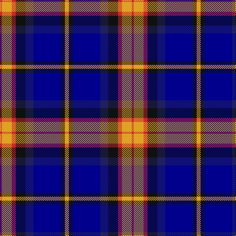

In pattern [RYRKBBKY](/stripes/ryrkbbky/).

This was sourced from register-of-tartans.  It is a [8 stripe tartan](/stripes/stripes8/).

Original link https://www.tartanregister.gov.uk/tartanDetails.aspx?ref=11036

## Register references

External register numbers recorded for this tartan.

- Scottish Register of Tartans: [11036](https://www.tartanregister.gov.uk/tartanDetails.aspx?ref=11036)

## Thread count
Y/8 K8 DB56 DBa16 K20 R8 Y20 R/4

## Palette
Each colour and the base-6 reference it is a variant of.

| Colour | Shade | Base |
|---|---|---|
| DB | <code style="background-color:#00008C;">#00008C</code> `oklch(28.9% 0.200 264.1)` <small>#00008C</small> | B <code style="background-color:#2A418A;">#2A418A</code> |
| DBa | <code style="background-color:#202060;">#202060</code> `oklch(28.9% 0.111 276.9)` <small>#202060</small> | B <code style="background-color:#2A418A;">#2A418A</code> |
| K | <code style="background-color:#101010;">#101010</code> `oklch(17.3% 0.000 89.9)` <small>#101010</small> | K <code style="background-color:#000000;">#000000</code> |
| R | <code style="background-color:#C82828;">#C82828</code> `oklch(54.2% 0.196 26.8)` <small>#C82828</small> | R <code style="background-color:#CC0000;">#CC0000</code> |
| Y | <code style="background-color:#E0A126;">#E0A126</code> `oklch(75.1% 0.146 78.3)` <small>#E0A126</small> | Y <code style="background-color:#F2BF00;">#F2BF00</code> |

# Sample pattern

## Nearest tartans

The nearest existing variants by ΔTartan distance.

1. [Lovell (2014)](/setts/s8/ly2k2db14db4k5r2ly5r1~x4/) — ΔT 0.73
1. [The Open Championship](/setts/s6/w2db15y2db20r9w2~x2/) — ΔT 0.95
1. [Ballantyne (Personal) STWR](/setts/s8/db34dy9ly3dy9y30r3y11r5/) — ΔT 1.07
1. [Scotch House 2000, antique](/setts/s8/db22r3db2r3db2k17o18dg4~x2/) — ΔT 1.08
1. [Utah State University](/setts/s11/lb7db10k7db7t7db45k21g21t4k4lb7~x2/) — ΔT 1.14
1. [Hanna of Stirlingshire (Clan)](/setts/s10/r1k1lr2k2lr2k1lr4k1db9lo1~x4/) — ΔT 1.14
1. [Sandberg of Greenock (Personal)](/setts/s8/ly3k12db1g5db12r1k2r1~x4/) — ΔT 1.15
1. [Clunie (Personal)](/setts/s6/w12db48k13o22k3ly6/) — ΔT 1.15
1. [NEWYORKER](/setts/s9/r3k1lb12k2db2k2k14lb2k2~x2/) — ΔT 1.16
1. [Banff and Buchan](/setts/s8/k17lb2k3db16t28db2t3lo2~x2/) — ΔT 1.16

## Neighbour map

Every grey dot is one of 14299 variants placed by the first two principal components of the ΔTartan feature space (44% of its variance). Red is this tartan; blue dots are its nearest — click one to open its page.

<svg viewBox="0 0 640 380" role="img" style="max-width:100%;height:auto;border:1px solid #e0e0e0;border-radius:4px;display:block" xmlns="http://www.w3.org/2000/svg"><image href="/nn/cloud.v1.png" width="640" height="380"/><a href="/setts/s8/ly2k2db14db4k5r2ly5r1~x4/"><circle cx="166.1" cy="152.9" r="4" fill="#3465a4"><title>Lovell (2014)</title></circle></a><a href="/setts/s6/w2db15y2db20r9w2~x2/"><circle cx="177.1" cy="188.2" r="4" fill="#3465a4"><title>The Open Championship</title></circle></a><a href="/setts/s8/db34dy9ly3dy9y30r3y11r5/"><circle cx="187.2" cy="174.1" r="4" fill="#3465a4"><title>Ballantyne (Personal) STWR</title></circle></a><a href="/setts/s8/db22r3db2r3db2k17o18dg4~x2/"><circle cx="167.8" cy="174.0" r="4" fill="#3465a4"><title>Scotch House 2000, antique</title></circle></a><a href="/setts/s11/lb7db10k7db7t7db45k21g21t4k4lb7~x2/"><circle cx="187.6" cy="160.3" r="4" fill="#3465a4"><title>Utah State University</title></circle></a><a href="/setts/s10/r1k1lr2k2lr2k1lr4k1db9lo1~x4/"><circle cx="148.3" cy="149.0" r="4" fill="#3465a4"><title>Hanna of Stirlingshire (Clan)</title></circle></a><a href="/setts/s8/ly3k12db1g5db12r1k2r1~x4/"><circle cx="188.2" cy="169.7" r="4" fill="#3465a4"><title>Sandberg of Greenock (Personal)</title></circle></a><a href="/setts/s6/w12db48k13o22k3ly6/"><circle cx="197.6" cy="160.5" r="4" fill="#3465a4"><title>Clunie (Personal)</title></circle></a><a href="/setts/s9/r3k1lb12k2db2k2k14lb2k2~x2/"><circle cx="170.6" cy="129.2" r="4" fill="#3465a4"><title>NEWYORKER</title></circle></a><a href="/setts/s8/k17lb2k3db16t28db2t3lo2~x2/"><circle cx="199.5" cy="156.4" r="4" fill="#3465a4"><title>Banff and Buchan</title></circle></a><circle cx="166.8" cy="157.7" r="5" fill="#c00000"/></svg>

ID: /setts/s8/lo2k2db14db4k5r2lo5r1~x4/
