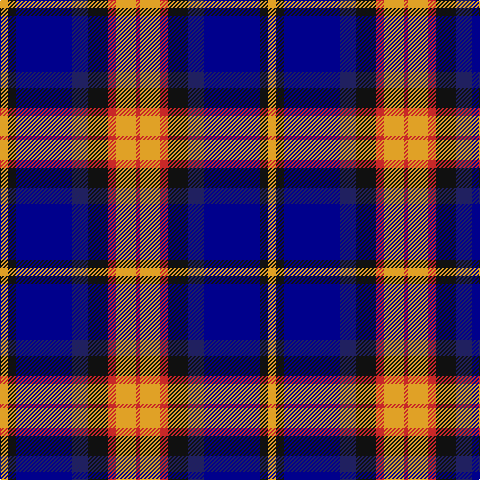

This page is one **sett** — a single exact thread-count. It belongs to the [tartan](/tartans/lo2k2dbi14db4k5r2lo5r1/)
(the same proportion at any scale), whose colour order is pattern [RYRKBBKY](/stripes/ryrkbbky/).

Sourced from register-of-tartans.  It is a [8 stripe tartan](/stripes/stripes8/).

Original link https://www.tartanregister.gov.uk/tartanDetails.aspx?ref=11036

## Register references

External register numbers recorded for this tartan.

- Scottish Register of Tartans: [11036](https://www.tartanregister.gov.uk/tartanDetails.aspx?ref=11036)

## Thread count
Y/8 K8 DB56 DBa16 K20 R8 Y20 R/4

## Palette

Palette: <strong>Tartan Register</strong>
<table><thead><tr><th>Colour</th><th>Threads</th><th>Shade</th><th>Base</th><th>OKLCh</th></tr></thead><tbody><tr><td>Y/</td><td style="text-align:right;font-variant-numeric:tabular-nums">8</td><td><code style="background-color:#E0A126;">#E0A126</code> <small style="color:#888">#E0A126</small></td><td>Y <code style="background-color:#F2BF00;">#F2BF00</code></td><td><small style="color:#888">oklch(75.1% 0.146 78.3)</small></td></tr><tr><td>K</td><td style="text-align:right;font-variant-numeric:tabular-nums">8</td><td><code style="background-color:#101010;">#101010</code> <small style="color:#888">#101010</small></td><td>K <code style="background-color:#000000;">#000000</code></td><td><small style="color:#888">oklch(17.3% 0.000 89.9)</small></td></tr><tr><td>DB</td><td style="text-align:right;font-variant-numeric:tabular-nums">56</td><td><code style="background-color:#00008C;">#00008C</code> <small style="color:#888">#00008C</small></td><td>B <code style="background-color:#2A418A;">#2A418A</code></td><td><small style="color:#888">oklch(28.9% 0.200 264.1)</small></td></tr><tr><td>DBa</td><td style="text-align:right;font-variant-numeric:tabular-nums">16</td><td><code style="background-color:#202060;">#202060</code> <small style="color:#888">#202060</small></td><td>B <code style="background-color:#2A418A;">#2A418A</code></td><td><small style="color:#888">oklch(28.9% 0.111 276.9)</small></td></tr><tr><td>K</td><td style="text-align:right;font-variant-numeric:tabular-nums">20</td><td><code style="background-color:#101010;">#101010</code> <small style="color:#888">#101010</small></td><td>K <code style="background-color:#000000;">#000000</code></td><td><small style="color:#888">oklch(17.3% 0.000 89.9)</small></td></tr><tr><td>R</td><td style="text-align:right;font-variant-numeric:tabular-nums">8</td><td><code style="background-color:#C82828;">#C82828</code> <small style="color:#888">#C82828</small></td><td>R <code style="background-color:#CC0000;">#CC0000</code></td><td><small style="color:#888">oklch(54.2% 0.196 26.8)</small></td></tr><tr><td>Y</td><td style="text-align:right;font-variant-numeric:tabular-nums">20</td><td><code style="background-color:#E0A126;">#E0A126</code> <small style="color:#888">#E0A126</small></td><td>Y <code style="background-color:#F2BF00;">#F2BF00</code></td><td><small style="color:#888">oklch(75.1% 0.146 78.3)</small></td></tr><tr><td>R/</td><td style="text-align:right;font-variant-numeric:tabular-nums">4</td><td><code style="background-color:#C82828;">#C82828</code> <small style="color:#888">#C82828</small></td><td>R <code style="background-color:#CC0000;">#CC0000</code></td><td><small style="color:#888">oklch(54.2% 0.196 26.8)</small></td></tr></tbody></table>

# Sample pattern

## Nearest tartans

The nearest existing variants by ΔTartan distance, with this tartan at the top so the swatches line up against it.

ΔTartan

Tartan

Sett

—

<a href="/ttd/edit/#slug=lo2k2dbi14db4k5r2lo5r1~x4">Lovell (2014)</a> <a class="nn-out" href="/setts/s8/lo2k2dbi14db4k5r2lo5r1~x4/" title="open its dictionary page">↗</a>

0.73

<a href="/ttd/edit/#slug=ly2k2dbi14db4k5r2ly5r1~x4">Lovell (2014)</a> <a class="nn-out" href="/setts/s8/ly2k2dbi14db4k5r2ly5r1~x4/" title="open its dictionary page">↗</a>

0.95

<a href="/ttd/edit/#slug=w2db15y2dbi20r9w2~x2">The Open Championship</a> <a class="nn-out" href="/setts/s6/w2db15y2dbi20r9w2~x2/" title="open its dictionary page">↗</a>

1.07

<a href="/ttd/edit/#slug=db34dy9ly3dy9y30r3y11r5">Ballantyne (Personal) STWR</a> <a class="nn-out" href="/setts/s8/db34dy9ly3dy9y30r3y11r5/" title="open its dictionary page">↗</a>

1.08

<a href="/ttd/edit/#slug=db22r3db2r3db2k17o18dg4~x2">Scotch House 2000, antique</a> <a class="nn-out" href="/setts/s8/db22r3db2r3db2k17o18dg4~x2/" title="open its dictionary page">↗</a>

1.14

<a href="/ttd/edit/#slug=lb7db10k7db7t7db45k21g21t4k4lb7~x2">Utah State University</a> <a class="nn-out" href="/setts/s11/lb7db10k7db7t7db45k21g21t4k4lb7~x2/" title="open its dictionary page">↗</a>

1.14

<a href="/ttd/edit/#slug=r1k1lr2k2lr2k1lr4k1db9lo1~x4">Hanna of Stirlingshire (Clan)</a> <a class="nn-out" href="/setts/s10/r1k1lr2k2lr2k1lr4k1db9lo1~x4/" title="open its dictionary page">↗</a>

1.15

<a href="/ttd/edit/#slug=ly3k12db1g5db12r1k2r1~x4">Sandberg of Greenock (Personal)</a> <a class="nn-out" href="/setts/s8/ly3k12db1g5db12r1k2r1~x4/" title="open its dictionary page">↗</a>

1.15

<a href="/ttd/edit/#slug=w12db48k13o22k3ly6">Clunie (Personal)</a> <a class="nn-out" href="/setts/s6/w12db48k13o22k3ly6/" title="open its dictionary page">↗</a>

1.15

<a href="/setts/s9/r3k1lb12k2db2k2ki14lb2ki2~x2/">NEWYORKER</a>

1.16

<a href="/ttd/edit/#slug=k17lb2k3db16t28db2t3lo2~x2">Banff and Buchan</a> <a class="nn-out" href="/setts/s8/k17lb2k3db16t28db2t3lo2~x2/" title="open its dictionary page">↗</a>

## Neighbour map

Every grey dot is one of 14359 variants placed by the first two principal components of the ΔTartan feature space (44% of its variance). Red is this tartan; blue dots are its nearest — click one to open its page.

<svg viewBox="0 0 640 380" role="img" style="max-width:100%;height:auto;border:1px solid #e0e0e0;border-radius:4px;display:block" xmlns="http://www.w3.org/2000/svg"><image href="/nn/cloud.v1.png" width="640" height="380"/><a href="/setts/s8/ly2k2dbi14db4k5r2ly5r1~x4/"><circle cx="165.7" cy="153.9" r="4" fill="#3465a4"><title>Lovell (2014)</title></circle></a><a href="/setts/s6/w2db15y2dbi20r9w2~x2/"><circle cx="176.8" cy="189.4" r="4" fill="#3465a4"><title>The Open Championship</title></circle></a><a href="/setts/s8/db34dy9ly3dy9y30r3y11r5/"><circle cx="186.8" cy="175.1" r="4" fill="#3465a4"><title>Ballantyne (Personal) STWR</title></circle></a><a href="/setts/s8/db22r3db2r3db2k17o18dg4~x2/"><circle cx="167.6" cy="175.1" r="4" fill="#3465a4"><title>Scotch House 2000, antique</title></circle></a><a href="/setts/s11/lb7db10k7db7t7db45k21g21t4k4lb7~x2/"><circle cx="187.4" cy="161.2" r="4" fill="#3465a4"><title>Utah State University</title></circle></a><a href="/setts/s10/r1k1lr2k2lr2k1lr4k1db9lo1~x4/"><circle cx="147.9" cy="150.1" r="4" fill="#3465a4"><title>Hanna of Stirlingshire (Clan)</title></circle></a><a href="/setts/s8/ly3k12db1g5db12r1k2r1~x4/"><circle cx="188.0" cy="170.7" r="4" fill="#3465a4"><title>Sandberg of Greenock (Personal)</title></circle></a><a href="/setts/s6/w12db48k13o22k3ly6/"><circle cx="197.1" cy="161.5" r="4" fill="#3465a4"><title>Clunie (Personal)</title></circle></a><a href="/setts/s9/r3k1lb12k2db2k2ki14lb2ki2~x2/"><circle cx="170.0" cy="130.2" r="4" fill="#3465a4"><title>NEWYORKER</title></circle></a><a href="/setts/s8/k17lb2k3db16t28db2t3lo2~x2/"><circle cx="199.3" cy="157.4" r="4" fill="#3465a4"><title>Banff and Buchan</title></circle></a><circle cx="166.5" cy="158.8" r="5" fill="#c00000"/></svg>

ID: /setts/s8/lo2k2dbi14db4k5r2lo5r1~x4/
