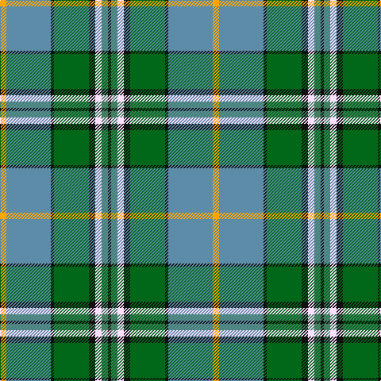

This page is one **sett** — a single exact thread-count. It belongs to the [tartan](/tartans/lo2t14k1g11k2w2g2k1/)
(the same proportion at any scale), whose colour order is pattern [KGWKGKBY](/stripes/kgwkgkby/).

Sourced from register-of-tartans.  It is a [8 stripe tartan](/stripes/stripes8/).

Original link https://www.tartanregister.gov.uk/tartanDetails.aspx?ref=2964

## Register references

External register numbers recorded for this tartan.

- Scottish Register of Tartans: [2964](https://www.tartanregister.gov.uk/tartanDetails.aspx?ref=2964)
- Scottish Tartans Authority (ITI): 2669
- Scottish Tartans World Register: 2669

## Thread count
Y/8 B56 K4 G44 K8 W8 Ga8 K/4

## Palette

Palette: <strong>Tartan Register</strong> <small style="color:#888">(4 of 6 colours)</small>
<table><thead><tr><th>Colour</th><th>Threads</th><th>Shade</th><th>Base</th><th>OKLCh</th></tr></thead><tbody><tr><td>Y/</td><td style="text-align:right;font-variant-numeric:tabular-nums">8</td><td><code style="background-color:#FFA500;">#FFA500</code> <small style="color:#888">#FFA500</small></td><td>Y <code style="background-color:#F2BF00;">#F2BF00</code></td><td><small style="color:#888">oklch(79.3% 0.171 70.7)</small></td></tr><tr><td>B</td><td style="text-align:right;font-variant-numeric:tabular-nums">56</td><td><code style="background-color:#5C8CA8;">#5C8CA8</code> <small style="color:#888">#5C8CA8</small></td><td>B <code style="background-color:#2A418A;">#2A418A</code></td><td><small style="color:#888">oklch(61.7% 0.067 235.0)</small></td></tr><tr><td>K</td><td style="text-align:right;font-variant-numeric:tabular-nums">4</td><td><code style="background-color:#101010;">#101010</code> <small style="color:#888">#101010</small></td><td>K <code style="background-color:#000000;">#000000</code></td><td><small style="color:#888">oklch(17.3% 0.000 89.9)</small></td></tr><tr><td>G</td><td style="text-align:right;font-variant-numeric:tabular-nums">44</td><td><code style="background-color:#006818;">#006818</code> <small style="color:#888">#006818</small></td><td>G <code style="background-color:#006100;">#006100</code></td><td><small style="color:#888">oklch(45.0% 0.142 145.0)</small></td></tr><tr><td>K</td><td style="text-align:right;font-variant-numeric:tabular-nums">8</td><td><code style="background-color:#101010;">#101010</code> <small style="color:#888">#101010</small></td><td>K <code style="background-color:#000000;">#000000</code></td><td><small style="color:#888">oklch(17.3% 0.000 89.9)</small></td></tr><tr><td>W</td><td style="text-align:right;font-variant-numeric:tabular-nums">8</td><td><code style="background-color:#FFE1FF;">#FFE1FF</code> <small style="color:#888">#FFE1FF</small></td><td>W <code style="background-color:#F7F7F7;">#F7F7F7</code></td><td><small style="color:#888">oklch(94.3% 0.051 326.0)</small></td></tr><tr><td>Ga</td><td style="text-align:right;font-variant-numeric:tabular-nums">8</td><td><code style="background-color:#408060;">#408060</code> <small style="color:#888">#408060</small></td><td>G <code style="background-color:#006100;">#006100</code></td><td><small style="color:#888">oklch(54.8% 0.084 160.1)</small></td></tr><tr><td>K/</td><td style="text-align:right;font-variant-numeric:tabular-nums">4</td><td><code style="background-color:#101010;">#101010</code> <small style="color:#888">#101010</small></td><td>K <code style="background-color:#000000;">#000000</code></td><td><small style="color:#888">oklch(17.3% 0.000 89.9)</small></td></tr></tbody></table>

# Sample pattern

## Nearest tartans

The nearest existing variants by ΔTartan distance, with this tartan at the top so the swatches line up against it.

ΔTartan

Tartan

Sett

—

<a href="/ttd/edit/#slug=lo2t14k1g11k2w2g2k1~x4">Mission</a> <a class="nn-out" href="/setts/s8/lo2t14k1g11k2w2g2k1~x4/" title="open its dictionary page">↗</a>

0.50

<a href="/ttd/edit/#slug=o2t14k1g11k2lr2g2k1~x4">Mission</a> <a class="nn-out" href="/setts/s8/o2t14k1g11k2lr2g2k1~x4/" title="open its dictionary page">↗</a>

0.96

<a href="/ttd/edit/#slug=b16w3b2ly4g24r2g4r5g4r2lb8~x2">Currie of Arran (Clan/family)</a> <a class="nn-out" href="/setts/s11/b16w3b2ly4g24r2g4r5g4r2lb8~x2/" title="open its dictionary page">↗</a>

0.98

<a href="/ttd/edit/#slug=w3t25k3r3k3r8g21k3k2~x2">Dunedin (USA) (District)</a> <a class="nn-out" href="/setts/s9/w3t25k3r3k3r8g21k3k2~x2/" title="open its dictionary page">↗</a>

1.00

<a href="/ttd/edit/#slug=t34r3t8db4t8k24g34k2w6">Hogg Dress (Name)</a> <a class="nn-out" href="/setts/s9/t34r3t8db4t8k24g34k2w6/" title="open its dictionary page">↗</a>

1.05

<a href="/ttd/edit/#slug=db4dg41lo4g4lo4g9r18lo4w4~x2">Gallagher Ancient</a> <a class="nn-out" href="/setts/s9/db4dg41lo4g4lo4g9r18lo4w4~x2/" title="open its dictionary page">↗</a>

1.05

<a href="/ttd/edit/#slug=g18lg6dy3w1dy3w1lt6db6~x2">Iroquois Falls Centenary</a> <a class="nn-out" href="/setts/s8/g18lg6dy3w1dy3w1lt6db6~x2/" title="open its dictionary page">↗</a>

1.07

<a href="/ttd/edit/#slug=ly1lt2n15k2lt2k2g12w2lt1~x2">Hek Family (Sunningdale, Berwick on Tweed)</a> <a class="nn-out" href="/setts/s9/ly1lt2n15k2lt2k2g12w2lt1~x2/" title="open its dictionary page">↗</a>

1.08

<a href="/ttd/edit/#slug=w3ly2g8ly2k3ly2n15k1ly2~x4">MacManus</a> <a class="nn-out" href="/setts/s9/w3ly2g8ly2k3ly2n15k1ly2~x4/" title="open its dictionary page">↗</a>

1.09

<a href="/ttd/edit/#slug=r6b2g20k3db8g2b4~x2">Royal British Legion, The</a> <a class="nn-out" href="/setts/s7/r6b2g20k3db8g2b4~x2/" title="open its dictionary page">↗</a>

1.09

<a href="/ttd/edit/#slug=db2r1db10w1o4g8ly1g2~x4">Ayrshire</a> <a class="nn-out" href="/setts/s8/db2r1db10w1o4g8ly1g2~x4/" title="open its dictionary page">↗</a>

## Neighbour map

Every grey dot is one of 14299 variants placed by the first two principal components of the ΔTartan feature space (44% of its variance). Red is this tartan; blue dots are its nearest — click one to open its page.

<svg viewBox="0 0 640 380" role="img" style="max-width:100%;height:auto;border:1px solid #e0e0e0;border-radius:4px;display:block" xmlns="http://www.w3.org/2000/svg"><image href="/nn/cloud.v1.png" width="640" height="380"/><a href="/setts/s8/o2t14k1g11k2lr2g2k1~x4/"><circle cx="174.6" cy="135.4" r="4" fill="#3465a4"><title>Mission</title></circle></a><a href="/setts/s11/b16w3b2ly4g24r2g4r5g4r2lb8~x2/"><circle cx="163.7" cy="126.4" r="4" fill="#3465a4"><title>Currie of Arran (Clan/family)</title></circle></a><a href="/setts/s9/w3t25k3r3k3r8g21k3k2~x2/"><circle cx="140.2" cy="131.2" r="4" fill="#3465a4"><title>Dunedin (USA) (District)</title></circle></a><a href="/setts/s9/t34r3t8db4t8k24g34k2w6/"><circle cx="181.6" cy="141.7" r="4" fill="#3465a4"><title>Hogg Dress (Name)</title></circle></a><a href="/setts/s9/db4dg41lo4g4lo4g9r18lo4w4~x2/"><circle cx="203.4" cy="143.4" r="4" fill="#3465a4"><title>Gallagher Ancient</title></circle></a><a href="/setts/s8/g18lg6dy3w1dy3w1lt6db6~x2/"><circle cx="146.9" cy="129.0" r="4" fill="#3465a4"><title>Iroquois Falls Centenary</title></circle></a><a href="/setts/s9/ly1lt2n15k2lt2k2g12w2lt1~x2/"><circle cx="182.4" cy="123.9" r="4" fill="#3465a4"><title>Hek Family (Sunningdale, Berwick on Tweed)</title></circle></a><a href="/setts/s9/w3ly2g8ly2k3ly2n15k1ly2~x4/"><circle cx="173.0" cy="141.1" r="4" fill="#3465a4"><title>MacManus</title></circle></a><a href="/setts/s7/r6b2g20k3db8g2b4~x2/"><circle cx="168.6" cy="164.2" r="4" fill="#3465a4"><title>Royal British Legion, The</title></circle></a><a href="/setts/s8/db2r1db10w1o4g8ly1g2~x4/"><circle cx="192.0" cy="172.5" r="4" fill="#3465a4"><title>Ayrshire</title></circle></a><circle cx="181.7" cy="136.8" r="5" fill="#c00000"/></svg>

ID: /setts/s8/lo2t14k1g11k2w2g2k1~x4/
