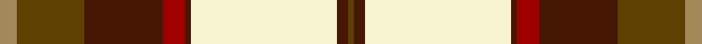

This page is one **sett** — a single exact thread-count. It belongs to the [tartan](/tartans/lo3dy12do14r4do1w26do2dy1/)
(the same proportion at any scale), whose colour order is pattern [GBWBRBGY](/stripes/gbwbrbgy/).

Sourced from register-of-tartans.  It is a [8 stripe tartan](/stripes/stripes8/).

Original link https://www.tartanregister.gov.uk/tartanDetails.aspx?ref=4159

2 attestations — the source records this cloth was collapsed from (oldest owns this page)

<ul>
<li>01/01/1978 — Turnberry (register-of-tartans, <a href="https://www.tartanregister.gov.uk/tartanDetails.aspx?ref=4159">record</a>)</li>
<li>pre 1978 — Turnberry (Fashion) (tartans-authority, <a href="http://www.tartansauthority.com/tartan-ferret/display/5088/">record</a>)</li>
</ul>

## Register references

External register numbers recorded for this tartan.

- Scottish Register of Tartans: [4159](https://www.tartanregister.gov.uk/tartanDetails.aspx?ref=4159)
- Scottish Tartans Authority (ITI): 5088

## Thread count
LT/6 T24 DR28 DRa8 DR2 LY52 DR4 T/2

## Palette

Palette: <strong>Tartan Register</strong> <small style="color:#888">(4 of 5 colours)</small>
<table><thead><tr><th>Colour</th><th>Threads</th><th>Shade</th><th>Base</th><th>OKLCh</th></tr></thead><tbody><tr><td>LT/</td><td style="text-align:right;font-variant-numeric:tabular-nums">6</td><td><code style="background-color:#A08858;">#A08858</code> <small style="color:#888">#A08858</small></td><td>Y <code style="background-color:#F2BF00;">#F2BF00</code></td><td><small style="color:#888">oklch(63.7% 0.071 84.0)</small></td></tr><tr><td>T</td><td style="text-align:right;font-variant-numeric:tabular-nums">24</td><td><code style="background-color:#604000;">#604000</code> <small style="color:#888">#604000</small></td><td>G <code style="background-color:#006100;">#006100</code></td><td><small style="color:#888">oklch(39.8% 0.083 76.8)</small></td></tr><tr><td>DR</td><td style="text-align:right;font-variant-numeric:tabular-nums">28</td><td><code style="background-color:#441800;">#441800</code> <small style="color:#888">#441800</small></td><td>B <code style="background-color:#2A418A;">#2A418A</code></td><td><small style="color:#888">oklch(27.3% 0.076 46.3)</small></td></tr><tr><td>DRa</td><td style="text-align:right;font-variant-numeric:tabular-nums">8</td><td><code style="background-color:#A00000;">#A00000</code> <small style="color:#888">#A00000</small></td><td>R <code style="background-color:#CC0000;">#CC0000</code></td><td><small style="color:#888">oklch(44.3% 0.182 29.2)</small></td></tr><tr><td>DR</td><td style="text-align:right;font-variant-numeric:tabular-nums">2</td><td><code style="background-color:#441800;">#441800</code> <small style="color:#888">#441800</small></td><td>B <code style="background-color:#2A418A;">#2A418A</code></td><td><small style="color:#888">oklch(27.3% 0.076 46.3)</small></td></tr><tr><td>LY</td><td style="text-align:right;font-variant-numeric:tabular-nums">52</td><td><code style="background-color:#F8F4D0;">#F8F4D0</code> <small style="color:#888">#F8F4D0</small></td><td>W <code style="background-color:#F7F7F7;">#F7F7F7</code></td><td><small style="color:#888">oklch(96.1% 0.047 102.0)</small></td></tr><tr><td>DR</td><td style="text-align:right;font-variant-numeric:tabular-nums">4</td><td><code style="background-color:#441800;">#441800</code> <small style="color:#888">#441800</small></td><td>B <code style="background-color:#2A418A;">#2A418A</code></td><td><small style="color:#888">oklch(27.3% 0.076 46.3)</small></td></tr><tr><td>T/</td><td style="text-align:right;font-variant-numeric:tabular-nums">2</td><td><code style="background-color:#604000;">#604000</code> <small style="color:#888">#604000</small></td><td>G <code style="background-color:#006100;">#006100</code></td><td><small style="color:#888">oklch(39.8% 0.083 76.8)</small></td></tr></tbody></table>

# Sample pattern

## Nearest tartans

The nearest existing variants by ΔTartan distance, with this tartan at the top so the swatches line up against it.

ΔTartan

Tartan

Sett

—

<a href="/ttd/edit/#slug=lo3dy12do14r4do1w26do2dy1~x2">Turnberry</a> <a class="nn-out" href="/setts/s8/lo3dy12do14r4do1w26do2dy1~x2/" title="open its dictionary page">↗</a>

1.16

<a href="/ttd/edit/#slug=g3r12g12lo5r1w25g2r1~x2">Dogwood Trade Tartan Tartan Number: 913. Earliest known date: 1968 The registered tartan of the Dinwiddie Clan. Dinwiddies are normally associated with the Maxwells, but Lord Lyon stated, in 1988, that Dinwiddies were a sept of no other clan. See products available Copyright © Blair Urquhart, Comrie, 2015</a> <a class="nn-out" href="/setts/s8/g3r12g12lo5r1w25g2r1~x2/" title="open its dictionary page">↗</a>

1.18

<a href="/ttd/edit/#slug=m50ly4w16db2w4db2w15g27r4~x2">Rosevear</a> <a class="nn-out" href="/setts/s9/m50ly4w16db2w4db2w15g27r4~x2/" title="open its dictionary page">↗</a>

1.22

<a href="/ttd/edit/#slug=g3r12g12o5r1w25g2r1~x2">Dogwood</a> <a class="nn-out" href="/setts/s8/g3r12g12o5r1w25g2r1~x2/" title="open its dictionary page">↗</a>

1.23

<a href="/ttd/edit/#slug=r50ly4w16db2w4db2w15g27r4~x2">Rosevear</a> <a class="nn-out" href="/setts/s9/r50ly4w16db2w4db2w15g27r4~x2/" title="open its dictionary page">↗</a>

1.24

<a href="/ttd/edit/#slug=r8lo44k32w2o52k7o7w3">Golden Wedding (Fashion)</a> <a class="nn-out" href="/setts/s8/r8lo44k32w2o52k7o7w3/" title="open its dictionary page">↗</a>

1.26

<a href="/ttd/edit/#slug=g22r2g4r2g4r18w24r1lo3~x2">Prince Edward Island, Dress</a> <a class="nn-out" href="/setts/s9/g22r2g4r2g4r18w24r1lo3~x2/" title="open its dictionary page">↗</a>

1.26

<a href="/ttd/edit/#slug=dg4dr14dg14o6dr1w30dg2dr1~x2">British Columbia #2</a> <a class="nn-out" href="/setts/s8/dg4dr14dg14o6dr1w30dg2dr1~x2/" title="open its dictionary page">↗</a>

1.26

<a href="/ttd/edit/#slug=dt3lo2dt30lo1w18lg30lo2lg3~x2">Bannockbane Green</a> <a class="nn-out" href="/setts/s8/dt3lo2dt30lo1w18lg30lo2lg3~x2/" title="open its dictionary page">↗</a>

1.28

<a href="/ttd/edit/#slug=dg4do10dg10o6do1w26dg2do1~x4">Dogwood</a> <a class="nn-out" href="/setts/s8/dg4do10dg10o6do1w26dg2do1~x4/" title="open its dictionary page">↗</a>

1.29

<a href="/ttd/edit/#slug=ly6r6ly6r6ly6k1db18w2db1w4~x2">Catalunya Escocia</a> <a class="nn-out" href="/setts/s10/ly6r6ly6r6ly6k1db18w2db1w4~x2/" title="open its dictionary page">↗</a>

## Neighbour map

Every grey dot is one of 14299 variants placed by the first two principal components of the ΔTartan feature space (44% of its variance). Red is this tartan; blue dots are its nearest — click one to open its page.

<svg viewBox="0 0 640 380" role="img" style="max-width:100%;height:auto;border:1px solid #e0e0e0;border-radius:4px;display:block" xmlns="http://www.w3.org/2000/svg"><image href="/nn/cloud.v1.png" width="640" height="380"/><a href="/setts/s8/g3r12g12lo5r1w25g2r1~x2/"><circle cx="223.1" cy="124.7" r="4" fill="#3465a4"><title>Dogwood Trade Tartan Tartan Number: 913. Earliest known date: 1968 The registered tartan of the Dinwiddie Clan. Dinwiddies are normally associated with the Maxwells, but Lord Lyon stated, in 1988, that Dinwiddies were a sept of no other clan. See products available Copyright © Blair Urquhart, Comrie, 2015</title></circle></a><a href="/setts/s9/m50ly4w16db2w4db2w15g27r4~x2/"><circle cx="192.4" cy="85.4" r="4" fill="#3465a4"><title>Rosevear</title></circle></a><a href="/setts/s8/g3r12g12o5r1w25g2r1~x2/"><circle cx="222.9" cy="124.9" r="4" fill="#3465a4"><title>Dogwood</title></circle></a><a href="/setts/s9/r50ly4w16db2w4db2w15g27r4~x2/"><circle cx="195.0" cy="84.7" r="4" fill="#3465a4"><title>Rosevear</title></circle></a><a href="/setts/s8/r8lo44k32w2o52k7o7w3/"><circle cx="208.4" cy="123.7" r="4" fill="#3465a4"><title>Golden Wedding (Fashion)</title></circle></a><a href="/setts/s9/g22r2g4r2g4r18w24r1lo3~x2/"><circle cx="214.3" cy="126.9" r="4" fill="#3465a4"><title>Prince Edward Island, Dress</title></circle></a><a href="/setts/s8/dg4dr14dg14o6dr1w30dg2dr1~x2/"><circle cx="215.5" cy="111.0" r="4" fill="#3465a4"><title>British Columbia #2</title></circle></a><a href="/setts/s8/dt3lo2dt30lo1w18lg30lo2lg3~x2/"><circle cx="203.1" cy="104.8" r="4" fill="#3465a4"><title>Bannockbane Green</title></circle></a><a href="/setts/s8/dg4do10dg10o6do1w26dg2do1~x4/"><circle cx="217.7" cy="118.1" r="4" fill="#3465a4"><title>Dogwood</title></circle></a><a href="/setts/s10/ly6r6ly6r6ly6k1db18w2db1w4~x2/"><circle cx="135.7" cy="116.2" r="4" fill="#3465a4"><title>Catalunya Escocia</title></circle></a><circle cx="196.8" cy="97.5" r="5" fill="#c00000"/></svg>

ID: /setts/s8/lo3dy12do14r4do1w26do2dy1~x2/
