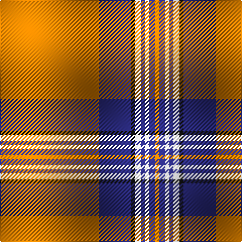

**Bands:** [YBKWBWBY](/stripes/ybkwbwby/) · **Stripes:** [LO DB K W DB W DB LO](/stripes/stripes8/) LO DB K W DB W DB LO

This was sourced from house-of-tartan.  It is a [8 band tartan](/bands/bands8/).

Original link http://www.house-of-tartan.scotland.net/house/TartanViewjs.asp?colr=Def&tnam=2395

## Variants

Other setts woven to the same stripe pattern.

- [Irn Bru](/setts/s8/lo98db32k3w6db4w4db6lo4/)

## Thread count
O/98 DB32 K4 W6 DB4 W4 DB6 O/4

## Palette
Each colour and its ΔE from the base-6 reference it is a variant of.

| Colour | Shade | Base | ΔE (OKLab) |
|---|---|---|---|
| DB | <code style="background-color:#2C2C80;">#2C2C80</code> `#2C2C80` | B <code style="background-color:#2A418A;">#2A418A</code> | 0.06 |
| K | <code style="background-color:#101010;">#101010</code> `#101010` | K <code style="background-color:#000000;">#000000</code> | 0.17 |
| O | <code style="background-color:#D87C00;">#D87C00</code> `#D87C00` | Y <code style="background-color:#F2BF00;">#F2BF00</code> | 0.17 |
| W | <code style="background-color:#FCFCFC;">#FCFCFC</code> `#FCFCFC` | W <code style="background-color:#F7F7F7;">#F7F7F7</code> | 0.01 |

# Sample pattern

## Nearest tartans

The nearest existing variants by ΔTartan distance.

1. [Irn Bru](/setts/s8/lo98db32k3w6db4w4db6lo4/) — ΔT 0.78
1. [Irn Bru (Corporate)](/setts/s8/o49db16k2w3db2w2db3o2~x2/) — ΔT 0.85
1. [Anthony Plaid Ecru](/setts/s9/lr18k1ly3k1lr2r2k2r2lr2~x4/) — ΔT 1.30
1. [Irn Bru](/setts/s8/r49b16k2w3b2w2b3r2~x2/) — ΔT 1.42
1. [Lermontov Bicentenary](/setts/s8/lo5r6k5r6lo36db3lo2k1~x2/) — ΔT 1.43
1. [Lermontov Bicentenary](/setts/s8/lo5r6k5r6lo36b3lo2k1~x2/) — ΔT 1.45
1. [Glenlivet Dress Reproduction (Corp)](/setts/s8/dy6r2dy42db2dy5w16dy5db2~x2/) — ΔT 1.56
1. [Loch Skene (Fashion)](/setts/s10/lb48dy15lo2dy3lb2dy3lo12lb8dy2lb6~x2/) — ΔT 1.59
1. [National Defense](/setts/s6/r40w2db2w2r1ly20~x2/) — ΔT 1.61
1. [Shaw of Tordarroch, Mrs (Personal)](/setts/s11/o8lb46db4lb4db4lb5y7lb7y7lb4db2~x2/) — ΔT 1.62

## Neighbour map

Every grey dot is one of 14299 variants placed by the first two principal components of the ΔTartan feature space (44% of its variance). Red is this tartan; blue dots are its nearest — click one to open its page.

<svg viewBox="0 0 640 380" role="img" style="max-width:100%;height:auto;border:1px solid #e0e0e0;border-radius:4px;display:block" xmlns="http://www.w3.org/2000/svg"><image href="/nn/cloud.v1.png" width="640" height="380"/><a href="/setts/s8/lo98db32k3w6db4w4db6lo4/"><circle cx="428.3" cy="86.1" r="4" fill="#3465a4"><title>Irn Bru</title></circle></a><a href="/setts/s8/o49db16k2w3db2w2db3o2~x2/"><circle cx="419.6" cy="98.9" r="4" fill="#3465a4"><title>Irn Bru (Corporate)</title></circle></a><a href="/setts/s9/lr18k1ly3k1lr2r2k2r2lr2~x4/"><circle cx="383.3" cy="115.6" r="4" fill="#3465a4"><title>Anthony Plaid Ecru</title></circle></a><a href="/setts/s8/r49b16k2w3b2w2b3r2~x2/"><circle cx="402.7" cy="90.2" r="4" fill="#3465a4"><title>Irn Bru</title></circle></a><a href="/setts/s8/lo5r6k5r6lo36db3lo2k1~x2/"><circle cx="437.9" cy="103.4" r="4" fill="#3465a4"><title>Lermontov Bicentenary</title></circle></a><a href="/setts/s8/lo5r6k5r6lo36b3lo2k1~x2/"><circle cx="448.2" cy="108.8" r="4" fill="#3465a4"><title>Lermontov Bicentenary</title></circle></a><a href="/setts/s8/dy6r2dy42db2dy5w16dy5db2~x2/"><circle cx="452.7" cy="136.2" r="4" fill="#3465a4"><title>Glenlivet Dress Reproduction (Corp)</title></circle></a><a href="/setts/s10/lb48dy15lo2dy3lb2dy3lo12lb8dy2lb6~x2/"><circle cx="389.6" cy="107.8" r="4" fill="#3465a4"><title>Loch Skene (Fashion)</title></circle></a><a href="/setts/s6/r40w2db2w2r1ly20~x2/"><circle cx="409.3" cy="104.2" r="4" fill="#3465a4"><title>National Defense</title></circle></a><a href="/setts/s11/o8lb46db4lb4db4lb5y7lb7y7lb4db2~x2/"><circle cx="396.7" cy="100.2" r="4" fill="#3465a4"><title>Shaw of Tordarroch, Mrs (Personal)</title></circle></a><circle cx="413.9" cy="102.6" r="5" fill="#c00000"/></svg>

ID: /setts/s8/lo49db16k2w3db2w2db3lo2~x2/
