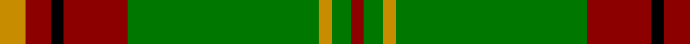

This page is one **sett** — a single exact thread-count. It belongs to the [tartan](/tartans/dy4dr4k2dr10g30dy2g3dr2/)
(the same proportion at any scale), whose colour order is pattern [RGYGRKRY](/stripes/rgygrkry/).

Sourced from register-of-tartans.  It is a [8 stripe tartan](/stripes/stripes8/).

Original link https://www.tartanregister.gov.uk/tartanDetails.aspx?ref=4890

## Register references

External register numbers recorded for this tartan.

- Scottish Register of Tartans: [4890](https://www.tartanregister.gov.uk/tartanDetails.aspx?ref=4890)
- Scottish Tartans Authority (ITI): 3666

## Thread count
DY/8 DR8 K4 DR20 G60 DY4 G6 DR/4

## Palette
Each colour and the base-6 reference it is a variant of.

| Colour | Shade | Base |
|---|---|---|
| B | <code style="background-color:#788CB4;">#788CB4</code> `oklch(63.9% 0.065 264.0)` <small>#788CB4</small> | B <code style="background-color:#2A418A;">#2A418A</code> |
| DB | <code style="background-color:#00008C;">#00008C</code> `oklch(28.9% 0.200 264.1)` <small>#00008C</small> | B <code style="background-color:#2A418A;">#2A418A</code> |
| DR | <code style="background-color:#8C0000;">#8C0000</code> `oklch(40.2% 0.165 29.2)` <small>#8C0000</small> | R <code style="background-color:#CC0000;">#CC0000</code> |
| DY | <code style="background-color:#C88C00;">#C88C00</code> `oklch(68.2% 0.142 78.2)` <small>#C88C00</small> | Y <code style="background-color:#F2BF00;">#F2BF00</code> |
| G | <code style="background-color:#007800;">#007800</code> `oklch(49.6% 0.169 142.5)` <small>#007800</small> | G <code style="background-color:#006100;">#006100</code> |
| K | <code style="background-color:#000000;">#000000</code> `oklch(0.0% 0.000 0.0)` <small>#000000</small> | K <code style="background-color:#000000;">#000000</code> |
| N | <code style="background-color:#C8C8C8;">#C8C8C8</code> `oklch(83.3% 0.000 89.9)` <small>#C8C8C8</small> | W <code style="background-color:#F7F7F7;">#F7F7F7</code> |
| P | <code style="background-color:#64008C;">#64008C</code> `oklch(38.5% 0.193 311.3)` <small>#64008C</small> | B <code style="background-color:#2A418A;">#2A418A</code> |

# Sample pattern

## Nearest tartans

The nearest existing variants by ΔTartan distance, with this tartan at the top so the swatches line up against it.

ΔTartan

Tartan

Sett

—

<a href="/ttd/edit/#slug=lo4r4k2r10g30lo2g3r2~x2">Beard</a> <a class="nn-out" href="/setts/s8/lo4r4k2r10g30lo2g3r2~x2/" title="open its dictionary page">↗</a>

1.15

<a href="/ttd/edit/#slug=g55p7r24g12db4ly3db4~x2">Crieff, and Strathearn</a> <a class="nn-out" href="/setts/s7/g55p7r24g12db4ly3db4~x2/" title="open its dictionary page">↗</a>

1.23

<a href="/ttd/edit/#slug=db3g16ly1r1w1r6g3r1g3w1~x2">Canadian Caledonian</a> <a class="nn-out" href="/setts/s10/db3g16ly1r1w1r6g3r1g3w1~x2/" title="open its dictionary page">↗</a>

1.27

<a href="/ttd/edit/#slug=ly5g3ly3g53r7db5r13w4~x2">Hall (P.I.E.) (Personal)</a> <a class="nn-out" href="/setts/s8/ly5g3ly3g53r7db5r13w4~x2/" title="open its dictionary page">↗</a>

1.30

<a href="/ttd/edit/#slug=r3k2r3g12r3w1r1g1~x4">MacCall/McCall</a> <a class="nn-out" href="/setts/s8/r3k2r3g12r3w1r1g1~x4/" title="open its dictionary page">↗</a>

1.31

<a href="/ttd/edit/#slug=g55dp7r24g12db4ly3db4~x2">Crieff and Strathearn District Tartan Tartan Number: 664. Earliest known date: 1988 A branch of the Stewart clan from Galloway and the South West of Scotland. See products available Copyright © Blair Urquhart, Comrie, 2015</a> <a class="nn-out" href="/setts/s7/g55dp7r24g12db4ly3db4~x2/" title="open its dictionary page">↗</a>

1.34

<a href="/ttd/edit/#slug=g13k1g13r1g1k1g1k1r13k1ly1k1~x3">Ulster</a> <a class="nn-out" href="/setts/s12/g13k1g13r1g1k1g1k1r13k1ly1k1~x3/" title="open its dictionary page">↗</a>

1.35

<a href="/ttd/edit/#slug=w6g5r5g45k4lo24k4g5~x2">O'Neill (Name)</a> <a class="nn-out" href="/setts/s8/w6g5r5g45k4lo24k4g5~x2/" title="open its dictionary page">↗</a>

1.36

<a href="/ttd/edit/#slug=db3g16ly1r1w1r6g3r1g3w1~x4">Canadian Caledonian</a> <a class="nn-out" href="/setts/s10/db3g16ly1r1w1r6g3r1g3w1~x4/" title="open its dictionary page">↗</a>

1.36

<a href="/ttd/edit/#slug=ly5g14dy4db4dy27g3dy4ly5~x2">Invertere (Daks #2) (Fashion)</a> <a class="nn-out" href="/setts/s8/ly5g14dy4db4dy27g3dy4ly5~x2/" title="open its dictionary page">↗</a>

1.38

<a href="/ttd/edit/#slug=g28r2g28r7lb2r7lb2r7k5dp4lb2~x2">Hynde (Sir John)</a> <a class="nn-out" href="/setts/s11/g28r2g28r7lb2r7lb2r7k5dp4lb2~x2/" title="open its dictionary page">↗</a>

## Neighbour map

Every grey dot is one of 14299 variants placed by the first two principal components of the ΔTartan feature space (44% of its variance). Red is this tartan; blue dots are its nearest — click one to open its page.

<svg viewBox="0 0 640 380" role="img" style="max-width:100%;height:auto;border:1px solid #e0e0e0;border-radius:4px;display:block" xmlns="http://www.w3.org/2000/svg"><image href="/nn/cloud.v1.png" width="640" height="380"/><a href="/setts/s7/g55p7r24g12db4ly3db4~x2/"><circle cx="358.7" cy="154.8" r="4" fill="#3465a4"><title>Crieff, and Strathearn</title></circle></a><a href="/setts/s10/db3g16ly1r1w1r6g3r1g3w1~x2/"><circle cx="340.2" cy="133.8" r="4" fill="#3465a4"><title>Canadian Caledonian</title></circle></a><a href="/setts/s8/ly5g3ly3g53r7db5r13w4~x2/"><circle cx="345.3" cy="131.6" r="4" fill="#3465a4"><title>Hall (P.I.E.) (Personal)</title></circle></a><a href="/setts/s8/r3k2r3g12r3w1r1g1~x4/"><circle cx="307.8" cy="182.7" r="4" fill="#3465a4"><title>MacCall/McCall</title></circle></a><a href="/setts/s7/g55dp7r24g12db4ly3db4~x2/"><circle cx="365.9" cy="158.0" r="4" fill="#3465a4"><title>Crieff and Strathearn District Tartan Tartan Number: 664. Earliest known date: 1988 A branch of the Stewart clan from Galloway and the South West of Scotland. See products available Copyright © Blair Urquhart, Comrie, 2015</title></circle></a><a href="/setts/s12/g13k1g13r1g1k1g1k1r13k1ly1k1~x3/"><circle cx="326.6" cy="136.1" r="4" fill="#3465a4"><title>Ulster</title></circle></a><a href="/setts/s8/w6g5r5g45k4lo24k4g5~x2/"><circle cx="299.6" cy="167.3" r="4" fill="#3465a4"><title>O'Neill (Name)</title></circle></a><a href="/setts/s10/db3g16ly1r1w1r6g3r1g3w1~x4/"><circle cx="334.4" cy="130.3" r="4" fill="#3465a4"><title>Canadian Caledonian</title></circle></a><a href="/setts/s8/ly5g14dy4db4dy27g3dy4ly5~x2/"><circle cx="278.5" cy="194.4" r="4" fill="#3465a4"><title>Invertere (Daks #2) (Fashion)</title></circle></a><a href="/setts/s11/g28r2g28r7lb2r7lb2r7k5dp4lb2~x2/"><circle cx="336.1" cy="153.6" r="4" fill="#3465a4"><title>Hynde (Sir John)</title></circle></a><circle cx="361.3" cy="165.1" r="5" fill="#c00000"/></svg>

ID: /setts/s8/lo4r4k2r10g30lo2g3r2~x2/
