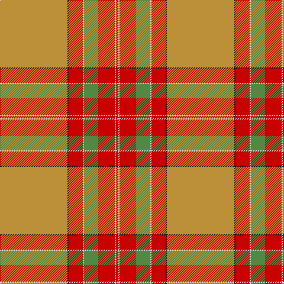

**Bands:** [RWRGWRKY](/stripes/rwrgwrky/) · **Stripes:** [R LB R G LB R K LO](/stripes/stripes8/) R LB R G LB R K LO

This was sourced from register-of-tartans.  It is a [8 band tartan](/bands/bands8/).

Original link https://www.tartanregister.gov.uk/tartanDetails.aspx?ref=2302

## Register references

External register numbers recorded for this tartan.

- Scottish Register of Tartans: [2302](https://www.tartanregister.gov.uk/tartanDetails.aspx?ref=2302)
- Scottish Tartans Authority (ITI): 6621

## Thread count
DO/114 K2 R24 LN2 LG24 R28 LN2 R/4

## Palette
Each colour and its ΔE from the base-6 reference it is a variant of.

| Colour | Shade | Base | ΔE (OKLab) |
|---|---|---|---|
| DO | <code style="background-color:#BC9038;">#BC9038</code> `#BC9038` | Y <code style="background-color:#F2BF00;">#F2BF00</code> | 0.16 |
| K | <code style="background-color:#101010;">#101010</code> `#101010` | K <code style="background-color:#000000;">#000000</code> | 0.17 |
| LG | <code style="background-color:#508844;">#508844</code> `#508844` | G <code style="background-color:#006100;">#006100</code> | 0.15 |
| LN | <code style="background-color:#D4D4D4;">#D4D4D4</code> `#D4D4D4` | W <code style="background-color:#F7F7F7;">#F7F7F7</code> | 0.11 |
| R | <code style="background-color:#C80000;">#C80000</code> `#C80000` | R <code style="background-color:#CC0000;">#CC0000</code> | 0.01 |

# Sample pattern

## Nearest tartans

The nearest existing variants by ΔTartan distance.

1. [MacByrd (Personal)](/setts/s8/o50k1r12lb1y12r14lb1r2~x4/) — ΔT 1.02
1. [Smith Hunting (Name)](/setts/s10/lo60w1r15w1lo9r15w1y9w1r15~x2/) — ΔT 1.31
1. [MacByrd (Personal)](/setts/s8/y50k1r12lb1y12r14lb1r2~x4/) — ΔT 1.67
1. [Connacht](/setts/s10/lo64g4o1g4o1g4o64dr2o2dr8~x2/) — ΔT 1.68
1. [Shenzhen (Sports)](/setts/s11/k3o29lo2o2lo4o2lo20ly1lo2ly10w3~x2/) — ΔT 2.02
1. [Australian, The](/setts/s17/t2o15lo10o4lo2k2lo2o4lo50o4lo2k2lo2o4lo10o15w2~x2/) — ΔT 2.02
1. [Down](/setts/s9/o65dr9r11o5t2lo2y5o2lo13~x2/) — ΔT 2.05
1. [Bell's Whisky](/setts/s9/r3w5dy16lo2dy1lo40w6o3r2~x4/) — ΔT 2.12
1. [Seton, hunting](/setts/s10/g6w1g12o4r4o2r4o32g1o2~x2/) — ΔT 2.15
1. [Fueglistal (Aargau) (Personal)](/setts/s9/k3o6lr13r2lr2r32lr1r2lr2~x2/) — ΔT 2.21

## Neighbour map

Every grey dot is one of 14299 variants placed by the first two principal components of the ΔTartan feature space (44% of its variance). Red is this tartan; blue dots are its nearest — click one to open its page.

<svg viewBox="0 0 640 380" role="img" style="max-width:100%;height:auto;border:1px solid #e0e0e0;border-radius:4px;display:block" xmlns="http://www.w3.org/2000/svg"><image href="/nn/cloud.v1.png" width="640" height="380"/><a href="/setts/s8/o50k1r12lb1y12r14lb1r2~x4/"><circle cx="425.8" cy="114.2" r="4" fill="#3465a4"><title>MacByrd (Personal)</title></circle></a><a href="/setts/s10/lo60w1r15w1lo9r15w1y9w1r15~x2/"><circle cx="461.8" cy="127.9" r="4" fill="#3465a4"><title>Smith Hunting (Name)</title></circle></a><a href="/setts/s8/y50k1r12lb1y12r14lb1r2~x4/"><circle cx="450.8" cy="134.1" r="4" fill="#3465a4"><title>MacByrd (Personal)</title></circle></a><a href="/setts/s10/lo64g4o1g4o1g4o64dr2o2dr8~x2/"><circle cx="409.2" cy="111.1" r="4" fill="#3465a4"><title>Connacht</title></circle></a><a href="/setts/s11/k3o29lo2o2lo4o2lo20ly1lo2ly10w3~x2/"><circle cx="303.1" cy="101.7" r="4" fill="#3465a4"><title>Shenzhen (Sports)</title></circle></a><a href="/setts/s17/t2o15lo10o4lo2k2lo2o4lo50o4lo2k2lo2o4lo10o15w2~x2/"><circle cx="417.3" cy="92.9" r="4" fill="#3465a4"><title>Australian, The</title></circle></a><a href="/setts/s9/o65dr9r11o5t2lo2y5o2lo13~x2/"><circle cx="460.0" cy="117.1" r="4" fill="#3465a4"><title>Down</title></circle></a><a href="/setts/s9/r3w5dy16lo2dy1lo40w6o3r2~x4/"><circle cx="340.0" cy="81.6" r="4" fill="#3465a4"><title>Bell's Whisky</title></circle></a><a href="/setts/s10/g6w1g12o4r4o2r4o32g1o2~x2/"><circle cx="464.4" cy="157.6" r="4" fill="#3465a4"><title>Seton, hunting</title></circle></a><a href="/setts/s9/k3o6lr13r2lr2r32lr1r2lr2~x2/"><circle cx="413.3" cy="112.3" r="4" fill="#3465a4"><title>Fueglistal (Aargau) (Personal)</title></circle></a><circle cx="442.4" cy="104.9" r="5" fill="#c00000"/></svg>

ID: /setts/s8/lo57k1r12lb1g12r14lb1r2~x2/
