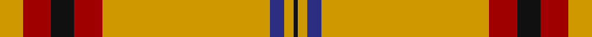

In pattern [KYBYRKRY](/stripes/kybyrkry/).

This was sourced from tartans-authority.  It is a [8 stripe tartan](/stripes/stripes8/).

Original link http://www.tartansauthority.com/tartan-ferret/display/11000/

## Thread count
DY/10 DR12 K10 DR12 DY72 DB6 DY4 K/2

## Palette
Each colour and the base-6 reference it is a variant of.

| Colour | Shade | Base |
|---|---|---|
| DB | <code style="background-color:#2C2C80;">#2C2C80</code> `oklch(35.0% 0.138 276.6)` <small>#2C2C80</small> | B <code style="background-color:#2A418A;">#2A418A</code> |
| DR | <code style="background-color:#A00000;">#A00000</code> `oklch(44.3% 0.182 29.2)` <small>#A00000</small> | R <code style="background-color:#CC0000;">#CC0000</code> |
| DY | <code style="background-color:#D09800;">#D09800</code> `oklch(71.4% 0.147 82.1)` <small>#D09800</small> | Y <code style="background-color:#F2BF00;">#F2BF00</code> |
| K | <code style="background-color:#101010;">#101010</code> `oklch(17.3% 0.000 89.9)` <small>#101010</small> | K <code style="background-color:#000000;">#000000</code> |

# Sample pattern

## Nearest tartans

The nearest existing variants by ΔTartan distance, with this tartan at the top so the swatches line up against it.

ΔTartan

Tartan

Sett

—

<a href="/ttd/edit/#slug=lo5r6k5r6lo36db3lo2k1~x2">Lermontov Bicentenary</a> <a class="nn-out" href="/setts/s8/lo5r6k5r6lo36db3lo2k1~x2/" title="open its dictionary page">↗</a>

0.37

<a href="/ttd/edit/#slug=lo5r6k5r6lo36b3lo2k1~x2">Lermontov Bicentenary</a> <a class="nn-out" href="/setts/s8/lo5r6k5r6lo36b3lo2k1~x2/" title="open its dictionary page">↗</a>

1.22

<a href="/ttd/edit/#slug=lo98db32k3w6db4w4db6lo4">Irn Bru</a> <a class="nn-out" href="/setts/s8/lo98db32k3w6db4w4db6lo4/" title="open its dictionary page">↗</a>

1.34

<a href="/ttd/edit/#slug=r36g18r4g6k1w2~x2">MacGregor</a> <a class="nn-out" href="/setts/s6/r36g18r4g6k1w2~x2/" title="open its dictionary page">↗</a>

1.40

<a href="/ttd/edit/#slug=r57g21r8g8k1w3~x2">MacGregor - 1800 (Clan)</a> <a class="nn-out" href="/setts/s6/r57g21r8g8k1w3~x2/" title="open its dictionary page">↗</a>

1.43

<a href="/ttd/edit/#slug=lo49db16k2w3db2w2db3lo2~x2">Irn Bru Corporate Tartan Tartan Number: 2395. Earliest known date: Sep 1998 Irn Bru (Iron Brew) was first produced in 1901 by A.G. Barr and has been Scotland's favourite fizzy drink ever since. The colours are based on the brand label. Irn Bru was famously advertised on TV as 'being made in Scotland . . . from GIRDERS!&quot; which was the subject of a complaint to the Advertising Standards Authority because it was 'untrue' !!! See products available Copyright © Blair Urquhart, Comrie, 2015</a> <a class="nn-out" href="/setts/s8/lo49db16k2w3db2w2db3lo2~x2/" title="open its dictionary page">↗</a>

1.47

<a href="/ttd/edit/#slug=r40w2db2w2r1ly20~x2">National Defense</a> <a class="nn-out" href="/setts/s6/r40w2db2w2r1ly20~x2/" title="open its dictionary page">↗</a>

1.49

<a href="/ttd/edit/#slug=g10r4g46r69k2w6">Colchester &amp; District Pipes &amp; Drums</a> <a class="nn-out" href="/setts/s6/g10r4g46r69k2w6/" title="open its dictionary page">↗</a>

1.53

<a href="/ttd/edit/#slug=r4g4w3g4r4g14r28k1r3g4~x2">Scott - 1842 (Clan)</a> <a class="nn-out" href="/setts/s10/r4g4w3g4r4g14r28k1r3g4~x2/" title="open its dictionary page">↗</a>

1.54

<a href="/ttd/edit/#slug=r4g24r6g4r4g6r44g1w4~x2">Baluch Regiment</a> <a class="nn-out" href="/setts/s9/r4g24r6g4r4g6r44g1w4~x2/" title="open its dictionary page">↗</a>

1.56

<a href="/ttd/edit/#slug=r41g19r7g8k1w3~x2">MacGregor #4</a> <a class="nn-out" href="/setts/s6/r41g19r7g8k1w3~x2/" title="open its dictionary page">↗</a>

## Neighbour map

Every grey dot is one of 14299 variants placed by the first two principal components of the ΔTartan feature space (44% of its variance). Red is this tartan; blue dots are its nearest — click one to open its page.

<svg viewBox="0 0 640 380" role="img" style="max-width:100%;height:auto;border:1px solid #e0e0e0;border-radius:4px;display:block" xmlns="http://www.w3.org/2000/svg"><image href="/nn/cloud.v1.png" width="640" height="380"/><a href="/setts/s8/lo5r6k5r6lo36b3lo2k1~x2/"><circle cx="448.2" cy="108.8" r="4" fill="#3465a4"><title>Lermontov Bicentenary</title></circle></a><a href="/setts/s8/lo98db32k3w6db4w4db6lo4/"><circle cx="428.3" cy="86.1" r="4" fill="#3465a4"><title>Irn Bru</title></circle></a><a href="/setts/s6/r36g18r4g6k1w2~x2/"><circle cx="422.3" cy="138.7" r="4" fill="#3465a4"><title>MacGregor</title></circle></a><a href="/setts/s6/r57g21r8g8k1w3~x2/"><circle cx="478.8" cy="120.5" r="4" fill="#3465a4"><title>MacGregor - 1800 (Clan)</title></circle></a><a href="/setts/s8/lo49db16k2w3db2w2db3lo2~x2/"><circle cx="413.9" cy="102.6" r="4" fill="#3465a4"><title>Irn Bru Corporate Tartan Tartan Number: 2395. Earliest known date: Sep 1998 Irn Bru (Iron Brew) was first produced in 1901 by A.G. Barr and has been Scotland's favourite fizzy drink ever since. The colours are based on the brand label. Irn Bru was famously advertised on TV as 'being made in Scotland . . . from GIRDERS!&quot; which was the subject of a complaint to the Advertising Standards Authority because it was 'untrue' !!! See products available Copyright © Blair Urquhart, Comrie, 2015</title></circle></a><a href="/setts/s6/r40w2db2w2r1ly20~x2/"><circle cx="409.3" cy="104.2" r="4" fill="#3465a4"><title>National Defense</title></circle></a><a href="/setts/s6/g10r4g46r69k2w6/"><circle cx="379.0" cy="129.0" r="4" fill="#3465a4"><title>Colchester &amp; District Pipes &amp; Drums</title></circle></a><a href="/setts/s10/r4g4w3g4r4g14r28k1r3g4~x2/"><circle cx="381.8" cy="123.4" r="4" fill="#3465a4"><title>Scott - 1842 (Clan)</title></circle></a><a href="/setts/s9/r4g24r6g4r4g6r44g1w4~x2/"><circle cx="449.0" cy="121.8" r="4" fill="#3465a4"><title>Baluch Regiment</title></circle></a><a href="/setts/s6/r41g19r7g8k1w3~x2/"><circle cx="428.4" cy="137.8" r="4" fill="#3465a4"><title>MacGregor #4</title></circle></a><circle cx="437.9" cy="103.4" r="5" fill="#c00000"/></svg>

ID: /setts/s8/lo5r6k5r6lo36db3lo2k1~x2/
