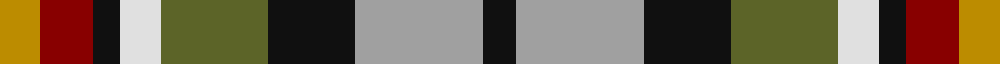

**Bands:** [KYKGWKRY](/stripes/kykgwkry/) · **Stripes:** [K LR K Y W K R LO](/stripes/stripes8/) K LR K Y W K R LO

This was sourced from tartans-authority.  It is a [8 band tartan](/bands/bands8/).

Original link http://www.tartansauthority.com/tartan-ferret/display/7405/

## Also known as

This cloth is also recorded under:

- Kilkenny County, Crest Range

## Attestations

This cloth appears in 2 source records; the oldest owns this page.

- 2004 — Kilkenny County Crest (Fashion) (tartans-authority, [record](http://www.tartansauthority.com/tartan-ferret/display/7405/))
- 01/05/2005 — Kilkenny County, Crest Range (register-of-tartans, [record](https://www.tartanregister.gov.uk/tartanDetails.aspx?ref=5363))

## Register references

External register numbers recorded for this tartan.

- Scottish Register of Tartans: [5363](https://www.tartanregister.gov.uk/tartanDetails.aspx?ref=5363)
- Scottish Tartans Authority (ITI): 7405
- Scottish Tartans World Register: 3088

## Thread count
DY/12 DR16 K8 LN12 G32 K26 N38 K/10

## Palette
Each colour and its ΔE from the base-6 reference it is a variant of.

| Colour | Shade | Base | ΔE (OKLab) |
|---|---|---|---|
| DR | <code style="background-color:#880000;">#880000</code> `#880000` | R <code style="background-color:#CC0000;">#CC0000</code> | 0.15 |
| DY | <code style="background-color:#BC8C00;">#BC8C00</code> `#BC8C00` | Y <code style="background-color:#F2BF00;">#F2BF00</code> | 0.16 |
| G | <code style="background-color:#5C6428;">#5C6428</code> `#5C6428` | G <code style="background-color:#006100;">#006100</code> | 0.10 |
| K | <code style="background-color:#101010;">#101010</code> `#101010` | K <code style="background-color:#000000;">#000000</code> | 0.17 |
| LN | <code style="background-color:#E0E0E0;">#E0E0E0</code> `#E0E0E0` | W <code style="background-color:#F7F7F7;">#F7F7F7</code> | 0.07 |
| N | <code style="background-color:#A0A0A0;">#A0A0A0</code> `#A0A0A0` | Y <code style="background-color:#F2BF00;">#F2BF00</code> | 0.21 |

# Sample pattern

## Nearest tartans

The nearest existing variants by ΔTartan distance.

1. [Isle of Arran (Personal)](/setts/s9/r1lo4dr3r1dr3lr1g3db3lr1~x4/) — ΔT 0.73
1. [Alabama (Fashion)](/setts/s7/r3lb8k9g16r12n12lo3~x2/) — ΔT 0.88
1. [Tipperary County Crest (Fashion)](/setts/s9/r10lr36k24r30lo8k16w18db16lo9/) — ΔT 0.89
1. [Belwade](/setts/s11/db4g4db4w1db1w1m4lo4w1g4m4~x4/) — ΔT 0.95
1. [Somerset #2](/setts/s8/dg14lb14db12lr8dy3k3dy3k5~x2/) — ΔT 1.01
1. [Eusa](/setts/s7/k16ly16r16g3db7w7k7~x2/) — ΔT 1.02
1. [Devon Rural Skills Trust](/setts/s8/w5y4b1y4r4b1dg4ly1~x2/) — ΔT 1.05
1. [Bhutan](/setts/s9/m3lb2db6lb2dr8lo2g6lo2m2~x2/) — ΔT 1.05
1. [Mekos, The](/setts/s6/dy19g23ly3db15r11w5~x2/) — ΔT 1.09
1. [Caledonian Labrador Retrievers](/setts/s8/m21lg4do5lg4m5k21g21lo5~x2/) — ΔT 1.11

## Neighbour map

Every grey dot is one of 14299 variants placed by the first two principal components of the ΔTartan feature space (44% of its variance). Red is this tartan; blue dots are its nearest — click one to open its page.

<svg viewBox="0 0 640 380" role="img" style="max-width:100%;height:auto;border:1px solid #e0e0e0;border-radius:4px;display:block" xmlns="http://www.w3.org/2000/svg"><image href="/nn/cloud.v1.png" width="640" height="380"/><a href="/setts/s9/r1lo4dr3r1dr3lr1g3db3lr1~x4/"><circle cx="16.4" cy="210.6" r="4" fill="#3465a4"><title>Isle of Arran (Personal)</title></circle></a><a href="/setts/s7/r3lb8k9g16r12n12lo3~x2/"><circle cx="25.7" cy="217.5" r="4" fill="#3465a4"><title>Alabama (Fashion)</title></circle></a><a href="/setts/s9/r10lr36k24r30lo8k16w18db16lo9/"><circle cx="14.0" cy="200.8" r="4" fill="#3465a4"><title>Tipperary County Crest (Fashion)</title></circle></a><a href="/setts/s11/db4g4db4w1db1w1m4lo4w1g4m4~x4/"><circle cx="14.0" cy="205.4" r="4" fill="#3465a4"><title>Belwade</title></circle></a><a href="/setts/s8/dg14lb14db12lr8dy3k3dy3k5~x2/"><circle cx="14.0" cy="201.5" r="4" fill="#3465a4"><title>Somerset #2</title></circle></a><a href="/setts/s7/k16ly16r16g3db7w7k7~x2/"><circle cx="25.6" cy="198.3" r="4" fill="#3465a4"><title>Eusa</title></circle></a><a href="/setts/s8/w5y4b1y4r4b1dg4ly1~x2/"><circle cx="44.9" cy="202.9" r="4" fill="#3465a4"><title>Devon Rural Skills Trust</title></circle></a><a href="/setts/s9/m3lb2db6lb2dr8lo2g6lo2m2~x2/"><circle cx="14.0" cy="199.0" r="4" fill="#3465a4"><title>Bhutan</title></circle></a><a href="/setts/s6/dy19g23ly3db15r11w5~x2/"><circle cx="70.6" cy="205.9" r="4" fill="#3465a4"><title>Mekos, The</title></circle></a><a href="/setts/s8/m21lg4do5lg4m5k21g21lo5~x2/"><circle cx="64.6" cy="188.8" r="4" fill="#3465a4"><title>Caledonian Labrador Retrievers</title></circle></a><circle cx="20.9" cy="203.2" r="5" fill="#c00000"/></svg>

ID: /setts/s8/lo6r8k4w6y16k13lr19k5~x2/
