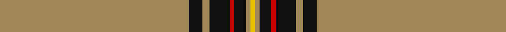

This page is one **sett** — a single exact thread-count. It belongs to the [tartan](/tartans/lo83k6lo3k9r2k5lo2ly2/)
(the same proportion at any scale), whose colour order is pattern [YKYKRKYY](/stripes/ykykrkyy/).

Sourced from register-of-tartans.  It is a [8 stripe tartan](/stripes/stripes8/).

Original link https://www.tartanregister.gov.uk/tartanDetails.aspx?ref=793

## Also known as

This cloth is also recorded under:

- Crane of Cluny Hunting

2 attestations — the source records this cloth was collapsed from (oldest owns this page)

<ul>
<li>01/05/2003 — Crane of Cluny Hunting (Personal) (register-of-tartans, <a href="https://www.tartanregister.gov.uk/tartanDetails.aspx?ref=793">record</a>)</li>
<li>pre 2004 — Crane of Cluny Htg (Personal) (tartans-authority, <a href="http://www.tartansauthority.com/tartan-ferret/display/6143/">record</a>)</li>
</ul>

## Register references

External register numbers recorded for this tartan.

- Scottish Register of Tartans: [793](https://www.tartanregister.gov.uk/tartanDetails.aspx?ref=793)
- Scottish Tartans Authority (ITI): 6143
- Scottish Tartans World Register: 2960

## Thread count
LT/166 K12 LT6 K18 R4 K10 LT4 Y/4

## Palette

Palette: <strong>Tartan Register</strong>
<table><thead><tr><th>Colour</th><th>Threads</th><th>Shade</th><th>Base</th><th>OKLCh</th></tr></thead><tbody><tr><td>LT/</td><td style="text-align:right;font-variant-numeric:tabular-nums">166</td><td><code style="background-color:#A08858;">#A08858</code> <small style="color:#888">#A08858</small></td><td>Y <code style="background-color:#F2BF00;">#F2BF00</code></td><td><small style="color:#888">oklch(63.7% 0.071 84.0)</small></td></tr><tr><td>K</td><td style="text-align:right;font-variant-numeric:tabular-nums">12</td><td><code style="background-color:#101010;">#101010</code> <small style="color:#888">#101010</small></td><td>K <code style="background-color:#000000;">#000000</code></td><td><small style="color:#888">oklch(17.3% 0.000 89.9)</small></td></tr><tr><td>LT</td><td style="text-align:right;font-variant-numeric:tabular-nums">6</td><td><code style="background-color:#A08858;">#A08858</code> <small style="color:#888">#A08858</small></td><td>Y <code style="background-color:#F2BF00;">#F2BF00</code></td><td><small style="color:#888">oklch(63.7% 0.071 84.0)</small></td></tr><tr><td>K</td><td style="text-align:right;font-variant-numeric:tabular-nums">18</td><td><code style="background-color:#101010;">#101010</code> <small style="color:#888">#101010</small></td><td>K <code style="background-color:#000000;">#000000</code></td><td><small style="color:#888">oklch(17.3% 0.000 89.9)</small></td></tr><tr><td>R</td><td style="text-align:right;font-variant-numeric:tabular-nums">4</td><td><code style="background-color:#C80000;">#C80000</code> <small style="color:#888">#C80000</small></td><td>R <code style="background-color:#CC0000;">#CC0000</code></td><td><small style="color:#888">oklch(52.3% 0.215 29.2)</small></td></tr><tr><td>K</td><td style="text-align:right;font-variant-numeric:tabular-nums">10</td><td><code style="background-color:#101010;">#101010</code> <small style="color:#888">#101010</small></td><td>K <code style="background-color:#000000;">#000000</code></td><td><small style="color:#888">oklch(17.3% 0.000 89.9)</small></td></tr><tr><td>LT</td><td style="text-align:right;font-variant-numeric:tabular-nums">4</td><td><code style="background-color:#A08858;">#A08858</code> <small style="color:#888">#A08858</small></td><td>Y <code style="background-color:#F2BF00;">#F2BF00</code></td><td><small style="color:#888">oklch(63.7% 0.071 84.0)</small></td></tr><tr><td>Y/</td><td style="text-align:right;font-variant-numeric:tabular-nums">4</td><td><code style="background-color:#E8C000;">#E8C000</code> <small style="color:#888">#E8C000</small></td><td>Y <code style="background-color:#F2BF00;">#F2BF00</code></td><td><small style="color:#888">oklch(81.9% 0.168 93.7)</small></td></tr></tbody></table>

# Sample pattern

## Nearest tartans

The nearest existing variants by ΔTartan distance, with this tartan at the top so the swatches line up against it.

ΔTartan

Tartan

Sett

—

<a href="/ttd/edit/#slug=lo83k6lo3k9r2k5lo2ly2~x2">Crane of Cluny Hunting (Personal)</a> <a class="nn-out" href="/setts/s8/lo83k6lo3k9r2k5lo2ly2~x2/" title="open its dictionary page">↗</a>

1.33

<a href="/ttd/edit/#slug=w2lo44db8lo2db2lo3r1~x2">Reece (Name)</a> <a class="nn-out" href="/setts/s7/w2lo44db8lo2db2lo3r1~x2/" title="open its dictionary page">↗</a>

1.74

<a href="/ttd/edit/#slug=dy2lb2lo4dy5lo5dy46lo7dy1w2~x2">KIltwalk, The (Corporate)</a> <a class="nn-out" href="/setts/s9/dy2lb2lo4dy5lo5dy46lo7dy1w2~x2/" title="open its dictionary page">↗</a>

1.84

<a href="/ttd/edit/#slug=dy6r2dy42db2dy5w16dy5db2~x2">Glenlivet Dress Reproduction (Corp)</a> <a class="nn-out" href="/setts/s8/dy6r2dy42db2dy5w16dy5db2~x2/" title="open its dictionary page">↗</a>

1.90

<a href="/ttd/edit/#slug=n140k3w16k3do16k3do16">Crail</a> <a class="nn-out" href="/setts/s7/n140k3w16k3do16k3do16/" title="open its dictionary page">↗</a>

2.01

<a href="/ttd/edit/#slug=w3k5lo3r3lo32k2lo3~x2">Bro-Dreger</a> <a class="nn-out" href="/setts/s7/w3k5lo3r3lo32k2lo3~x2/" title="open its dictionary page">↗</a>

2.12

<a href="/ttd/edit/#slug=r4dp12g2dp2g46w1~x2">Kinfauns Castle (Corporate)</a> <a class="nn-out" href="/setts/s6/r4dp12g2dp2g46w1~x2/" title="open its dictionary page">↗</a>

2.17

<a href="/ttd/edit/#slug=y24y1k9y1y9y2w2db2~x2">Gairloch</a> <a class="nn-out" href="/setts/s8/y24y1k9y1y9y2w2db2~x2/" title="open its dictionary page">↗</a>

2.20

<a href="/ttd/edit/#slug=w16dy5db2dy42r2dy6r2dy42db2dy5w16dy5db2dy5~x2">Glenlivet Dress Reproduction</a> <a class="nn-out" href="/setts/s14/w16dy5db2dy42r2dy6r2dy42db2dy5w16dy5db2dy5~x2/" title="open its dictionary page">↗</a>

2.21

<a href="/ttd/edit/#slug=db6db3ly3db2ly3db4ly48db4">Morris (Welsh Name)</a> <a class="nn-out" href="/setts/s8/db6db3ly3db2ly3db4ly48db4/" title="open its dictionary page">↗</a>

2.21

<a href="/ttd/edit/#slug=ly6dy14db10dy58g3dy8w2">Kozmyk (Corporate)</a> <a class="nn-out" href="/setts/s7/ly6dy14db10dy58g3dy8w2/" title="open its dictionary page">↗</a>

## Neighbour map

Every grey dot is one of 14299 variants placed by the first two principal components of the ΔTartan feature space (44% of its variance). Red is this tartan; blue dots are its nearest — click one to open its page.

<svg viewBox="0 0 640 380" role="img" style="max-width:100%;height:auto;border:1px solid #e0e0e0;border-radius:4px;display:block" xmlns="http://www.w3.org/2000/svg"><image href="/nn/cloud.v1.png" width="640" height="380"/><a href="/setts/s7/w2lo44db8lo2db2lo3r1~x2/"><circle cx="589.6" cy="118.6" r="4" fill="#3465a4"><title>Reece (Name)</title></circle></a><a href="/setts/s9/dy2lb2lo4dy5lo5dy46lo7dy1w2~x2/"><circle cx="551.2" cy="113.8" r="4" fill="#3465a4"><title>KIltwalk, The (Corporate)</title></circle></a><a href="/setts/s8/dy6r2dy42db2dy5w16dy5db2~x2/"><circle cx="452.7" cy="136.2" r="4" fill="#3465a4"><title>Glenlivet Dress Reproduction (Corp)</title></circle></a><a href="/setts/s7/n140k3w16k3do16k3do16/"><circle cx="502.6" cy="111.6" r="4" fill="#3465a4"><title>Crail</title></circle></a><a href="/setts/s7/w3k5lo3r3lo32k2lo3~x2/"><circle cx="469.3" cy="144.3" r="4" fill="#3465a4"><title>Bro-Dreger</title></circle></a><a href="/setts/s6/r4dp12g2dp2g46w1~x2/"><circle cx="518.5" cy="140.9" r="4" fill="#3465a4"><title>Kinfauns Castle (Corporate)</title></circle></a><a href="/setts/s8/y24y1k9y1y9y2w2db2~x2/"><circle cx="471.5" cy="147.0" r="4" fill="#3465a4"><title>Gairloch</title></circle></a><a href="/setts/s14/w16dy5db2dy42r2dy6r2dy42db2dy5w16dy5db2dy5~x2/"><circle cx="437.8" cy="114.3" r="4" fill="#3465a4"><title>Glenlivet Dress Reproduction</title></circle></a><a href="/setts/s8/db6db3ly3db2ly3db4ly48db4/"><circle cx="473.4" cy="113.0" r="4" fill="#3465a4"><title>Morris (Welsh Name)</title></circle></a><a href="/setts/s7/ly6dy14db10dy58g3dy8w2/"><circle cx="548.9" cy="148.0" r="4" fill="#3465a4"><title>Kozmyk (Corporate)</title></circle></a><circle cx="561.7" cy="93.1" r="5" fill="#c00000"/></svg>

ID: /setts/s8/lo83k6lo3k9r2k5lo2ly2~x2/
