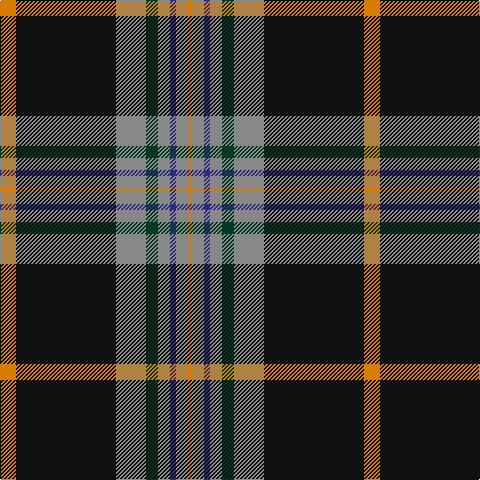

In pattern [YKRGRBRY](/stripes/ykrgrbry/).

This was sourced from tartans-authority.  It is a [8 stripe tartan](/stripes/stripes8/).

Original link http://www.tartansauthority.com/tartan-ferret/display/3175/

## Thread count
O/16 K100 N30 DG12 N12 DB6 N12 O/4

## Palette
Each colour and the base-6 reference it is a variant of.

| Colour | Shade | Base |
|---|---|---|
| DB | <code style="background-color:#2C2C80;">#2C2C80</code> `oklch(35.0% 0.138 276.6)` <small>#2C2C80</small> | B <code style="background-color:#2A418A;">#2A418A</code> |
| DG | <code style="background-color:#003820;">#003820</code> `oklch(30.0% 0.070 158.3)` <small>#003820</small> | G <code style="background-color:#006100;">#006100</code> |
| K | <code style="background-color:#101010;">#101010</code> `oklch(17.3% 0.000 89.9)` <small>#101010</small> | K <code style="background-color:#000000;">#000000</code> |
| N | <code style="background-color:#888888;">#888888</code> `oklch(62.7% 0.000 89.9)` <small>#888888</small> | R <code style="background-color:#CC0000;">#CC0000</code> |
| O | <code style="background-color:#D87C00;">#D87C00</code> `oklch(67.3% 0.155 61.8)` <small>#D87C00</small> | Y <code style="background-color:#F2BF00;">#F2BF00</code> |

# Sample pattern

## Nearest tartans

The nearest existing variants by ΔTartan distance, with this tartan at the top so the swatches line up against it.

ΔTartan

Tartan

Sett

—

<a href="/ttd/edit/#slug=lo8k50o15dg6o6db3o6lo2~x2">Royal College of G.P.s (Corporate)</a> <a class="nn-out" href="/setts/s8/lo8k50o15dg6o6db3o6lo2~x2/" title="open its dictionary page">↗</a>

0.95

<a href="/ttd/edit/#slug=r6k1w4k4n15r1k35o2~x2">Distripress (Corporate)</a> <a class="nn-out" href="/setts/s8/r6k1w4k4n15r1k35o2~x2/" title="open its dictionary page">↗</a>

0.98

<a href="/ttd/edit/#slug=w10db2w1db35dg10lo3dg10r4~x2">Sandelin #2 (Personal)</a> <a class="nn-out" href="/setts/s8/w10db2w1db35dg10lo3dg10r4~x2/" title="open its dictionary page">↗</a>

1.03

<a href="/ttd/edit/#slug=w3dt1k14dt2k1g6k1dt30lo3~x2">Bro-Kerne</a> <a class="nn-out" href="/setts/s9/w3dt1k14dt2k1g6k1dt30lo3~x2/" title="open its dictionary page">↗</a>

1.03

<a href="/ttd/edit/#slug=k4dt16k3dt3k32lo7k3r10k2w4~x2">Model T Ford (Corporate)</a> <a class="nn-out" href="/setts/s10/k4dt16k3dt3k32lo7k3r10k2w4~x2/" title="open its dictionary page">↗</a>

1.04

<a href="/ttd/edit/#slug=k76dt11k3ly6k3dt13k11o76">Kunbi</a> <a class="nn-out" href="/setts/s8/k76dt11k3ly6k3dt13k11o76/" title="open its dictionary page">↗</a>

1.08

<a href="/ttd/edit/#slug=r6dt4w2g27dt37ly2~x2">Highlands of Durham (Corporate)</a> <a class="nn-out" href="/setts/s6/r6dt4w2g27dt37ly2~x2/" title="open its dictionary page">↗</a>

1.09

<a href="/ttd/edit/#slug=r8lg9dp3ly1dp1ly2dp2k32dp3~x2">Gedling, Peter (Personal)</a> <a class="nn-out" href="/setts/s9/r8lg9dp3ly1dp1ly2dp2k32dp3~x2/" title="open its dictionary page">↗</a>

1.11

<a href="/ttd/edit/#slug=r4k32dg18k1w2k1dg4m4~x2">Hot Boontjie</a> <a class="nn-out" href="/setts/s8/r4k32dg18k1w2k1dg4m4~x2/" title="open its dictionary page">↗</a>

1.13

<a href="/ttd/edit/#slug=b9w2dg30o6r2o2r2o6~x2">Ware/Warr (Name)</a> <a class="nn-out" href="/setts/s8/b9w2dg30o6r2o2r2o6~x2/" title="open its dictionary page">↗</a>

1.15

<a href="/ttd/edit/#slug=db64k11r2k4r2k4g32y4~x2">Sinclair-Brown</a> <a class="nn-out" href="/setts/s8/db64k11r2k4r2k4g32y4~x2/" title="open its dictionary page">↗</a>

## Neighbour map

Every grey dot is one of 14299 variants placed by the first two principal components of the ΔTartan feature space (44% of its variance). Red is this tartan; blue dots are its nearest — click one to open its page.

<svg viewBox="0 0 640 380" role="img" style="max-width:100%;height:auto;border:1px solid #e0e0e0;border-radius:4px;display:block" xmlns="http://www.w3.org/2000/svg"><image href="/nn/cloud.v1.png" width="640" height="380"/><a href="/setts/s8/r6k1w4k4n15r1k35o2~x2/"><circle cx="355.5" cy="110.0" r="4" fill="#3465a4"><title>Distripress (Corporate)</title></circle></a><a href="/setts/s8/w10db2w1db35dg10lo3dg10r4~x2/"><circle cx="271.8" cy="113.8" r="4" fill="#3465a4"><title>Sandelin #2 (Personal)</title></circle></a><a href="/setts/s9/w3dt1k14dt2k1g6k1dt30lo3~x2/"><circle cx="332.9" cy="116.5" r="4" fill="#3465a4"><title>Bro-Kerne</title></circle></a><a href="/setts/s10/k4dt16k3dt3k32lo7k3r10k2w4~x2/"><circle cx="264.7" cy="140.3" r="4" fill="#3465a4"><title>Model T Ford (Corporate)</title></circle></a><a href="/setts/s8/k76dt11k3ly6k3dt13k11o76/"><circle cx="298.7" cy="139.4" r="4" fill="#3465a4"><title>Kunbi</title></circle></a><a href="/setts/s6/r6dt4w2g27dt37ly2~x2/"><circle cx="301.7" cy="159.2" r="4" fill="#3465a4"><title>Highlands of Durham (Corporate)</title></circle></a><a href="/setts/s9/r8lg9dp3ly1dp1ly2dp2k32dp3~x2/"><circle cx="291.8" cy="87.8" r="4" fill="#3465a4"><title>Gedling, Peter (Personal)</title></circle></a><a href="/setts/s8/r4k32dg18k1w2k1dg4m4~x2/"><circle cx="340.1" cy="130.4" r="4" fill="#3465a4"><title>Hot Boontjie</title></circle></a><a href="/setts/s8/b9w2dg30o6r2o2r2o6~x2/"><circle cx="277.2" cy="144.8" r="4" fill="#3465a4"><title>Ware/Warr (Name)</title></circle></a><a href="/setts/s8/db64k11r2k4r2k4g32y4~x2/"><circle cx="313.0" cy="115.7" r="4" fill="#3465a4"><title>Sinclair-Brown</title></circle></a><circle cx="297.3" cy="121.3" r="5" fill="#c00000"/></svg>

ID: /setts/s8/lo8k50o15dg6o6db3o6lo2~x2/
