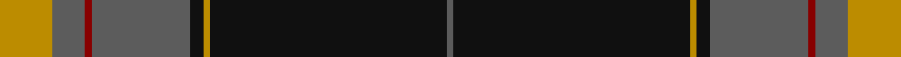

This page is one **sett** — a single exact thread-count. It belongs to the [tartan](/tartans/lo8n5r1n15k2lo1k36n1/)
(the same proportion at any scale), whose colour order is pattern [BKYKBRBY](/stripes/bkykbrby/).

Sourced from tartans-authority.  It is a [8 stripe tartan](/stripes/stripes8/).

Original link http://www.tartansauthority.com/tartan-ferret/display/8803/

## Thread count
DY/16 N10 DR2 N30 K4 DY2 K72 N/2

## Palette

Palette: <strong>Tartan Register</strong> <small style="color:#888">(3 of 4 colours)</small>
<table><thead><tr><th>Colour</th><th>Threads</th><th>Shade</th><th>Base</th><th>OKLCh</th></tr></thead><tbody><tr><td>DY/</td><td style="text-align:right;font-variant-numeric:tabular-nums">16</td><td><code style="background-color:#BC8C00;">#BC8C00</code> <small style="color:#888">#BC8C00</small></td><td>Y <code style="background-color:#F2BF00;">#F2BF00</code></td><td><small style="color:#888">oklch(66.8% 0.137 84.1)</small></td></tr><tr><td>N</td><td style="text-align:right;font-variant-numeric:tabular-nums">10</td><td><code style="background-color:#5C5C5C;">#5C5C5C</code> <small style="color:#888">#5C5C5C</small></td><td>B <code style="background-color:#2A418A;">#2A418A</code></td><td><small style="color:#888">oklch(47.5% 0.000 89.9)</small></td></tr><tr><td>DR</td><td style="text-align:right;font-variant-numeric:tabular-nums">2</td><td><code style="background-color:#880000;">#880000</code> <small style="color:#888">#880000</small></td><td>R <code style="background-color:#CC0000;">#CC0000</code></td><td><small style="color:#888">oklch(39.4% 0.162 29.2)</small></td></tr><tr><td>N</td><td style="text-align:right;font-variant-numeric:tabular-nums">30</td><td><code style="background-color:#5C5C5C;">#5C5C5C</code> <small style="color:#888">#5C5C5C</small></td><td>B <code style="background-color:#2A418A;">#2A418A</code></td><td><small style="color:#888">oklch(47.5% 0.000 89.9)</small></td></tr><tr><td>K</td><td style="text-align:right;font-variant-numeric:tabular-nums">4</td><td><code style="background-color:#101010;">#101010</code> <small style="color:#888">#101010</small></td><td>K <code style="background-color:#000000;">#000000</code></td><td><small style="color:#888">oklch(17.3% 0.000 89.9)</small></td></tr><tr><td>DY</td><td style="text-align:right;font-variant-numeric:tabular-nums">2</td><td><code style="background-color:#BC8C00;">#BC8C00</code> <small style="color:#888">#BC8C00</small></td><td>Y <code style="background-color:#F2BF00;">#F2BF00</code></td><td><small style="color:#888">oklch(66.8% 0.137 84.1)</small></td></tr><tr><td>K</td><td style="text-align:right;font-variant-numeric:tabular-nums">72</td><td><code style="background-color:#101010;">#101010</code> <small style="color:#888">#101010</small></td><td>K <code style="background-color:#000000;">#000000</code></td><td><small style="color:#888">oklch(17.3% 0.000 89.9)</small></td></tr><tr><td>N/</td><td style="text-align:right;font-variant-numeric:tabular-nums">2</td><td><code style="background-color:#5C5C5C;">#5C5C5C</code> <small style="color:#888">#5C5C5C</small></td><td>B <code style="background-color:#2A418A;">#2A418A</code></td><td><small style="color:#888">oklch(47.5% 0.000 89.9)</small></td></tr></tbody></table>

# Sample pattern

## Nearest tartans

The nearest existing variants by ΔTartan distance, with this tartan at the top so the swatches line up against it.

ΔTartan

Tartan

Sett

—

<a href="/ttd/edit/#slug=lo8n5r1n15k2lo1k36n1~x2">Cirse 3D</a> <a class="nn-out" href="/setts/s8/lo8n5r1n15k2lo1k36n1~x2/" title="open its dictionary page">↗</a>

0.86

<a href="/setts/s8/n52k10do16n1lb2~x2/">Wcwm 1163</a>

1.06

<a href="/ttd/edit/#slug=k12r2k28dg12k1w3k1dg12r4~x2">MacDiarmid</a> <a class="nn-out" href="/setts/s9/k12r2k28dg12k1w3k1dg12r4~x2/" title="open its dictionary page">↗</a>

1.07

<a href="/ttd/edit/#slug=r4k32dg18k1w2k1dg4m4~x2">Hot Boontjie</a> <a class="nn-out" href="/setts/s8/r4k32dg18k1w2k1dg4m4~x2/" title="open its dictionary page">↗</a>

1.10

<a href="/ttd/edit/#slug=r6k1w4k4n15r1k35o2~x2">Distripress (Corporate)</a> <a class="nn-out" href="/setts/s8/r6k1w4k4n15r1k35o2~x2/" title="open its dictionary page">↗</a>

1.13

<a href="/ttd/edit/#slug=k12r2k28g12k1w3k1g12r4~x2">MacDiarmid (Clan)</a> <a class="nn-out" href="/setts/s9/k12r2k28g12k1w3k1g12r4~x2/" title="open its dictionary page">↗</a>

1.17

<a href="/ttd/edit/#slug=k83r16dg56k2w5k2dg56r5~x2">MacDiarmid #2</a> <a class="nn-out" href="/setts/s8/k83r16dg56k2w5k2dg56r5~x2/" title="open its dictionary page">↗</a>

1.23

<a href="/ttd/edit/#slug=r35w8k85o6k4o14k2dp4">MacEvil (Corporate)</a> <a class="nn-out" href="/setts/s8/r35w8k85o6k4o14k2dp4/" title="open its dictionary page">↗</a>

1.28

<a href="/ttd/edit/#slug=k74o4k7o4k9o40k2o4k2">Llewellyn (Welsh Name)</a> <a class="nn-out" href="/setts/s9/k74o4k7o4k9o40k2o4k2/" title="open its dictionary page">↗</a>

1.28

<a href="/ttd/edit/#slug=b10k6g42k2g1k2r1k24r2~x2">Black Thistle</a> <a class="nn-out" href="/setts/s9/b10k6g42k2g1k2r1k24r2~x2/" title="open its dictionary page">↗</a>

1.29

<a href="/ttd/edit/#slug=k76dt11k3ly6k3dt13k11o76">Kunbi</a> <a class="nn-out" href="/setts/s8/k76dt11k3ly6k3dt13k11o76/" title="open its dictionary page">↗</a>

## Neighbour map

Every grey dot is one of 14299 variants placed by the first two principal components of the ΔTartan feature space (44% of its variance). Red is this tartan; blue dots are its nearest — click one to open its page.

<svg viewBox="0 0 640 380" role="img" style="max-width:100%;height:auto;border:1px solid #e0e0e0;border-radius:4px;display:block" xmlns="http://www.w3.org/2000/svg"><image href="/nn/cloud.v1.png" width="640" height="380"/><a href="/setts/s8/n52k10do16n1lb2~x2/"><circle cx="346.2" cy="124.4" r="4" fill="#3465a4"><title>Wcwm 1163</title></circle></a><a href="/setts/s9/k12r2k28dg12k1w3k1dg12r4~x2/"><circle cx="352.3" cy="157.8" r="4" fill="#3465a4"><title>MacDiarmid</title></circle></a><a href="/setts/s8/r4k32dg18k1w2k1dg4m4~x2/"><circle cx="340.1" cy="130.4" r="4" fill="#3465a4"><title>Hot Boontjie</title></circle></a><a href="/setts/s8/r6k1w4k4n15r1k35o2~x2/"><circle cx="355.5" cy="110.0" r="4" fill="#3465a4"><title>Distripress (Corporate)</title></circle></a><a href="/setts/s9/k12r2k28g12k1w3k1g12r4~x2/"><circle cx="343.6" cy="152.9" r="4" fill="#3465a4"><title>MacDiarmid (Clan)</title></circle></a><a href="/setts/s8/k83r16dg56k2w5k2dg56r5~x2/"><circle cx="358.6" cy="151.7" r="4" fill="#3465a4"><title>MacDiarmid #2</title></circle></a><a href="/setts/s8/r35w8k85o6k4o14k2dp4/"><circle cx="362.6" cy="98.6" r="4" fill="#3465a4"><title>MacEvil (Corporate)</title></circle></a><a href="/setts/s9/k74o4k7o4k9o40k2o4k2/"><circle cx="422.9" cy="116.1" r="4" fill="#3465a4"><title>Llewellyn (Welsh Name)</title></circle></a><a href="/setts/s9/b10k6g42k2g1k2r1k24r2~x2/"><circle cx="336.5" cy="118.8" r="4" fill="#3465a4"><title>Black Thistle</title></circle></a><a href="/setts/s8/k76dt11k3ly6k3dt13k11o76/"><circle cx="298.7" cy="139.4" r="4" fill="#3465a4"><title>Kunbi</title></circle></a><circle cx="377.4" cy="131.7" r="5" fill="#c00000"/></svg>

ID: /setts/s8/lo8n5r1n15k2lo1k36n1~x2/
