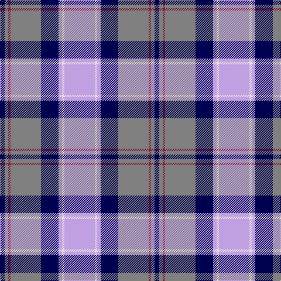

This page is one **sett** — a single exact thread-count. It belongs to the [tartan](/tartans/lp26ln2lp3db15n26dr2n3db4/)
(the same proportion at any scale), whose colour order is pattern [BGRGBWWW](/stripes/bgrgbwww/).

Sourced from weddslist.  It is a [8 stripe tartan](/stripes/stripes8/).

Original link http://www.weddslist.com/cgi-bin/tartans/pg.pl?source=sts

## Thread count
LP/52 LN4 LP6 DB30 N52 DR4 N6 DB/8

## Palette
Each colour and the base-6 reference it is a variant of.

| Colour | Shade | Base |
|---|---|---|
| DB | <code style="background-color:#000050;">#000050</code> `oklch(19.5% 0.135 264.1)` <small>#000050</small> | B <code style="background-color:#2A418A;">#2A418A</code> |
| DR | <code style="background-color:#802040;">#802040</code> `oklch(40.8% 0.132 5.2)` <small>#802040</small> | R <code style="background-color:#CC0000;">#CC0000</code> |
| LN | <code style="background-color:#E0E0E0;">#E0E0E0</code> `oklch(90.7% 0.000 89.9)` <small>#E0E0E0</small> | W <code style="background-color:#F7F7F7;">#F7F7F7</code> |
| LP | <code style="background-color:#C0A0E0;">#C0A0E0</code> `oklch(75.7% 0.096 307.0)` <small>#C0A0E0</small> | W <code style="background-color:#F7F7F7;">#F7F7F7</code> |
| N | <code style="background-color:#808080;">#808080</code> `oklch(60.0% 0.000 89.9)` <small>#808080</small> | G <code style="background-color:#006100;">#006100</code> |

# Sample pattern

## Nearest tartans

The nearest existing variants by ΔTartan distance, with this tartan at the top so the swatches line up against it.

ΔTartan

Tartan

Sett

—

<a href="/ttd/edit/#slug=lp26w2lp3db15y26m2y3db4~x2">Scottish Highlander, dress</a> <a class="nn-out" href="/setts/s8/lp26w2lp3db15y26m2y3db4~x2/" title="open its dictionary page">↗</a>

0.96

<a href="/ttd/edit/#slug=w17k2n6t6w1n1dp10k2dp3~x4">Hebridean Arisaid Blue (Dance) Fashion Tartan Tartan Number: 6558. Earliest known date: 01/01/2005 Threadcount and colours aren't 100% original. Generated manually. See products available Copyright © Blair Urquhart, Comrie, 2015</a> <a class="nn-out" href="/setts/s9/w17k2n6t6w1n1dp10k2dp3~x4/" title="open its dictionary page">↗</a>

0.99

<a href="/ttd/edit/#slug=db8r3db34t3k9w31r5w3r3w8~x2">Stewart of Appin Dress Clan Tartan Tartan Number: 481. Earliest known date: pre 2003 The Stewarts of Appin fueded relentlessly with the Campbells, and they were supported in these pursuits and other military activities by some of the Clan MacColl, whose tartan is very similar. The Stewarts of Ardshiel, a branch of the Appin Clan, have a certified tartan of their own dating back to the 1820's, which has elements of the Appin design. Stewarts of Appin are descended from Dugald, the son of Sir John Stewart of Lorne who was murdered in 1463. Dugald established the Appin branch of the family by dividing his lands between his five sons. The tartan is worn by the Stonehaven pipe bands. See products available Copyright © Blair Urquhart, Comrie, 2015</a> <a class="nn-out" href="/setts/s10/db8r3db34t3k9w31r5w3r3w8~x2/" title="open its dictionary page">↗</a>

1.02

<a href="/ttd/edit/#slug=db8r3db34b3k9w31r5w3r3w8">Stuart/Stewart of Appin Dress</a> <a class="nn-out" href="/setts/s10/db8r3db34b3k9w31r5w3r3w8/" title="open its dictionary page">↗</a>

1.06

<a href="/ttd/edit/#slug=r3lr25db6db3r2t5db18w3~x2">Fulbright Foundation</a> <a class="nn-out" href="/setts/s8/r3lr25db6db3r2t5db18w3~x2/" title="open its dictionary page">↗</a>

1.06

<a href="/ttd/edit/#slug=w28t19db19w4db2p2db7~x2">St. Andrews Dress, Earl of (Danc</a> <a class="nn-out" href="/setts/s7/w28t19db19w4db2p2db7~x2/" title="open its dictionary page">↗</a>

1.08

<a href="/ttd/edit/#slug=t12k1t1k1t1db8w9y2~x4">Arran (Pendleton)</a> <a class="nn-out" href="/setts/s8/t12k1t1k1t1db8w9y2~x4/" title="open its dictionary page">↗</a>

1.09

<a href="/ttd/edit/#slug=t12k1t1k1t1db8w9o2~x4">Arran - 1989 (Fashion)</a> <a class="nn-out" href="/setts/s8/t12k1t1k1t1db8w9o2~x4/" title="open its dictionary page">↗</a>

1.10

<a href="/ttd/edit/#slug=r6t2r2t23k2r4k2b21r2b2w6~x2">IRPA</a> <a class="nn-out" href="/setts/s11/r6t2r2t23k2r4k2b21r2b2w6~x2/" title="open its dictionary page">↗</a>

1.11

<a href="/ttd/edit/#slug=dt1lr7w1o3w1o7dt4p13w1~x4">Wcwm 1893-11</a> <a class="nn-out" href="/setts/s9/dt1lr7w1o3w1o7dt4p13w1~x4/" title="open its dictionary page">↗</a>

1.11

<a href="/ttd/edit/#slug=r15t98db72ly25db8w15">Afternoon Tea / Earl Grey</a> <a class="nn-out" href="/setts/s6/r15t98db72ly25db8w15/" title="open its dictionary page">↗</a>

## Neighbour map

Every grey dot is one of 14299 variants placed by the first two principal components of the ΔTartan feature space (44% of its variance). Red is this tartan; blue dots are its nearest — click one to open its page.

<svg viewBox="0 0 640 380" role="img" style="max-width:100%;height:auto;border:1px solid #e0e0e0;border-radius:4px;display:block" xmlns="http://www.w3.org/2000/svg"><image href="/nn/cloud.v1.png" width="640" height="380"/><a href="/setts/s9/w17k2n6t6w1n1dp10k2dp3~x4/"><circle cx="152.3" cy="122.8" r="4" fill="#3465a4"><title>Hebridean Arisaid Blue (Dance) Fashion Tartan Tartan Number: 6558. Earliest known date: 01/01/2005 Threadcount and colours aren't 100% original. Generated manually. See products available Copyright © Blair Urquhart, Comrie, 2015</title></circle></a><a href="/setts/s10/db8r3db34t3k9w31r5w3r3w8~x2/"><circle cx="168.0" cy="126.1" r="4" fill="#3465a4"><title>Stewart of Appin Dress Clan Tartan Tartan Number: 481. Earliest known date: pre 2003 The Stewarts of Appin fueded relentlessly with the Campbells, and they were supported in these pursuits and other military activities by some of the Clan MacColl, whose tartan is very similar. The Stewarts of Ardshiel, a branch of the Appin Clan, have a certified tartan of their own dating back to the 1820's, which has elements of the Appin design. Stewarts of Appin are descended from Dugald, the son of Sir John Stewart of Lorne who was murdered in 1463. Dugald established the Appin branch of the family by dividing his lands between his five sons. The tartan is worn by the Stonehaven pipe bands. See products available Copyright © Blair Urquhart, Comrie, 2015</title></circle></a><a href="/setts/s10/db8r3db34b3k9w31r5w3r3w8/"><circle cx="169.3" cy="126.5" r="4" fill="#3465a4"><title>Stuart/Stewart of Appin Dress</title></circle></a><a href="/setts/s8/r3lr25db6db3r2t5db18w3~x2/"><circle cx="153.2" cy="133.5" r="4" fill="#3465a4"><title>Fulbright Foundation</title></circle></a><a href="/setts/s7/w28t19db19w4db2p2db7~x2/"><circle cx="169.8" cy="155.5" r="4" fill="#3465a4"><title>St. Andrews Dress, Earl of (Danc</title></circle></a><a href="/setts/s8/t12k1t1k1t1db8w9y2~x4/"><circle cx="158.3" cy="148.0" r="4" fill="#3465a4"><title>Arran (Pendleton)</title></circle></a><a href="/setts/s8/t12k1t1k1t1db8w9o2~x4/"><circle cx="156.1" cy="142.4" r="4" fill="#3465a4"><title>Arran - 1989 (Fashion)</title></circle></a><a href="/setts/s11/r6t2r2t23k2r4k2b21r2b2w6~x2/"><circle cx="169.3" cy="130.1" r="4" fill="#3465a4"><title>IRPA</title></circle></a><a href="/setts/s9/dt1lr7w1o3w1o7dt4p13w1~x4/"><circle cx="138.1" cy="135.4" r="4" fill="#3465a4"><title>Wcwm 1893-11</title></circle></a><a href="/setts/s6/r15t98db72ly25db8w15/"><circle cx="186.0" cy="168.3" r="4" fill="#3465a4"><title>Afternoon Tea / Earl Grey</title></circle></a><circle cx="178.5" cy="146.6" r="5" fill="#c00000"/></svg>

ID: /setts/s8/lp26w2lp3db15y26m2y3db4~x2/
