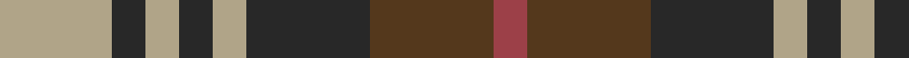
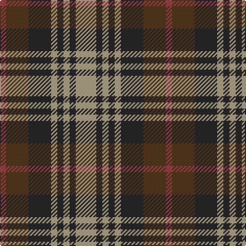

In pattern [RGBYBYBY](/stripes/rgbybyby/).

This was sourced from house-of-tartan.  It is a [8 stripe tartan](/stripes/stripes8/).

Original link http://www.house-of-tartan.scotland.net/house/TartanViewjs.asp?colr=Def&tnam=8700

## Thread count
N/20 K6 N6 K6 N6 K22 T22 DR/6

## Palette
Each colour and the base-6 reference it is a variant of.

| Colour | Shade | Base |
|---|---|---|
| DR | <code style="background-color:#9C4048;">#9C4048</code> `oklch(49.7% 0.123 17.5)` <small>#9C4048</small> | R <code style="background-color:#CC0000;">#CC0000</code> |
| K | <code style="background-color:#282828;">#282828</code> `oklch(27.7% 0.000 89.9)` <small>#282828</small> | B <code style="background-color:#2A418A;">#2A418A</code> |
| LT | <code style="background-color:#8C6C4C;">#8C6C4C</code> `oklch(55.5% 0.061 66.0)` <small>#8C6C4C</small> | R <code style="background-color:#CC0000;">#CC0000</code> |
| N | <code style="background-color:#B0A488;">#B0A488</code> `oklch(72.1% 0.041 87.6)` <small>#B0A488</small> | Y <code style="background-color:#F2BF00;">#F2BF00</code> |
| T | <code style="background-color:#54381C;">#54381C</code> `oklch(36.7% 0.058 64.3)` <small>#54381C</small> | G <code style="background-color:#006100;">#006100</code> |

# Sample pattern

## Nearest tartans

The nearest existing variants by ΔTartan distance, with this tartan at the top so the swatches line up against it.

ΔTartan

Tartan

Sett

—

<a href="/ttd/edit/#slug=lr10dt3lr3dt3lr3dt11dy11o3~x2">Holden Monaro Corporate Tartan Tartan Number: 8700. Earliest known date: 1831 Holden Monaro GTS 1978 car seats. Reproduction colours. Warp 162 threads Weft 202 threads. Last weaving went through with slight difference. Sett size = 4 3/8th - 4 3/4 inch (112mm - 120mm) See products available Copyright © Blair Urquhart, Comrie, 2015</a> <a class="nn-out" href="/setts/s8/lr10dt3lr3dt3lr3dt11dy11o3~x2/" title="open its dictionary page">↗</a>

0.61

<a href="/setts/s8/g4r3t1k1t3~x4/">Wilson's No.214</a>

0.65

<a href="/ttd/edit/#slug=r2g4db8r9g9k2r2~x4">Stewart (Artefact)</a> <a class="nn-out" href="/setts/s7/r2g4db8r9g9k2r2~x4/" title="open its dictionary page">↗</a>

0.71

<a href="/ttd/edit/#slug=r2g4db8r9g9k2r2~x2">Stewart, Plaid</a> <a class="nn-out" href="/setts/s7/r2g4db8r9g9k2r2~x2/" title="open its dictionary page">↗</a>

1.01

<a href="/ttd/edit/#slug=r3db3r3db10g10r3g3r3~x2">Flora, MacDonald</a> <a class="nn-out" href="/setts/s8/r3db3r3db10g10r3g3r3~x2/" title="open its dictionary page">↗</a>

1.04

<a href="/ttd/edit/#slug=g4db9r9g9k2r2k2g9r9db8g4r2~x4">Stewart/Stuart C18th - Cf 1314 &amp; 4454</a> <a class="nn-out" href="/setts/s12/g4db9r9g9k2r2k2g9r9db8g4r2~x4/" title="open its dictionary page">↗</a>

1.06

<a href="/ttd/edit/#slug=dp13r8lb5dg24lb5r10lb5r10~x2">Chaudhri (Name)</a> <a class="nn-out" href="/setts/s8/dp13r8lb5dg24lb5r10lb5r10~x2/" title="open its dictionary page">↗</a>

1.08

<a href="/ttd/edit/#slug=r33g17db50g17r11g17r9k7">Carnegie</a> <a class="nn-out" href="/setts/s8/r33g17db50g17r11g17r9k7/" title="open its dictionary page">↗</a>

1.10

<a href="/ttd/edit/#slug=dp13n8w5dg24w5n10w5n10~x2">Chaudhri, Zafar Iqbal</a> <a class="nn-out" href="/setts/s8/dp13n8w5dg24w5n10w5n10~x2/" title="open its dictionary page">↗</a>

1.13

<a href="/ttd/edit/#slug=r3dg3r3dg10db10r3db3r3~x2">Flora MacDonald</a> <a class="nn-out" href="/setts/s8/r3dg3r3dg10db10r3db3r3~x2/" title="open its dictionary page">↗</a>

1.15

<a href="/setts/s8/g6k1r1t2r2~x4/">Wilson's No.193</a>

## Neighbour map

Every grey dot is one of 14299 variants placed by the first two principal components of the ΔTartan feature space (44% of its variance). Red is this tartan; blue dots are its nearest — click one to open its page.

<svg viewBox="0 0 640 380" role="img" style="max-width:100%;height:auto;border:1px solid #e0e0e0;border-radius:4px;display:block" xmlns="http://www.w3.org/2000/svg"><image href="/nn/cloud.v1.png" width="640" height="380"/><a href="/setts/s8/g4r3t1k1t3~x4/"><circle cx="117.4" cy="249.9" r="4" fill="#3465a4"><title>Wilson's No.214</title></circle></a><a href="/setts/s7/r2g4db8r9g9k2r2~x4/"><circle cx="160.1" cy="252.5" r="4" fill="#3465a4"><title>Stewart (Artefact)</title></circle></a><a href="/setts/s7/r2g4db8r9g9k2r2~x2/"><circle cx="146.0" cy="246.5" r="4" fill="#3465a4"><title>Stewart, Plaid</title></circle></a><a href="/setts/s8/r3db3r3db10g10r3g3r3~x2/"><circle cx="170.3" cy="274.1" r="4" fill="#3465a4"><title>Flora, MacDonald</title></circle></a><a href="/setts/s12/g4db9r9g9k2r2k2g9r9db8g4r2~x4/"><circle cx="145.0" cy="238.7" r="4" fill="#3465a4"><title>Stewart/Stuart C18th - Cf 1314 &amp; 4454</title></circle></a><a href="/setts/s8/dp13r8lb5dg24lb5r10lb5r10~x2/"><circle cx="120.2" cy="230.9" r="4" fill="#3465a4"><title>Chaudhri (Name)</title></circle></a><a href="/setts/s8/r33g17db50g17r11g17r9k7/"><circle cx="158.1" cy="221.0" r="4" fill="#3465a4"><title>Carnegie</title></circle></a><a href="/setts/s8/dp13n8w5dg24w5n10w5n10~x2/"><circle cx="108.6" cy="231.1" r="4" fill="#3465a4"><title>Chaudhri, Zafar Iqbal</title></circle></a><a href="/setts/s8/r3dg3r3dg10db10r3db3r3~x2/"><circle cx="175.3" cy="275.0" r="4" fill="#3465a4"><title>Flora MacDonald</title></circle></a><a href="/setts/s8/g6k1r1t2r2~x4/"><circle cx="164.3" cy="218.3" r="4" fill="#3465a4"><title>Wilson's No.193</title></circle></a><circle cx="141.5" cy="250.1" r="5" fill="#c00000"/></svg>

ID: /setts/s8/lr10dt3lr3dt3lr3dt11dy11o3~x2/
