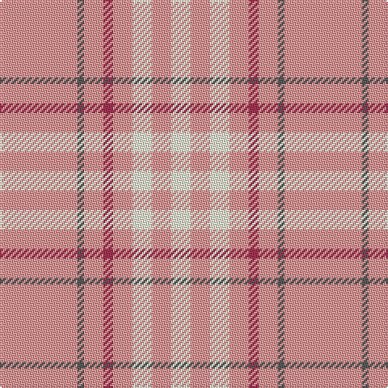

**Bands:** [YBYRYWYW](/stripes/ybyrywyw/) · **Stripes:** [LR N LR M LR W LR W](/stripes/stripes8/) LR N LR M LR W LR W

This was sourced from register-of-tartans.  It is a [8 band tartan](/bands/bands8/).

Original link https://www.tartanregister.gov.uk/tartanDetails.aspx?ref=4040

## Attestations

This cloth appears in 2 source records; the oldest owns this page.

- 01/01/2007 — Weaving for Life (register-of-tartans, [record](https://www.tartanregister.gov.uk/tartanDetails.aspx?ref=4040))
- 2007 — Weaving for Life (Fashion) (tartans-authority, [record](http://www.tartansauthority.com/tartan-ferret/display/7333/))

## Register references

External register numbers recorded for this tartan.

- Scottish Register of Tartans: [4040](https://www.tartanregister.gov.uk/tartanDetails.aspx?ref=4040)
- Scottish Tartans Authority (ITI): 7333

## Thread count
LRa/48 N4 LRa12 DR6 LRa12 LY12 LRa12 LY/12

## Palette
Each colour and its ΔE from the base-6 reference it is a variant of.

| Colour | Shade | Base | ΔE (OKLab) |
|---|---|---|---|
| DR | <code style="background-color:#A43454;">#A43454</code> `#A43454` | R <code style="background-color:#CC0000;">#CC0000</code> | 0.10 |
| LR | <code style="background-color:#E09CA0;">#E09CA0</code> `#E09CA0` | Y <code style="background-color:#F2BF00;">#F2BF00</code> | 0.18 |
| LRa | <code style="background-color:#EC9898;">#EC9898</code> `#EC9898` | Y <code style="background-color:#F2BF00;">#F2BF00</code> | 0.18 |
| LY | <code style="background-color:#FCFCD4;">#FCFCD4</code> `#FCFCD4` | W <code style="background-color:#F7F7F7;">#F7F7F7</code> | 0.05 |
| N | <code style="background-color:#5C5C5C;">#5C5C5C</code> `#5C5C5C` | B <code style="background-color:#2A418A;">#2A418A</code> | 0.15 |

# Sample pattern

## Nearest tartans

The nearest existing variants by ΔTartan distance.

1. [Twilfit](/setts/s9/t25r46w11r11w7r11w11r46t12/) — ΔT 1.82
1. [Nevis Dress](/setts/s11/lr42r10n2r2lb2r2lr10lb6r2lb3lr2~x2/) — ΔT 2.31
1. [MacLachlan, Marled Dress (Fashion)](/setts/s13/lb16o2lb2o2lb2o16o16r3o16o16lb16o2lb2~x2/) — ΔT 2.31
1. [Perry Arisaid (Personal)](/setts/s5/lb65r27w2lb4ly5~x2/) — ΔT 2.33
1. [Gary (Personal)](/setts/s12/dp2r1lo4w2lo12w8lo12w2lo2lo2w1lo2~x4/) — ΔT 2.34
1. [Ailsa, Pink (Dance)](/setts/s6/r8w3r28w32k3w4~x2/) — ΔT 2.39
1. [Middleton, City of](/setts/s9/o16w1o1k1o8lo4r2w2r2~x4/) — ΔT 2.40
1. [Washington State University Cougar](/setts/s7/r6w3n6lb10r38w2n4/) — ΔT 2.43
1. [Wolfe (Name)](/setts/s7/g4o4g13o13g4o36lo4~x2/) — ΔT 2.44
1. [Wolfe](/setts/s12/o36g4o13g13o4g4o4g13o13g4o36lo4~x2/) — ΔT 2.55

## Neighbour map

Every grey dot is one of 14299 variants placed by the first two principal components of the ΔTartan feature space (44% of its variance). Red is this tartan; blue dots are its nearest — click one to open its page.

<svg viewBox="0 0 640 380" role="img" style="max-width:100%;height:auto;border:1px solid #e0e0e0;border-radius:4px;display:block" xmlns="http://www.w3.org/2000/svg"><image href="/nn/cloud.v1.png" width="640" height="380"/><a href="/setts/s9/t25r46w11r11w7r11w11r46t12/"><circle cx="363.6" cy="226.8" r="4" fill="#3465a4"><title>Twilfit</title></circle></a><a href="/setts/s11/lr42r10n2r2lb2r2lr10lb6r2lb3lr2~x2/"><circle cx="449.8" cy="119.1" r="4" fill="#3465a4"><title>Nevis Dress</title></circle></a><a href="/setts/s13/lb16o2lb2o2lb2o16o16r3o16o16lb16o2lb2~x2/"><circle cx="410.0" cy="224.6" r="4" fill="#3465a4"><title>MacLachlan, Marled Dress (Fashion)</title></circle></a><a href="/setts/s5/lb65r27w2lb4ly5~x2/"><circle cx="460.8" cy="143.2" r="4" fill="#3465a4"><title>Perry Arisaid (Personal)</title></circle></a><a href="/setts/s12/dp2r1lo4w2lo12w8lo12w2lo2lo2w1lo2~x4/"><circle cx="343.5" cy="131.7" r="4" fill="#3465a4"><title>Gary (Personal)</title></circle></a><a href="/setts/s6/r8w3r28w32k3w4~x2/"><circle cx="340.8" cy="197.6" r="4" fill="#3465a4"><title>Ailsa, Pink (Dance)</title></circle></a><a href="/setts/s9/o16w1o1k1o8lo4r2w2r2~x4/"><circle cx="434.3" cy="162.4" r="4" fill="#3465a4"><title>Middleton, City of</title></circle></a><a href="/setts/s7/r6w3n6lb10r38w2n4/"><circle cx="413.2" cy="141.2" r="4" fill="#3465a4"><title>Washington State University Cougar</title></circle></a><a href="/setts/s7/g4o4g13o13g4o36lo4~x2/"><circle cx="448.2" cy="214.9" r="4" fill="#3465a4"><title>Wolfe (Name)</title></circle></a><a href="/setts/s12/o36g4o13g13o4g4o4g13o13g4o36lo4~x2/"><circle cx="462.0" cy="197.4" r="4" fill="#3465a4"><title>Wolfe</title></circle></a><circle cx="450.2" cy="188.3" r="5" fill="#c00000"/></svg>

ID: /setts/s8/lr24n2lr6m3lr6w6lr6w6~x2/
