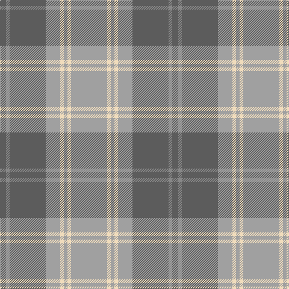

**Bands:** [BRBYWYWY](/stripes/brbywywy/) · **Stripes:** [N O N LR W LR W LR](/stripes/stripes8/) N O N LR W LR W LR

This was sourced from tartans-authority.  It is a [8 band tartan](/bands/bands8/).

Original link http://www.tartansauthority.com/tartan-ferret/display/10208/

## Thread count
N/10 Nb6 N60 Na24 W6 Na6 W6 Na/60

## Palette
Each colour and its ΔE from the base-6 reference it is a variant of.

| Colour | Shade | Base | ΔE (OKLab) |
|---|---|---|---|
| N | <code style="background-color:#5C5C5C;">#5C5C5C</code> `#5C5C5C` | B <code style="background-color:#2A418A;">#2A418A</code> | 0.15 |
| Na | <code style="background-color:#A0A0A0;">#A0A0A0</code> `#A0A0A0` | Y <code style="background-color:#F2BF00;">#F2BF00</code> | 0.21 |
| Nb | <code style="background-color:#888888;">#888888</code> `#888888` | R <code style="background-color:#CC0000;">#CC0000</code> | 0.24 |
| W | <code style="background-color:#F0DCBC;">#F0DCBC</code> `#F0DCBC` | W <code style="background-color:#F7F7F7;">#F7F7F7</code> | 0.09 |

# Sample pattern

## Nearest tartans

The nearest existing variants by ΔTartan distance.

1. [Qatar Airways](/setts/s12/m3o2m6o21lr2o4lr3o3lr4o2lr13w2~x2/) — ΔT 1.11
1. [Lochnagar Plaid (District)](/setts/s6/w1dp1o7n4o1w1~x4/) — ΔT 1.11
1. [Tenmaya Check](/setts/s8/lb1o12r1dt1r1dt2r5lb1~x4/) — ΔT 1.20
1. [Gammell (Personal)](/setts/s8/t32r3t3r3t3r10g24r3~x2/) — ΔT 1.22
1. [Johore](/setts/s8/o57w5g20o5lo10o5g20w5~x2/) — ΔT 1.27
1. [Chambers Bay](/setts/s7/g2t15lr5g2t2g7w2~x4/) — ΔT 1.41
1. [Lochnagar Trade Tartan Tartan Number: 1771. Earliest known date: pre 2003 Colours represents the Scottish hills, the water, and the heather. See products available Copyright © Blair Urquhart, Comrie, 2015](/setts/s6/w1dp1lb7o4lb1w1~x4/) — ΔT 1.46
1. [Clyde Trade Tartan Tartan Number: 1296. Earliest known date: pre 1992 See Strathclyde District See products available Copyright © Blair Urquhart, Comrie, 2015](/setts/s10/lb4n2lb18r2n5o16r2o2r2o2~x2/) — ΔT 1.47
1. [Tenmaya Corporate Tartan Tartan Number: 2346. Earliest known date: 1996 May 1996 for Tenmaya Department Store Ltd in Okayama, Japan. Sample in STA Johnston Collection. Designed for British promotion October/November 1996 which demonstrated weaving and woven by Archie Snmall from Selkirk who was sent to Fukuoka to demonstrate weaving. See products available Copyright © Blair Urquhart, Comrie, 2015](/setts/s8/lb1n12r1dt1r1dt2r5lb1~x4/) — ΔT 1.50
1. [Titanium (Fashion)](/setts/s9/n44o8n8o22lb4o4lb11o2lb2~x2/) — ΔT 1.52

## Neighbour map

Every grey dot is one of 14313 variants placed by the first two principal components of the ΔTartan feature space (44% of its variance). Red is this tartan; blue dots are its nearest — click one to open its page.

<svg viewBox="0 0 640 380" role="img" style="max-width:100%;height:auto;border:1px solid #e0e0e0;border-radius:4px;display:block" xmlns="http://www.w3.org/2000/svg"><image href="/nn/cloud.v1.png" width="640" height="380"/><a href="/setts/s12/m3o2m6o21lr2o4lr3o3lr4o2lr13w2~x2/"><circle cx="307.8" cy="176.9" r="4" fill="#3465a4"><title>Qatar Airways</title></circle></a><a href="/setts/s6/w1dp1o7n4o1w1~x4/"><circle cx="311.4" cy="230.7" r="4" fill="#3465a4"><title>Lochnagar Plaid (District)</title></circle></a><a href="/setts/s8/lb1o12r1dt1r1dt2r5lb1~x4/"><circle cx="342.0" cy="181.7" r="4" fill="#3465a4"><title>Tenmaya Check</title></circle></a><a href="/setts/s8/t32r3t3r3t3r10g24r3~x2/"><circle cx="304.0" cy="201.7" r="4" fill="#3465a4"><title>Gammell (Personal)</title></circle></a><a href="/setts/s8/o57w5g20o5lo10o5g20w5~x2/"><circle cx="329.7" cy="195.5" r="4" fill="#3465a4"><title>Johore</title></circle></a><a href="/setts/s7/g2t15lr5g2t2g7w2~x4/"><circle cx="305.9" cy="243.2" r="4" fill="#3465a4"><title>Chambers Bay</title></circle></a><a href="/setts/s6/w1dp1lb7o4lb1w1~x4/"><circle cx="318.9" cy="229.8" r="4" fill="#3465a4"><title>Lochnagar Trade Tartan Tartan Number: 1771. Earliest known date: pre 2003 Colours represents the Scottish hills, the water, and the heather. See products available Copyright © Blair Urquhart, Comrie, 2015</title></circle></a><a href="/setts/s10/lb4n2lb18r2n5o16r2o2r2o2~x2/"><circle cx="263.9" cy="186.8" r="4" fill="#3465a4"><title>Clyde Trade Tartan Tartan Number: 1296. Earliest known date: pre 1992 See Strathclyde District See products available Copyright © Blair Urquhart, Comrie, 2015</title></circle></a><a href="/setts/s8/lb1n12r1dt1r1dt2r5lb1~x4/"><circle cx="337.2" cy="182.1" r="4" fill="#3465a4"><title>Tenmaya Corporate Tartan Tartan Number: 2346. Earliest known date: 1996 May 1996 for Tenmaya Department Store Ltd in Okayama, Japan. Sample in STA Johnston Collection. Designed for British promotion October/November 1996 which demonstrated weaving and woven by Archie Snmall from Selkirk who was sent to Fukuoka to demonstrate weaving. See products available Copyright © Blair Urquhart, Comrie, 2015</title></circle></a><a href="/setts/s9/n44o8n8o22lb4o4lb11o2lb2~x2/"><circle cx="379.8" cy="181.4" r="4" fill="#3465a4"><title>Titanium (Fashion)</title></circle></a><circle cx="344.3" cy="207.8" r="5" fill="#c00000"/></svg>

ID: /setts/s8/lr30w3lr3w3lr12n30o3n5~x2/
