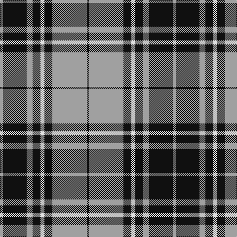

This page is one **sett** — a single exact thread-count. It belongs to the [tartan](/tartans/lr3k24lr6k8w4k8lr35k2/)
(the same proportion at any scale), whose colour order is pattern [KYKWKYKY](/stripes/kykwkyky/).

Sourced from tartans-authority.  It is a [8 stripe tartan](/stripes/stripes8/).

Original link http://www.tartansauthority.com/tartan-ferret/display/8231/

## Register references

External register numbers recorded for this tartan.

- Scottish Tartans Authority (ITI): 8231

## Thread count
N/6 K48 N12 K16 LN8 K16 N70 K/4

## Palette

Palette: <strong>Tartan Register</strong>
<table><thead><tr><th>Colour</th><th>Threads</th><th>Shade</th><th>Base</th><th>OKLCh</th></tr></thead><tbody><tr><td>N/</td><td style="text-align:right;font-variant-numeric:tabular-nums">6</td><td><code style="background-color:#A0A0A0;">#A0A0A0</code> <small style="color:#888">#A0A0A0</small></td><td>Y <code style="background-color:#F2BF00;">#F2BF00</code></td><td><small style="color:#888">oklch(70.6% 0.000 89.9)</small></td></tr><tr><td>K</td><td style="text-align:right;font-variant-numeric:tabular-nums">48</td><td><code style="background-color:#101010;">#101010</code> <small style="color:#888">#101010</small></td><td>K <code style="background-color:#000000;">#000000</code></td><td><small style="color:#888">oklch(17.3% 0.000 89.9)</small></td></tr><tr><td>N</td><td style="text-align:right;font-variant-numeric:tabular-nums">12</td><td><code style="background-color:#A0A0A0;">#A0A0A0</code> <small style="color:#888">#A0A0A0</small></td><td>Y <code style="background-color:#F2BF00;">#F2BF00</code></td><td><small style="color:#888">oklch(70.6% 0.000 89.9)</small></td></tr><tr><td>K</td><td style="text-align:right;font-variant-numeric:tabular-nums">16</td><td><code style="background-color:#101010;">#101010</code> <small style="color:#888">#101010</small></td><td>K <code style="background-color:#000000;">#000000</code></td><td><small style="color:#888">oklch(17.3% 0.000 89.9)</small></td></tr><tr><td>LN</td><td style="text-align:right;font-variant-numeric:tabular-nums">8</td><td><code style="background-color:#E0E0E0;">#E0E0E0</code> <small style="color:#888">#E0E0E0</small></td><td>W <code style="background-color:#F7F7F7;">#F7F7F7</code></td><td><small style="color:#888">oklch(90.7% 0.000 89.9)</small></td></tr><tr><td>K</td><td style="text-align:right;font-variant-numeric:tabular-nums">16</td><td><code style="background-color:#101010;">#101010</code> <small style="color:#888">#101010</small></td><td>K <code style="background-color:#000000;">#000000</code></td><td><small style="color:#888">oklch(17.3% 0.000 89.9)</small></td></tr><tr><td>N</td><td style="text-align:right;font-variant-numeric:tabular-nums">70</td><td><code style="background-color:#A0A0A0;">#A0A0A0</code> <small style="color:#888">#A0A0A0</small></td><td>Y <code style="background-color:#F2BF00;">#F2BF00</code></td><td><small style="color:#888">oklch(70.6% 0.000 89.9)</small></td></tr><tr><td>K/</td><td style="text-align:right;font-variant-numeric:tabular-nums">4</td><td><code style="background-color:#101010;">#101010</code> <small style="color:#888">#101010</small></td><td>K <code style="background-color:#000000;">#000000</code></td><td><small style="color:#888">oklch(17.3% 0.000 89.9)</small></td></tr></tbody></table>

# Sample pattern

## Nearest tartans

The nearest existing variants by ΔTartan distance, with this tartan at the top so the swatches line up against it.

ΔTartan

Tartan

Sett

—

<a href="/ttd/edit/#slug=lr3k24lr6k8w4k8lr35k2~x2">Nowell/Noel 1951 (Name)</a> <a class="nn-out" href="/setts/s8/lr3k24lr6k8w4k8lr35k2~x2/" title="open its dictionary page">↗</a>

0.71

<a href="/ttd/edit/#slug=k12lr1k2lr6k4lr3k4lr21r4~x2">MacKnight (Name)</a> <a class="nn-out" href="/setts/s9/k12lr1k2lr6k4lr3k4lr21r4~x2/" title="open its dictionary page">↗</a>

0.88

<a href="/ttd/edit/#slug=w6k1w2k4w4k2w4k15r1~x2">Menzies Dress Tartan Tartan Number: 12444. Earliest known date: See products available Copyright © Blair Urquhart, Comrie, 2015</a> <a class="nn-out" href="/setts/s9/w6k1w2k4w4k2w4k15r1~x2/" title="open its dictionary page">↗</a>

0.94

<a href="/ttd/edit/#slug=db19w1db6w1db2w2lo2w1lo18~x4">Highland Park High School (Texas)</a> <a class="nn-out" href="/setts/s9/db19w1db6w1db2w2lo2w1lo18~x4/" title="open its dictionary page">↗</a>

0.96

<a href="/ttd/edit/#slug=k4ly18db44k3ly10k4">Stutterheim (Corporate)</a> <a class="nn-out" href="/setts/s6/k4ly18db44k3ly10k4/" title="open its dictionary page">↗</a>

0.97

<a href="/ttd/edit/#slug=y5r3y35k28y4k11y2~x2">Korner-Macpherson (Personal)</a> <a class="nn-out" href="/setts/s7/y5r3y35k28y4k11y2~x2/" title="open its dictionary page">↗</a>

1.06

<a href="/ttd/edit/#slug=w4k26t26k2t5w2~x2">Indian Pipe Band (Corporate)</a> <a class="nn-out" href="/setts/s6/w4k26t26k2t5w2~x2/" title="open its dictionary page">↗</a>

1.08

<a href="/ttd/edit/#slug=k4ly2k13ly1y8y13ly2y4~x2">Bannockbane Grey #3</a> <a class="nn-out" href="/setts/s8/k4ly2k13ly1y8y13ly2y4~x2/" title="open its dictionary page">↗</a>

1.12

<a href="/ttd/edit/#slug=db19w1db6w1db2w2ly2w1ly18~x4">Highland Park High School (Texas)</a> <a class="nn-out" href="/setts/s9/db19w1db6w1db2w2ly2w1ly18~x4/" title="open its dictionary page">↗</a>

1.14

<a href="/ttd/edit/#slug=k10o1k2o1k4o10ly1o2~x4">West Point Military Academy (Mil.)</a> <a class="nn-out" href="/setts/s8/k10o1k2o1k4o10ly1o2~x4/" title="open its dictionary page">↗</a>

1.19

<a href="/setts/s8/k37w9k3g9w3~x2/">Glen Coe #2</a>

## Neighbour map

Every grey dot is one of 14359 variants placed by the first two principal components of the ΔTartan feature space (44% of its variance). Red is this tartan; blue dots are its nearest — click one to open its page.

<svg viewBox="0 0 640 380" role="img" style="max-width:100%;height:auto;border:1px solid #e0e0e0;border-radius:4px;display:block" xmlns="http://www.w3.org/2000/svg"><image href="/nn/cloud.v1.png" width="640" height="380"/><a href="/setts/s9/k12lr1k2lr6k4lr3k4lr21r4~x2/"><circle cx="325.1" cy="160.1" r="4" fill="#3465a4"><title>MacKnight (Name)</title></circle></a><a href="/setts/s9/w6k1w2k4w4k2w4k15r1~x2/"><circle cx="315.1" cy="167.2" r="4" fill="#3465a4"><title>Menzies Dress Tartan Tartan Number: 12444. Earliest known date: See products available Copyright © Blair Urquhart, Comrie, 2015</title></circle></a><a href="/setts/s9/db19w1db6w1db2w2lo2w1lo18~x4/"><circle cx="314.8" cy="140.5" r="4" fill="#3465a4"><title>Highland Park High School (Texas)</title></circle></a><a href="/setts/s6/k4ly18db44k3ly10k4/"><circle cx="297.5" cy="177.7" r="4" fill="#3465a4"><title>Stutterheim (Corporate)</title></circle></a><a href="/setts/s7/y5r3y35k28y4k11y2~x2/"><circle cx="346.9" cy="188.6" r="4" fill="#3465a4"><title>Korner-Macpherson (Personal)</title></circle></a><a href="/setts/s6/w4k26t26k2t5w2~x2/"><circle cx="280.5" cy="194.8" r="4" fill="#3465a4"><title>Indian Pipe Band (Corporate)</title></circle></a><a href="/setts/s8/k4ly2k13ly1y8y13ly2y4~x2/"><circle cx="290.1" cy="200.9" r="4" fill="#3465a4"><title>Bannockbane Grey #3</title></circle></a><a href="/setts/s9/db19w1db6w1db2w2ly2w1ly18~x4/"><circle cx="305.4" cy="136.7" r="4" fill="#3465a4"><title>Highland Park High School (Texas)</title></circle></a><a href="/setts/s8/k10o1k2o1k4o10ly1o2~x4/"><circle cx="309.0" cy="203.1" r="4" fill="#3465a4"><title>West Point Military Academy (Mil.)</title></circle></a><a href="/setts/s8/k37w9k3g9w3~x2/"><circle cx="265.9" cy="175.9" r="4" fill="#3465a4"><title>Glen Coe #2</title></circle></a><circle cx="304.3" cy="170.1" r="5" fill="#c00000"/></svg>

ID: /setts/s8/lr3k24lr6k8w4k8lr35k2~x2/
