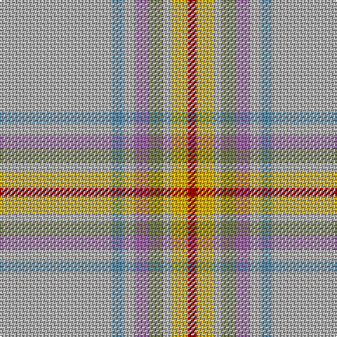

In pattern [RYYGRYBY](/stripes/ryygryby/).

This was sourced from register-of-tartans.  It is a [8 stripe tartan](/stripes/stripes8/).

Original link https://www.tartanregister.gov.uk/tartanDetails.aspx?ref=11252

## Register references

External register numbers recorded for this tartan.

- Scottish Register of Tartans: [11252](https://www.tartanregister.gov.uk/tartanDetails.aspx?ref=11252)

## Thread count
N/80 B8 N8 LP10 G10 N6 Y12 DR/6

## Palette
Each colour and its ΔE from the base-6 reference it is a variant of.

| Colour | Shade | Base | ΔE (OKLab) |
|---|---|---|---|
| B | <code style="background-color:#5C8CA8;">#5C8CA8</code> `#5C8CA8` | B <code style="background-color:#2A418A;">#2A418A</code> | 0.23 |
| DR | <code style="background-color:#A00000;">#A00000</code> `#A00000` | R <code style="background-color:#CC0000;">#CC0000</code> | 0.09 |
| G | <code style="background-color:#767E52;">#767E52</code> `#767E52` | G <code style="background-color:#006100;">#006100</code> | 0.17 |
| LP | <code style="background-color:#9C68A4;">#9C68A4</code> `#9C68A4` | R <code style="background-color:#CC0000;">#CC0000</code> | 0.21 |
| N | <code style="background-color:#B0B0B0;">#B0B0B0</code> `#B0B0B0` | Y <code style="background-color:#F2BF00;">#F2BF00</code> | 0.18 |
| Y | <code style="background-color:#D8B000;">#D8B000</code> `#D8B000` | Y <code style="background-color:#F2BF00;">#F2BF00</code> | 0.06 |

# Sample pattern

## Nearest tartans

The nearest existing variants by ΔTartan distance.

1. [Middleton, City of](/setts/s9/o16w1o1k1o8lo4r2w2r2~x4/) — ΔT 1.68
1. [Canuck Place](/setts/s9/w1db2lg15db3lg26o24lg3r2lo1~x2/) — ΔT 1.88
1. [Portree, Check](/setts/s12/y38db4y8o2y4w3y4m14n7y2n4w2~x2/) — ΔT 2.06
1. [Stuart Silver Commemorative Tartan Tartan Number: 1281. Earliest known date: 1977 1977 Jubilee tartan NOT accepted. No official jubilee tartan was adopted for the occasion. See products available Copyright © Blair Urquhart, Comrie, 2015](/setts/s12/o60t5o8ly2o4w2o4g16dy8o2dy4w2~x2/) — ΔT 2.07
1. [Glen Ross (WCWM - 1)](/setts/s11/lb21n4r1o1lb1n1o4y3n1y1lb1~x4/) — ΔT 2.07
1. [Stuart / Stewart, Silver](/setts/s12/y60t5y8ly2y4w2y4g16o8y2o4w2~x2/) — ΔT 2.11
1. [Dabney Grey (Personal)](/setts/s11/r2lr2r1lr24o1n3k3lr3o12lr4r1~x2/) — ΔT 2.13
1. [Portree Check (District) Tartan Tartan Number: 1280. Earliest known date: pre 2003 Designed for the Porteous Family Association, and submitted to the Monitoring Committee of the Scottish Tartan Society by Captain Barry Porteous who was president of the association at that time. See products available Copyright © Blair Urquhart, Comrie, 2015](/setts/s12/o38lp4o8dy2o4w3o4r14n7o2n4w2~x2/) — ΔT 2.14
1. [Muskoka (District)](/setts/s8/w2g5t10g20r1ly2r2ly1~x2/) — ΔT 2.17
1. [Bartlett (Personal)](/setts/s13/r4lo40n12o2n12lo30k2lo4k2lo4o2lo3k3~x2/) — ΔT 2.22

## Neighbour map

Every grey dot is one of 14299 variants placed by the first two principal components of the ΔTartan feature space (44% of its variance). Red is this tartan; blue dots are its nearest — click one to open its page.

<svg viewBox="0 0 640 380" role="img" style="max-width:100%;height:auto;border:1px solid #e0e0e0;border-radius:4px;display:block" xmlns="http://www.w3.org/2000/svg"><image href="/nn/cloud.v1.png" width="640" height="380"/><a href="/setts/s9/o16w1o1k1o8lo4r2w2r2~x4/"><circle cx="434.3" cy="162.4" r="4" fill="#3465a4"><title>Middleton, City of</title></circle></a><a href="/setts/s9/w1db2lg15db3lg26o24lg3r2lo1~x2/"><circle cx="384.0" cy="137.7" r="4" fill="#3465a4"><title>Canuck Place</title></circle></a><a href="/setts/s12/y38db4y8o2y4w3y4m14n7y2n4w2~x2/"><circle cx="382.1" cy="126.9" r="4" fill="#3465a4"><title>Portree, Check</title></circle></a><a href="/setts/s12/o60t5o8ly2o4w2o4g16dy8o2dy4w2~x2/"><circle cx="457.4" cy="101.2" r="4" fill="#3465a4"><title>Stuart Silver Commemorative Tartan Tartan Number: 1281. Earliest known date: 1977 1977 Jubilee tartan NOT accepted. No official jubilee tartan was adopted for the occasion. See products available Copyright © Blair Urquhart, Comrie, 2015</title></circle></a><a href="/setts/s11/lb21n4r1o1lb1n1o4y3n1y1lb1~x4/"><circle cx="390.0" cy="112.4" r="4" fill="#3465a4"><title>Glen Ross (WCWM - 1)</title></circle></a><a href="/setts/s12/y60t5y8ly2y4w2y4g16o8y2o4w2~x2/"><circle cx="497.7" cy="124.8" r="4" fill="#3465a4"><title>Stuart / Stewart, Silver</title></circle></a><a href="/setts/s11/r2lr2r1lr24o1n3k3lr3o12lr4r1~x2/"><circle cx="394.2" cy="130.0" r="4" fill="#3465a4"><title>Dabney Grey (Personal)</title></circle></a><a href="/setts/s12/o38lp4o8dy2o4w3o4r14n7o2n4w2~x2/"><circle cx="369.8" cy="117.3" r="4" fill="#3465a4"><title>Portree Check (District) Tartan Tartan Number: 1280. Earliest known date: pre 2003 Designed for the Porteous Family Association, and submitted to the Monitoring Committee of the Scottish Tartan Society by Captain Barry Porteous who was president of the association at that time. See products available Copyright © Blair Urquhart, Comrie, 2015</title></circle></a><a href="/setts/s8/w2g5t10g20r1ly2r2ly1~x2/"><circle cx="361.6" cy="152.5" r="4" fill="#3465a4"><title>Muskoka (District)</title></circle></a><a href="/setts/s13/r4lo40n12o2n12lo30k2lo4k2lo4o2lo3k3~x2/"><circle cx="454.1" cy="139.1" r="4" fill="#3465a4"><title>Bartlett (Personal)</title></circle></a><circle cx="442.7" cy="158.3" r="5" fill="#c00000"/></svg>

ID: /setts/s8/lr40t4lr4m5y5lr3ly6r3~x2/
