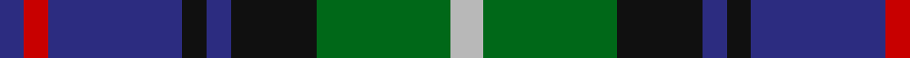
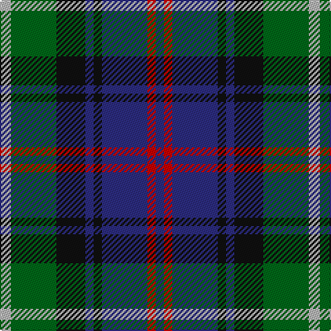

In pattern [BRBKBKGY](/stripes/brbkbkgy/).

This was sourced from house-of-tartan.  It is a [8 stripe tartan](/stripes/stripes8/).

Original link http://www.house-of-tartan.scotland.net/house/TartanViewjs.asp?colr=Def&tnam=2054

## Thread count
N/8 G33 K21 DB6 K6 DB33 R6 DB/6

## Palette
Each colour and the base-6 reference it is a variant of.

| Colour | Shade | Base |
|---|---|---|
| DB | <code style="background-color:#2C2C80;">#2C2C80</code> `oklch(35.0% 0.138 276.6)` <small>#2C2C80</small> | B <code style="background-color:#2A418A;">#2A418A</code> |
| G | <code style="background-color:#006818;">#006818</code> `oklch(45.0% 0.142 145.0)` <small>#006818</small> | G <code style="background-color:#006100;">#006100</code> |
| K | <code style="background-color:#101010;">#101010</code> `oklch(17.3% 0.000 89.9)` <small>#101010</small> | K <code style="background-color:#000000;">#000000</code> |
| N | <code style="background-color:#B8B8B8;">#B8B8B8</code> `oklch(78.3% 0.000 89.9)` <small>#B8B8B8</small> | Y <code style="background-color:#F2BF00;">#F2BF00</code> |
| R | <code style="background-color:#C80000;">#C80000</code> `oklch(52.3% 0.215 29.2)` <small>#C80000</small> | R <code style="background-color:#CC0000;">#CC0000</code> |

# Sample pattern

## Nearest tartans

The nearest existing variants by ΔTartan distance, with this tartan at the top so the swatches line up against it.

ΔTartan

Tartan

Sett

—

<a href="/ttd/edit/#slug=lr8g33k21db6k6db33r6db6">Royal Highland Corporate Tartan Tartan Number: 2054. Earliest known date: March 1992 In 1808 the Highland Society of Scotland used the Universal or Black Watch tartan. This has been incorporated in the new design along with colours to represent the agricultural heritage and interests of the Society. This design includes changes that were made when the first version proved an exact match to the 'Wellington' tartan. The white is 'Barley white'. See products available Copyright © Blair Urquhart, Comrie, 2015</a> <a class="nn-out" href="/setts/s8/lr8g33k21db6k6db33r6db6/" title="open its dictionary page">↗</a>

0.68

<a href="/ttd/edit/#slug=k4b21dy10y4k20r6b3~x2">Swankie (Personal)</a> <a class="nn-out" href="/setts/s7/k4b21dy10y4k20r6b3~x2/" title="open its dictionary page">↗</a>

0.69

<a href="/ttd/edit/#slug=k3ly3g22db6k17g6db22r3db3~x2">Maresh</a> <a class="nn-out" href="/setts/s9/k3ly3g22db6k17g6db22r3db3~x2/" title="open its dictionary page">↗</a>

0.72

<a href="/ttd/edit/#slug=t4g14ly2k14db14k2db3~x2">Hogarth of Firhill (Clan)</a> <a class="nn-out" href="/setts/s7/t4g14ly2k14db14k2db3~x2/" title="open its dictionary page">↗</a>

0.76

<a href="/ttd/edit/#slug=t2g6ly1k6db6k1db1~x2">Hogarth of Firhill</a> <a class="nn-out" href="/setts/s7/t2g6ly1k6db6k1db1~x2/" title="open its dictionary page">↗</a>

0.77

<a href="/ttd/edit/#slug=g16lb3g3k10db12r2db3~x2">MacLean, Donald (Personal)</a> <a class="nn-out" href="/setts/s7/g16lb3g3k10db12r2db3~x2/" title="open its dictionary page">↗</a>

0.79

<a href="/ttd/edit/#slug=b2dg6ly1k6db6k1db1~x2">Hogarth of Firhill #2</a> <a class="nn-out" href="/setts/s7/b2dg6ly1k6db6k1db1~x2/" title="open its dictionary page">↗</a>

0.79

<a href="/ttd/edit/#slug=db10r7db31k25dg23k8db7k8ly5~x2">MacCallum of Berwick</a> <a class="nn-out" href="/setts/s9/db10r7db31k25dg23k8db7k8ly5~x2/" title="open its dictionary page">↗</a>

0.79

<a href="/ttd/edit/#slug=db1r1db6k6dg6w1~x2">Wellington</a> <a class="nn-out" href="/setts/s6/db1r1db6k6dg6w1~x2/" title="open its dictionary page">↗</a>

0.79

<a href="/ttd/edit/#slug=r3db20g3k20db3g20w3g3~x2">MacFrog (Personal)</a> <a class="nn-out" href="/setts/s8/r3db20g3k20db3g20w3g3~x2/" title="open its dictionary page">↗</a>

0.82

<a href="/ttd/edit/#slug=g11t3g5r3g5k22db22k5~x2">Wood (Personal)</a> <a class="nn-out" href="/setts/s8/g11t3g5r3g5k22db22k5~x2/" title="open its dictionary page">↗</a>

## Neighbour map

Every grey dot is one of 14299 variants placed by the first two principal components of the ΔTartan feature space (44% of its variance). Red is this tartan; blue dots are its nearest — click one to open its page.

<svg viewBox="0 0 640 380" role="img" style="max-width:100%;height:auto;border:1px solid #e0e0e0;border-radius:4px;display:block" xmlns="http://www.w3.org/2000/svg"><image href="/nn/cloud.v1.png" width="640" height="380"/><a href="/setts/s7/k4b21dy10y4k20r6b3~x2/"><circle cx="147.4" cy="213.4" r="4" fill="#3465a4"><title>Swankie (Personal)</title></circle></a><a href="/setts/s9/k3ly3g22db6k17g6db22r3db3~x2/"><circle cx="168.7" cy="202.3" r="4" fill="#3465a4"><title>Maresh</title></circle></a><a href="/setts/s7/t4g14ly2k14db14k2db3~x2/"><circle cx="134.8" cy="220.9" r="4" fill="#3465a4"><title>Hogarth of Firhill (Clan)</title></circle></a><a href="/setts/s7/t2g6ly1k6db6k1db1~x2/"><circle cx="116.1" cy="225.7" r="4" fill="#3465a4"><title>Hogarth of Firhill</title></circle></a><a href="/setts/s7/g16lb3g3k10db12r2db3~x2/"><circle cx="164.3" cy="215.2" r="4" fill="#3465a4"><title>MacLean, Donald (Personal)</title></circle></a><a href="/setts/s7/b2dg6ly1k6db6k1db1~x2/"><circle cx="120.0" cy="229.0" r="4" fill="#3465a4"><title>Hogarth of Firhill #2</title></circle></a><a href="/setts/s9/db10r7db31k25dg23k8db7k8ly5~x2/"><circle cx="159.6" cy="223.9" r="4" fill="#3465a4"><title>MacCallum of Berwick</title></circle></a><a href="/setts/s6/db1r1db6k6dg6w1~x2/"><circle cx="142.2" cy="236.4" r="4" fill="#3465a4"><title>Wellington</title></circle></a><a href="/setts/s8/r3db20g3k20db3g20w3g3~x2/"><circle cx="143.6" cy="199.0" r="4" fill="#3465a4"><title>MacFrog (Personal)</title></circle></a><a href="/setts/s8/g11t3g5r3g5k22db22k5~x2/"><circle cx="172.4" cy="216.8" r="4" fill="#3465a4"><title>Wood (Personal)</title></circle></a><circle cx="146.7" cy="217.7" r="5" fill="#c00000"/></svg>

ID: /setts/s8/lr8g33k21db6k6db33r6db6/
