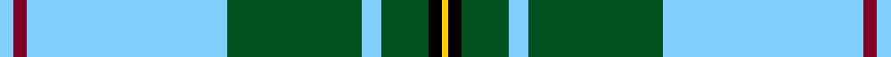

In pattern [WRWGWGKY](/stripes/wrwgwgky/).

This was sourced from register-of-tartans.  It is a [8 stripe tartan](/stripes/stripes8/).

Original link https://www.tartanregister.gov.uk/tartanDetails.aspx?ref=11614

## Register references

External register numbers recorded for this tartan.

- Scottish Register of Tartans: [11614](https://www.tartanregister.gov.uk/tartanDetails.aspx?ref=11614)

## Thread count
LB/4 DR4 LB60 G40 LB6 G14 K4 Y/2

## Palette
Each colour and the base-6 reference it is a variant of.

| Colour | Shade | Base |
|---|---|---|
| DR | <code style="background-color:#800028;">#800028</code> `oklch(38.2% 0.152 14.5)` <small>#800028</small> | R <code style="background-color:#CC0000;">#CC0000</code> |
| G | <code style="background-color:#005020;">#005020</code> `oklch(37.7% 0.105 149.6)` <small>#005020</small> | G <code style="background-color:#006100;">#006100</code> |
| K | <code style="background-color:#000000;">#000000</code> `oklch(0.0% 0.000 0.0)` <small>#000000</small> | K <code style="background-color:#000000;">#000000</code> |
| LB | <code style="background-color:#82CFFD;">#82CFFD</code> `oklch(82.2% 0.100 236.0)` <small>#82CFFD</small> | W <code style="background-color:#F7F7F7;">#F7F7F7</code> |
| Y | <code style="background-color:#FCCC00;">#FCCC00</code> `oklch(86.2% 0.176 91.5)` <small>#FCCC00</small> | Y <code style="background-color:#F2BF00;">#F2BF00</code> |

# Sample pattern

## Nearest tartans

The nearest existing variants by ΔTartan distance.

1. [McClurg, William Thomas (Personal)](/setts/s9/k4ly1g2ly1g32lt1g3lt32db3~x2/) — ΔT 1.30
1. [Pearce Scotch Plaid 4 (Fashion)](/setts/s7/ly6dg36w5b4w30b1w2~x2/) — ΔT 1.60
1. [McClurg](/setts/s9/k4ly1g2ly1g32lt1g3db32lt3~x2/) — ΔT 1.61
1. [Scottish Prison Service (Corporate)](/setts/s8/w3k1r4g20k3b30w4r2~x2/) — ΔT 1.61
1. [Unidentified (shirt fabric)](/setts/s9/w5db3w25k2w2k16g8k1w4/) — ΔT 1.64
1. [McGuinness, Tam (Personal)](/setts/s5/lo2db4g60p30w1~x2/) — ΔT 1.64
1. [Cornish National Day](/setts/s8/k5w2ly36t47r3~x2/) — ΔT 1.65
1. [Bell of the Borders](/setts/s9/r3g2k9lr2k2lr24ly2lr2ly1~x4/) — ΔT 1.65
1. [Bruichladdich (Corporate)](/setts/s10/k3y3lo3y3k12y24k1y3k3w3~x2/) — ΔT 1.66
1. [Nynashamn Whisky Society (Corporate)](/setts/s6/ly21g26db62w2dg2w2/) — ΔT 1.67

## Neighbour map

Every grey dot is one of 14299 variants placed by the first two principal components of the ΔTartan feature space (44% of its variance). Red is this tartan; blue dots are its nearest — click one to open its page.

<svg viewBox="0 0 640 380" role="img" style="max-width:100%;height:auto;border:1px solid #e0e0e0;border-radius:4px;display:block" xmlns="http://www.w3.org/2000/svg"><image href="/nn/cloud.v1.png" width="640" height="380"/><a href="/setts/s9/k4ly1g2ly1g32lt1g3lt32db3~x2/"><circle cx="278.5" cy="91.1" r="4" fill="#3465a4"><title>McClurg, William Thomas (Personal)</title></circle></a><a href="/setts/s7/ly6dg36w5b4w30b1w2~x2/"><circle cx="269.8" cy="114.5" r="4" fill="#3465a4"><title>Pearce Scotch Plaid 4 (Fashion)</title></circle></a><a href="/setts/s9/k4ly1g2ly1g32lt1g3db32lt3~x2/"><circle cx="275.9" cy="99.4" r="4" fill="#3465a4"><title>McClurg</title></circle></a><a href="/setts/s8/w3k1r4g20k3b30w4r2~x2/"><circle cx="252.5" cy="115.9" r="4" fill="#3465a4"><title>Scottish Prison Service (Corporate)</title></circle></a><a href="/setts/s9/w5db3w25k2w2k16g8k1w4/"><circle cx="278.1" cy="117.5" r="4" fill="#3465a4"><title>Unidentified (shirt fabric)</title></circle></a><a href="/setts/s5/lo2db4g60p30w1~x2/"><circle cx="383.4" cy="113.4" r="4" fill="#3465a4"><title>McGuinness, Tam (Personal)</title></circle></a><a href="/setts/s8/k5w2ly36t47r3~x2/"><circle cx="296.5" cy="139.0" r="4" fill="#3465a4"><title>Cornish National Day</title></circle></a><a href="/setts/s9/r3g2k9lr2k2lr24ly2lr2ly1~x4/"><circle cx="308.9" cy="91.8" r="4" fill="#3465a4"><title>Bell of the Borders</title></circle></a><a href="/setts/s10/k3y3lo3y3k12y24k1y3k3w3~x2/"><circle cx="320.2" cy="123.9" r="4" fill="#3465a4"><title>Bruichladdich (Corporate)</title></circle></a><a href="/setts/s6/ly21g26db62w2dg2w2/"><circle cx="301.2" cy="128.1" r="4" fill="#3465a4"><title>Nynashamn Whisky Society (Corporate)</title></circle></a><circle cx="298.1" cy="107.2" r="5" fill="#c00000"/></svg>

ID: /setts/s8/lt2r2lt30dg20lt3dg7k2ly1~x2/
