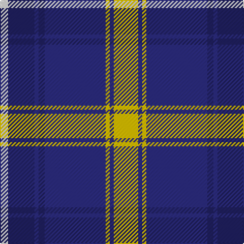

**Bands:** [WBBBBYBY](/stripes/wbbbbyby/) · **Stripes:** [W DB DB DB DB LY DB LY](/stripes/stripes8/) W DB DB DB DB LY DB LY

This was sourced from house-of-tartan.  It is a [8 band tartan](/bands/bands8/).

Original link http://www.house-of-tartan.scotland.net/house/TartanViewjs.asp?colr=Def&tnam=2109

## Thread count
LN/8 DBa26 DB4 DBa6 DB60 Y4 DB4 Y/24

## Palette
Each colour and its ΔE from the base-6 reference it is a variant of.

| Colour | Shade | Base | ΔE (OKLab) |
|---|---|---|---|
| DB | <code style="background-color:#2C2C80;">#2C2C80</code> `#2C2C80` | B <code style="background-color:#2A418A;">#2A418A</code> | 0.06 |
| DBa | <code style="background-color:#202060;">#202060</code> `#202060` | B <code style="background-color:#2A418A;">#2A418A</code> | 0.11 |
| LN | <code style="background-color:#E0E0E0;">#E0E0E0</code> `#E0E0E0` | W <code style="background-color:#F7F7F7;">#F7F7F7</code> | 0.07 |
| Y | <code style="background-color:#E8C000;">#E8C000</code> `#E8C000` | Y <code style="background-color:#F2BF00;">#F2BF00</code> | 0.02 |

# Sample pattern

## Nearest tartans

The nearest existing variants by ΔTartan distance.

1. [Highlands School (North Carolina)](/setts/s8/lo12db2lo2db30dt2db2dt13lb4~x2/) — ΔT 0.65
1. [Longniddry Eildon Blue Dress Fancy Tartan Tartan Number: 5486. Earliest known date: pre 1992 Dancers tartan See products available Copyright © Blair Urquhart, Comrie, 2015](/setts/s8/db42lb2lb2lb2db5dt12lb32db4~x2/) — ΔT 0.71
1. [Detroit Lions](/setts/s8/db30lb2k9w3db6w4k3lb6~x2/) — ΔT 0.78
1. [Highlands School, (North Carolina)](/setts/s8/y12db2y2db30db3db2db13w4~x2/) — ΔT 0.87
1. [Scottish Knights Templar Int. (Corp)](/setts/s9/r3db20k6lb5k4lb3k2r1db2~x2/) — ΔT 0.89
1. [Eildon/Longniddry Blue Dress Fashion Tartan Tartan Number: 4799. Earliest known date: 01/01/1980 A Dancers' Fancy from Dalgliesh. This appears under three different names - Longniddry #5486, Eildon #4799 and Harmony Eildon #87 (original Scottish Tartans Authority references). Needs resolving. Sample in Scottish Tartans Authority's Dalgety Collection. /Threadcount and colours aren't 100% original. Generated manually./ See products available Copyright © Blair Urquhart, Comrie, 2015](/setts/s8/db30t2w2t2db4t10w25db4~x2/) — ΔT 0.93
1. [Longniddry Blue (Dance)](/setts/s8/dt42lb2lb2lb2dt5dt12lb32dt4~x2/) — ΔT 0.95
1. [Hannay Blue (Fashion?)](/setts/s10/k9t4k2t4k2t30k9t4db14ly2~x2/) — ΔT 1.02
1. [Lord Arran (Corporate)](/setts/s9/r3dy1w12dy2db2dy2db14w2db2~x2/) — ΔT 1.03
1. [Int. Police Association (Official)](/setts/s7/db7r3db26t2db2t26ly4~x2/) — ΔT 1.05

## Neighbour map

Every grey dot is one of 14313 variants placed by the first two principal components of the ΔTartan feature space (44% of its variance). Red is this tartan; blue dots are its nearest — click one to open its page.

<svg viewBox="0 0 640 380" role="img" style="max-width:100%;height:auto;border:1px solid #e0e0e0;border-radius:4px;display:block" xmlns="http://www.w3.org/2000/svg"><image href="/nn/cloud.v1.png" width="640" height="380"/><a href="/setts/s8/lo12db2lo2db30dt2db2dt13lb4~x2/"><circle cx="273.2" cy="160.5" r="4" fill="#3465a4"><title>Highlands School (North Carolina)</title></circle></a><a href="/setts/s8/db42lb2lb2lb2db5dt12lb32db4~x2/"><circle cx="289.5" cy="139.0" r="4" fill="#3465a4"><title>Longniddry Eildon Blue Dress Fancy Tartan Tartan Number: 5486. Earliest known date: pre 1992 Dancers tartan See products available Copyright © Blair Urquhart, Comrie, 2015</title></circle></a><a href="/setts/s8/db30lb2k9w3db6w4k3lb6~x2/"><circle cx="291.6" cy="153.6" r="4" fill="#3465a4"><title>Detroit Lions</title></circle></a><a href="/setts/s8/y12db2y2db30db3db2db13w4~x2/"><circle cx="280.3" cy="170.7" r="4" fill="#3465a4"><title>Highlands School, (North Carolina)</title></circle></a><a href="/setts/s9/r3db20k6lb5k4lb3k2r1db2~x2/"><circle cx="266.3" cy="145.8" r="4" fill="#3465a4"><title>Scottish Knights Templar Int. (Corp)</title></circle></a><a href="/setts/s8/db30t2w2t2db4t10w25db4~x2/"><circle cx="244.3" cy="147.0" r="4" fill="#3465a4"><title>Eildon/Longniddry Blue Dress Fashion Tartan Tartan Number: 4799. Earliest known date: 01/01/1980 A Dancers' Fancy from Dalgliesh. This appears under three different names - Longniddry #5486, Eildon #4799 and Harmony Eildon #87 (original Scottish Tartans Authority references). Needs resolving. Sample in Scottish Tartans Authority's Dalgety Collection. /Threadcount and colours aren't 100% original. Generated manually./ See products available Copyright © Blair Urquhart, Comrie, 2015</title></circle></a><a href="/setts/s8/dt42lb2lb2lb2dt5dt12lb32dt4~x2/"><circle cx="287.5" cy="139.5" r="4" fill="#3465a4"><title>Longniddry Blue (Dance)</title></circle></a><a href="/setts/s10/k9t4k2t4k2t30k9t4db14ly2~x2/"><circle cx="284.9" cy="161.3" r="4" fill="#3465a4"><title>Hannay Blue (Fashion?)</title></circle></a><a href="/setts/s9/r3dy1w12dy2db2dy2db14w2db2~x2/"><circle cx="225.4" cy="143.3" r="4" fill="#3465a4"><title>Lord Arran (Corporate)</title></circle></a><a href="/setts/s7/db7r3db26t2db2t26ly4~x2/"><circle cx="288.6" cy="179.8" r="4" fill="#3465a4"><title>Int. Police Association (Official)</title></circle></a><circle cx="260.5" cy="155.8" r="5" fill="#c00000"/></svg>

ID: /setts/s8/ly12db2ly2db30db3db2db13w4~x2/
