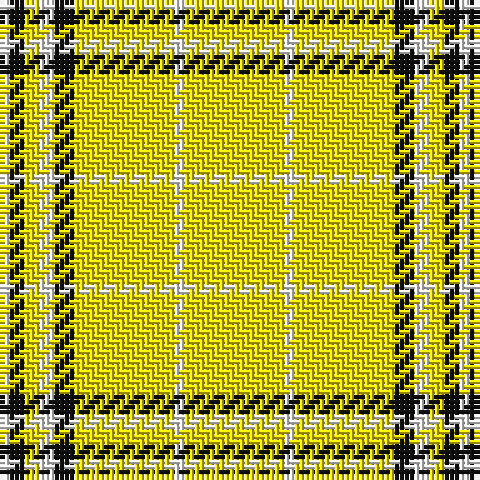

This page is one **sett** — a single exact thread-count. It belongs to the [tartan](/tartans/y20w2y20k4w3y3k3w2/)
(the same proportion at any scale), whose colour order is pattern [WKYWKYWY](/stripes/wkywkywy/).

Sourced from register-of-tartans.  It is a [8 stripe tartan](/stripes/stripes8/).

Original link https://www.tartanregister.gov.uk/tartanDetails.aspx?ref=6012

2 attestations — the source records this cloth was collapsed from (oldest owns this page)

<ul>
<li>01/01/2009 — Guzzo Check (Personal) (register-of-tartans, <a href="https://www.tartanregister.gov.uk/tartanDetails.aspx?ref=6012">record</a>)</li>
<li>pre 2009 — Guzzo Check (Personal) (tartans-authority, <a href="http://www.tartansauthority.com/tartan-ferret/display/8036/">record</a>)</li>
</ul>

## Register references

External register numbers recorded for this tartan.

- Scottish Register of Tartans: [6012](https://www.tartanregister.gov.uk/tartanDetails.aspx?ref=6012)
- Scottish Tartans Authority (ITI): 8036

## Thread count
Y/20 W2 Y20 K4 W3 Y3 K3 W/2

## Palette
Each colour and the base-6 reference it is a variant of.

| Colour | Shade | Base |
|---|---|---|
| K | <code style="background-color:#101010;">#101010</code> `oklch(17.3% 0.000 89.9)` <small>#101010</small> | K <code style="background-color:#000000;">#000000</code> |
| W | <code style="background-color:#FFFFFF;">#FFFFFF</code> `oklch(100.0% 0.000 89.9)` <small>#FFFFFF</small> | W <code style="background-color:#F7F7F7;">#F7F7F7</code> |
| Y | <code style="background-color:#FFE600;">#FFE600</code> `oklch(91.7% 0.192 101.4)` <small>#FFE600</small> | Y <code style="background-color:#F2BF00;">#F2BF00</code> |

# Sample pattern

## Nearest tartans

The nearest existing variants by ΔTartan distance, with this tartan at the top so the swatches line up against it.

ΔTartan

Tartan

Sett

—

<a href="/ttd/edit/#slug=ly20w2ly20k4w3ly3k3w2">Guzzo Check (Personal)</a> <a class="nn-out" href="/setts/s8/ly20w2ly20k4w3ly3k3w2/" title="open its dictionary page">↗</a>

1.95

<a href="/ttd/edit/#slug=w40o3w10o6w20k3w2k3w10r4w2r8w2">Virginia Quadricentennial</a> <a class="nn-out" href="/setts/s13/w40o3w10o6w20k3w2k3w10r4w2r8w2/" title="open its dictionary page">↗</a>

2.45

<a href="/ttd/edit/#slug=w20k2w20ly5k3w3ly4k2">Guzzo Dress (Montreal, Canada) (Personal)</a> <a class="nn-out" href="/setts/s8/w20k2w20ly5k3w3ly4k2/" title="open its dictionary page">↗</a>

2.48

<a href="/ttd/edit/#slug=db6db3ly3db2ly3db4ly48db4">Morris (Welsh Name)</a> <a class="nn-out" href="/setts/s8/db6db3ly3db2ly3db4ly48db4/" title="open its dictionary page">↗</a>

2.49

<a href="/ttd/edit/#slug=r2ly33k5w3g2~x2">Port Moresby City Pipes and Drums</a> <a class="nn-out" href="/setts/s5/r2ly33k5w3g2~x2/" title="open its dictionary page">↗</a>

2.71

<a href="/ttd/edit/#slug=ly40lo3ly10lo6ly20k3ly2k3ly10r4ly2r8ly2~x2">Virginia Quadricentennial (District)</a> <a class="nn-out" href="/setts/s13/ly40lo3ly10lo6ly20k3ly2k3ly10r4ly2r8ly2~x2/" title="open its dictionary page">↗</a>

2.71

<a href="/ttd/edit/#slug=ly75k26k3ly4k6~x2">Perry Ancient (Personal)</a> <a class="nn-out" href="/setts/s5/ly75k26k3ly4k6~x2/" title="open its dictionary page">↗</a>

2.71

<a href="/ttd/edit/#slug=w20k2w20lo5k3w3lo4k2">Guzzo Dress (Personal)</a> <a class="nn-out" href="/setts/s8/w20k2w20lo5k3w3lo4k2/" title="open its dictionary page">↗</a>

2.80

<a href="/ttd/edit/#slug=dt4ly9w4dt9ly18w1~x2">WVU Mountaineer (Corporate)</a> <a class="nn-out" href="/setts/s6/dt4ly9w4dt9ly18w1~x2/" title="open its dictionary page">↗</a>

2.80

<a href="/ttd/edit/#slug=k7w3k7w45r3w3r3~x2">White Stripes (Corporate)</a> <a class="nn-out" href="/setts/s7/k7w3k7w45r3w3r3~x2/" title="open its dictionary page">↗</a>

2.83

<a href="/ttd/edit/#slug=lo40g13lo6db13lo22~x2">Burt's Highlanders (Fashion)</a> <a class="nn-out" href="/setts/s5/lo40g13lo6db13lo22~x2/" title="open its dictionary page">↗</a>

## Neighbour map

Every grey dot is one of 14299 variants placed by the first two principal components of the ΔTartan feature space (44% of its variance). Red is this tartan; blue dots are its nearest — click one to open its page.

<svg viewBox="0 0 640 380" role="img" style="max-width:100%;height:auto;border:1px solid #e0e0e0;border-radius:4px;display:block" xmlns="http://www.w3.org/2000/svg"><image href="/nn/cloud.v1.png" width="640" height="380"/><a href="/setts/s13/w40o3w10o6w20k3w2k3w10r4w2r8w2/"><circle cx="427.9" cy="97.5" r="4" fill="#3465a4"><title>Virginia Quadricentennial</title></circle></a><a href="/setts/s8/w20k2w20ly5k3w3ly4k2/"><circle cx="386.0" cy="164.9" r="4" fill="#3465a4"><title>Guzzo Dress (Montreal, Canada) (Personal)</title></circle></a><a href="/setts/s8/db6db3ly3db2ly3db4ly48db4/"><circle cx="473.4" cy="113.0" r="4" fill="#3465a4"><title>Morris (Welsh Name)</title></circle></a><a href="/setts/s5/r2ly33k5w3g2~x2/"><circle cx="422.2" cy="128.6" r="4" fill="#3465a4"><title>Port Moresby City Pipes and Drums</title></circle></a><a href="/setts/s13/ly40lo3ly10lo6ly20k3ly2k3ly10r4ly2r8ly2~x2/"><circle cx="468.0" cy="122.9" r="4" fill="#3465a4"><title>Virginia Quadricentennial (District)</title></circle></a><a href="/setts/s5/ly75k26k3ly4k6~x2/"><circle cx="429.2" cy="149.2" r="4" fill="#3465a4"><title>Perry Ancient (Personal)</title></circle></a><a href="/setts/s8/w20k2w20lo5k3w3lo4k2/"><circle cx="400.8" cy="174.1" r="4" fill="#3465a4"><title>Guzzo Dress (Personal)</title></circle></a><a href="/setts/s6/dt4ly9w4dt9ly18w1~x2/"><circle cx="316.0" cy="182.8" r="4" fill="#3465a4"><title>WVU Mountaineer (Corporate)</title></circle></a><a href="/setts/s7/k7w3k7w45r3w3r3~x2/"><circle cx="420.2" cy="133.7" r="4" fill="#3465a4"><title>White Stripes (Corporate)</title></circle></a><a href="/setts/s5/lo40g13lo6db13lo22~x2/"><circle cx="374.5" cy="244.7" r="4" fill="#3465a4"><title>Burt's Highlanders (Fashion)</title></circle></a><circle cx="413.7" cy="165.6" r="5" fill="#c00000"/></svg>

ID: /setts/s8/ly20w2ly20k4w3ly3k3w2/
