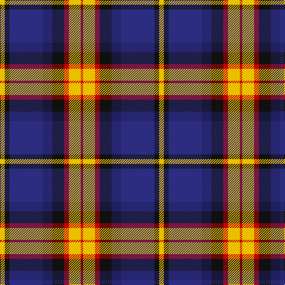

This page is one **sett** — a single exact thread-count. It belongs to the [tartan](/tartans/ly2k2dbi14db4k5r2ly5r1/)
(the same proportion at any scale), whose colour order is pattern [RYRKBBKY](/stripes/ryrkbbky/).

Sourced from tartans-authority.  It is a [8 stripe tartan](/stripes/stripes8/).

Original link http://www.tartansauthority.com/tartan-ferret/display/11036/

## Register references

External register numbers recorded for this tartan.

- Scottish Register of Tartans: [11036](https://www.tartanregister.gov.uk/tartanDetails?ref=11036)
- Scottish Tartans Authority (ITI): 11036

## Thread count
Y/8 K8 DB56 DBa16 K20 R8 Y20 R/4

## Palette

Palette: <strong>Tartan Register</strong>
<table><thead><tr><th>Colour</th><th>Threads</th><th>Shade</th><th>Base</th><th>OKLCh</th></tr></thead><tbody><tr><td>Y/</td><td style="text-align:right;font-variant-numeric:tabular-nums">8</td><td><code style="background-color:#E8C000;">#E8C000</code> <small style="color:#888">#E8C000</small></td><td>Y <code style="background-color:#F2BF00;">#F2BF00</code></td><td><small style="color:#888">oklch(81.9% 0.168 93.7)</small></td></tr><tr><td>K</td><td style="text-align:right;font-variant-numeric:tabular-nums">8</td><td><code style="background-color:#101010;">#101010</code> <small style="color:#888">#101010</small></td><td>K <code style="background-color:#000000;">#000000</code></td><td><small style="color:#888">oklch(17.3% 0.000 89.9)</small></td></tr><tr><td>DB</td><td style="text-align:right;font-variant-numeric:tabular-nums">56</td><td><code style="background-color:#2C2C80;">#2C2C80</code> <small style="color:#888">#2C2C80</small></td><td>B <code style="background-color:#2A418A;">#2A418A</code></td><td><small style="color:#888">oklch(35.0% 0.138 276.6)</small></td></tr><tr><td>DBa</td><td style="text-align:right;font-variant-numeric:tabular-nums">16</td><td><code style="background-color:#202060;">#202060</code> <small style="color:#888">#202060</small></td><td>B <code style="background-color:#2A418A;">#2A418A</code></td><td><small style="color:#888">oklch(28.9% 0.111 276.9)</small></td></tr><tr><td>K</td><td style="text-align:right;font-variant-numeric:tabular-nums">20</td><td><code style="background-color:#101010;">#101010</code> <small style="color:#888">#101010</small></td><td>K <code style="background-color:#000000;">#000000</code></td><td><small style="color:#888">oklch(17.3% 0.000 89.9)</small></td></tr><tr><td>R</td><td style="text-align:right;font-variant-numeric:tabular-nums">8</td><td><code style="background-color:#C80000;">#C80000</code> <small style="color:#888">#C80000</small></td><td>R <code style="background-color:#CC0000;">#CC0000</code></td><td><small style="color:#888">oklch(52.3% 0.215 29.2)</small></td></tr><tr><td>Y</td><td style="text-align:right;font-variant-numeric:tabular-nums">20</td><td><code style="background-color:#E8C000;">#E8C000</code> <small style="color:#888">#E8C000</small></td><td>Y <code style="background-color:#F2BF00;">#F2BF00</code></td><td><small style="color:#888">oklch(81.9% 0.168 93.7)</small></td></tr><tr><td>R/</td><td style="text-align:right;font-variant-numeric:tabular-nums">4</td><td><code style="background-color:#C80000;">#C80000</code> <small style="color:#888">#C80000</small></td><td>R <code style="background-color:#CC0000;">#CC0000</code></td><td><small style="color:#888">oklch(52.3% 0.215 29.2)</small></td></tr></tbody></table>

# Sample pattern

## Nearest tartans

The nearest existing variants by ΔTartan distance, with this tartan at the top so the swatches line up against it.

ΔTartan

Tartan

Sett

—

<a href="/ttd/edit/#slug=ly2k2dbi14db4k5r2ly5r1~x4">Lovell (2014)</a> <a class="nn-out" href="/setts/s8/ly2k2dbi14db4k5r2ly5r1~x4/" title="open its dictionary page">↗</a>

0.73

<a href="/ttd/edit/#slug=lo2k2dbi14db4k5r2lo5r1~x4">Lovell (2014)</a> <a class="nn-out" href="/setts/s8/lo2k2dbi14db4k5r2lo5r1~x4/" title="open its dictionary page">↗</a>

0.81

<a href="/ttd/edit/#slug=k26n2k2n2k2n10w10n6dt10lo5~x2">Collister (Personal)</a> <a class="nn-out" href="/setts/s10/k26n2k2n2k2n10w10n6dt10lo5~x2/" title="open its dictionary page">↗</a>

0.82

<a href="/ttd/edit/#slug=n12k2n2k2n2k12lp12t3w1~x2">de Franck, Matt (Personal)</a> <a class="nn-out" href="/setts/s9/n12k2n2k2n2k12lp12t3w1~x2/" title="open its dictionary page">↗</a>

0.91

<a href="/ttd/edit/#slug=db34dy9ly3dy9y30r3y11r5">Ballantyne (Personal) STWR</a> <a class="nn-out" href="/setts/s8/db34dy9ly3dy9y30r3y11r5/" title="open its dictionary page">↗</a>

0.96

<a href="/ttd/edit/#slug=db49ly12r12ly12dg32w8db3">Kuznetsov (2014)</a> <a class="nn-out" href="/setts/s7/db49ly12r12ly12dg32w8db3/" title="open its dictionary page">↗</a>

0.97

<a href="/ttd/edit/#slug=db22r3db2r3db2k17o18dg4~x2">Scotch House 2000, antique</a> <a class="nn-out" href="/setts/s8/db22r3db2r3db2k17o18dg4~x2/" title="open its dictionary page">↗</a>

0.99

<a href="/setts/s9/r3k1lb12k2db2k2ki14lb2ki2~x2/">NEWYORKER</a>

1.01

<a href="/ttd/edit/#slug=p18k7g5r4g7k1ly2~x2">Regent</a> <a class="nn-out" href="/setts/s7/p18k7g5r4g7k1ly2~x2/" title="open its dictionary page">↗</a>

1.02

<a href="/ttd/edit/#slug=dg14k2dg4r2dg4k14p15k1w3~x2">MacRae, hunting</a> <a class="nn-out" href="/setts/s9/dg14k2dg4r2dg4k14p15k1w3~x2/" title="open its dictionary page">↗</a>

1.04

<a href="/ttd/edit/#slug=db16w6r8db3lo1g1lg3db1g10~x4">Ogilvie of Inverquharity or Ohio</a> <a class="nn-out" href="/setts/s9/db16w6r8db3lo1g1lg3db1g10~x4/" title="open its dictionary page">↗</a>

## Neighbour map

Every grey dot is one of 14359 variants placed by the first two principal components of the ΔTartan feature space (44% of its variance). Red is this tartan; blue dots are its nearest — click one to open its page.

<svg viewBox="0 0 640 380" role="img" style="max-width:100%;height:auto;border:1px solid #e0e0e0;border-radius:4px;display:block" xmlns="http://www.w3.org/2000/svg"><image href="/nn/cloud.v1.png" width="640" height="380"/><a href="/setts/s8/lo2k2dbi14db4k5r2lo5r1~x4/"><circle cx="166.5" cy="158.8" r="4" fill="#3465a4"><title>Lovell (2014)</title></circle></a><a href="/setts/s10/k26n2k2n2k2n10w10n6dt10lo5~x2/"><circle cx="157.7" cy="142.8" r="4" fill="#3465a4"><title>Collister (Personal)</title></circle></a><a href="/setts/s9/n12k2n2k2n2k12lp12t3w1~x2/"><circle cx="149.9" cy="156.7" r="4" fill="#3465a4"><title>de Franck, Matt (Personal)</title></circle></a><a href="/setts/s8/db34dy9ly3dy9y30r3y11r5/"><circle cx="186.8" cy="175.1" r="4" fill="#3465a4"><title>Ballantyne (Personal) STWR</title></circle></a><a href="/setts/s7/db49ly12r12ly12dg32w8db3/"><circle cx="156.5" cy="153.3" r="4" fill="#3465a4"><title>Kuznetsov (2014)</title></circle></a><a href="/setts/s8/db22r3db2r3db2k17o18dg4~x2/"><circle cx="167.6" cy="175.1" r="4" fill="#3465a4"><title>Scotch House 2000, antique</title></circle></a><a href="/setts/s9/r3k1lb12k2db2k2ki14lb2ki2~x2/"><circle cx="170.0" cy="130.2" r="4" fill="#3465a4"><title>NEWYORKER</title></circle></a><a href="/setts/s7/p18k7g5r4g7k1ly2~x2/"><circle cx="185.6" cy="151.0" r="4" fill="#3465a4"><title>Regent</title></circle></a><a href="/setts/s9/dg14k2dg4r2dg4k14p15k1w3~x2/"><circle cx="164.6" cy="155.1" r="4" fill="#3465a4"><title>MacRae, hunting</title></circle></a><a href="/setts/s9/db16w6r8db3lo1g1lg3db1g10~x4/"><circle cx="147.6" cy="126.4" r="4" fill="#3465a4"><title>Ogilvie of Inverquharity or Ohio</title></circle></a><circle cx="165.7" cy="153.9" r="5" fill="#c00000"/></svg>

ID: /setts/s8/ly2k2dbi14db4k5r2ly5r1~x4/
