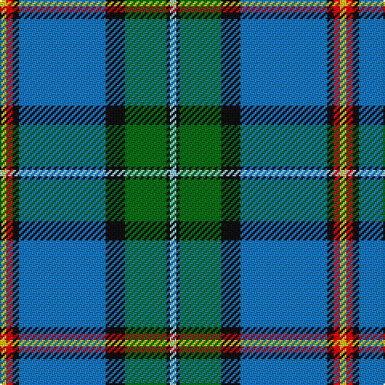

In pattern [WKGKBKRY](/stripes/wkgkbkry/).

This was sourced from register-of-tartans.  It is a [8 stripe tartan](/stripes/stripes8/).

Original link https://www.tartanregister.gov.uk/tartanDetails.aspx?ref=1336

## Attestations

This cloth appears in 2 source records; the oldest owns this page.

- 01/12/2005 — German MacLeod (register-of-tartans, [record](https://www.tartanregister.gov.uk/tartanDetails.aspx?ref=1336))
- 2005 December — German MacLeod (Corporate) (tartans-authority, [record](http://www.tartansauthority.com/tartan-ferret/display/6816/))

## Register references

External register numbers recorded for this tartan.

- Scottish Register of Tartans: [1336](https://www.tartanregister.gov.uk/tartanDetails.aspx?ref=1336)
- Scottish Tartans Authority (ITI): 6816

## Thread count
Y/4 R4 K4 B54 K12 G26 K2 LB/4

## Palette
Each colour and its ΔE from the base-6 reference it is a variant of.

| Colour | Shade | Base | ΔE (OKLab) |
|---|---|---|---|
| B | <code style="background-color:#1474B4;">#1474B4</code> `#1474B4` | B <code style="background-color:#2A418A;">#2A418A</code> | 0.15 |
| G | <code style="background-color:#006818;">#006818</code> `#006818` | G <code style="background-color:#006100;">#006100</code> | 0.02 |
| K | <code style="background-color:#101010;">#101010</code> `#101010` | K <code style="background-color:#000000;">#000000</code> | 0.17 |
| LB | <code style="background-color:#98C8E8;">#98C8E8</code> `#98C8E8` | W <code style="background-color:#F7F7F7;">#F7F7F7</code> | 0.18 |
| R | <code style="background-color:#C80000;">#C80000</code> `#C80000` | R <code style="background-color:#CC0000;">#CC0000</code> | 0.01 |
| Y | <code style="background-color:#E8C000;">#E8C000</code> `#E8C000` | Y <code style="background-color:#F2BF00;">#F2BF00</code> | 0.02 |

# Sample pattern

## Nearest tartans

The nearest existing variants by ΔTartan distance.

1. [Nova Scotia (Province)](/setts/s9/w2db20g2g2g2g4g8ly2r1~x2/) — ΔT 0.68
1. [Heriot Watt University](/setts/s10/g4ly1t3db15g2r2g14db1t28db2~x2/) — ΔT 0.69
1. [Nova Scotia](/setts/s9/w2db20dg2g2dg2g4dg8ly2r1~x2/) — ΔT 0.91
1. [Johnston, Diana Hunting (Personal)](/setts/s8/ly3db1k2g26db28w1db1r2~x2/) — ΔT 0.91
1. [Unidentified (ex Tony Murray)](/setts/s9/w2db20dg2dg2dg2dg5dg8ly2r1~x2/) — ΔT 0.97
1. [Inkster (Name)](/setts/s8/db31ly4g68w4db31r2k6r2~x2/) — ΔT 0.99
1. [Canadian Centennial](/setts/s8/r3w6r2g32db36k2db4ly2~x2/) — ΔT 1.00
1. [Highland Glen (Corporate)](/setts/s9/t50r3t4r4t7k14g31lo2w2~x2/) — ΔT 1.05
1. [Caskie](/setts/s7/w3k1t25r7g12k1ly3~x2/) — ΔT 1.08
1. [1314 (Corporate)](/setts/s11/db10g6o4r2o4k10db6k4db28g55w4/) — ΔT 1.13

## Neighbour map

Every grey dot is one of 14299 variants placed by the first two principal components of the ΔTartan feature space (44% of its variance). Red is this tartan; blue dots are its nearest — click one to open its page.

<svg viewBox="0 0 640 380" role="img" style="max-width:100%;height:auto;border:1px solid #e0e0e0;border-radius:4px;display:block" xmlns="http://www.w3.org/2000/svg"><image href="/nn/cloud.v1.png" width="640" height="380"/><a href="/setts/s9/w2db20g2g2g2g4g8ly2r1~x2/"><circle cx="230.9" cy="114.0" r="4" fill="#3465a4"><title>Nova Scotia (Province)</title></circle></a><a href="/setts/s10/g4ly1t3db15g2r2g14db1t28db2~x2/"><circle cx="231.0" cy="102.4" r="4" fill="#3465a4"><title>Heriot Watt University</title></circle></a><a href="/setts/s9/w2db20dg2g2dg2g4dg8ly2r1~x2/"><circle cx="231.7" cy="115.2" r="4" fill="#3465a4"><title>Nova Scotia</title></circle></a><a href="/setts/s8/ly3db1k2g26db28w1db1r2~x2/"><circle cx="293.5" cy="106.9" r="4" fill="#3465a4"><title>Johnston, Diana Hunting (Personal)</title></circle></a><a href="/setts/s9/w2db20dg2dg2dg2dg5dg8ly2r1~x2/"><circle cx="237.6" cy="123.7" r="4" fill="#3465a4"><title>Unidentified (ex Tony Murray)</title></circle></a><a href="/setts/s8/db31ly4g68w4db31r2k6r2~x2/"><circle cx="295.2" cy="114.8" r="4" fill="#3465a4"><title>Inkster (Name)</title></circle></a><a href="/setts/s8/r3w6r2g32db36k2db4ly2~x2/"><circle cx="243.3" cy="120.5" r="4" fill="#3465a4"><title>Canadian Centennial</title></circle></a><a href="/setts/s9/t50r3t4r4t7k14g31lo2w2~x2/"><circle cx="298.2" cy="121.7" r="4" fill="#3465a4"><title>Highland Glen (Corporate)</title></circle></a><a href="/setts/s7/w3k1t25r7g12k1ly3~x2/"><circle cx="242.0" cy="119.1" r="4" fill="#3465a4"><title>Caskie</title></circle></a><a href="/setts/s11/db10g6o4r2o4k10db6k4db28g55w4/"><circle cx="253.7" cy="100.0" r="4" fill="#3465a4"><title>1314 (Corporate)</title></circle></a><circle cx="263.6" cy="112.4" r="5" fill="#c00000"/></svg>

ID: /setts/s8/ly2r2k2b27k6g13k1lb2~x2/
