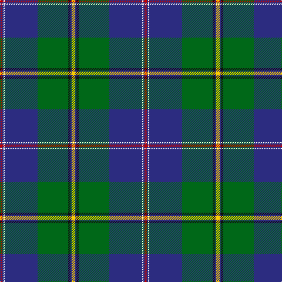

**Bands:** [RBWBGKBY](/stripes/rbwbgkby/) · **Stripes:** [R DB W DB G K DB LY](/stripes/stripes8/) R DB W DB G K DB LY

This was sourced from tartans-authority.  It is a [8 band tartan](/bands/bands8/).

Original link http://www.tartansauthority.com/tartan-ferret/display/11179/

## Thread count
R/4 DB2 W2 DB56 G52 K4 DB2 Y/6

## Palette
Each colour and its ΔE from the base-6 reference it is a variant of.

| Colour | Shade | Base | ΔE (OKLab) |
|---|---|---|---|
| DB | <code style="background-color:#2C2C80;">#2C2C80</code> `#2C2C80` | B <code style="background-color:#2A418A;">#2A418A</code> | 0.06 |
| G | <code style="background-color:#006818;">#006818</code> `#006818` | G <code style="background-color:#006100;">#006100</code> | 0.02 |
| K | <code style="background-color:#101010;">#101010</code> `#101010` | K <code style="background-color:#000000;">#000000</code> | 0.17 |
| R | <code style="background-color:#C80000;">#C80000</code> `#C80000` | R <code style="background-color:#CC0000;">#CC0000</code> | 0.01 |
| W | <code style="background-color:#FCFCFC;">#FCFCFC</code> `#FCFCFC` | W <code style="background-color:#F7F7F7;">#F7F7F7</code> | 0.01 |
| Y | <code style="background-color:#FCCC00;">#FCCC00</code> `#FCCC00` | Y <code style="background-color:#F2BF00;">#F2BF00</code> | 0.04 |

# Sample pattern

## Nearest tartans

The nearest existing variants by ΔTartan distance.

1. [Inkster (Name)](/setts/s8/db31ly4g68w4db31r2k6r2~x2/) — ΔT 0.61
1. [Young](/setts/s8/db3t3g30db25dp4r3ly2dp1~x2/) — ΔT 0.87
1. [German MacLeod](/setts/s8/lb2k1g13k6b27k2r2ly2~x2/) — ΔT 0.91
1. [Mulcahy (Name)](/setts/s9/db33k1db5k8g8r2g15ly1w2~x2/) — ΔT 0.95
1. [1314 (Corporate)](/setts/s11/db10g6o4r2o4k10db6k4db28g55w4/) — ΔT 0.95
1. [Mulcahy](/setts/s11/db66k2db10k15g15r4g15r4g30ly2w4/) — ΔT 1.01
1. [Nova Scotia](/setts/s9/w2db20dg2g2dg2g4dg8ly2r1~x2/) — ΔT 1.03
1. [Canadian Centennial](/setts/s8/r3w6r2g32db36k2db4ly2~x2/) — ΔT 1.06
1. [Sinclair-Brown](/setts/s8/db64k11r2k4r2k4g32y4~x2/) — ΔT 1.12
1. [Blue Blas Alba](/setts/s9/y4ly2y39dt10o4dt4r4dt25w3~x2/) — ΔT 1.14

## Neighbour map

Every grey dot is one of 14313 variants placed by the first two principal components of the ΔTartan feature space (44% of its variance). Red is this tartan; blue dots are its nearest — click one to open its page.

<svg viewBox="0 0 640 380" role="img" style="max-width:100%;height:auto;border:1px solid #e0e0e0;border-radius:4px;display:block" xmlns="http://www.w3.org/2000/svg"><image href="/nn/cloud.v1.png" width="640" height="380"/><a href="/setts/s8/db31ly4g68w4db31r2k6r2~x2/"><circle cx="295.2" cy="114.8" r="4" fill="#3465a4"><title>Inkster (Name)</title></circle></a><a href="/setts/s8/db3t3g30db25dp4r3ly2dp1~x2/"><circle cx="268.8" cy="117.2" r="4" fill="#3465a4"><title>Young</title></circle></a><a href="/setts/s8/lb2k1g13k6b27k2r2ly2~x2/"><circle cx="263.7" cy="112.4" r="4" fill="#3465a4"><title>German MacLeod</title></circle></a><a href="/setts/s9/db33k1db5k8g8r2g15ly1w2~x2/"><circle cx="301.2" cy="113.4" r="4" fill="#3465a4"><title>Mulcahy (Name)</title></circle></a><a href="/setts/s11/db10g6o4r2o4k10db6k4db28g55w4/"><circle cx="253.7" cy="100.0" r="4" fill="#3465a4"><title>1314 (Corporate)</title></circle></a><a href="/setts/s11/db66k2db10k15g15r4g15r4g30ly2w4/"><circle cx="274.2" cy="102.4" r="4" fill="#3465a4"><title>Mulcahy</title></circle></a><a href="/setts/s9/w2db20dg2g2dg2g4dg8ly2r1~x2/"><circle cx="231.7" cy="115.2" r="4" fill="#3465a4"><title>Nova Scotia</title></circle></a><a href="/setts/s8/r3w6r2g32db36k2db4ly2~x2/"><circle cx="243.5" cy="120.5" r="4" fill="#3465a4"><title>Canadian Centennial</title></circle></a><a href="/setts/s8/db64k11r2k4r2k4g32y4~x2/"><circle cx="313.0" cy="115.8" r="4" fill="#3465a4"><title>Sinclair-Brown</title></circle></a><a href="/setts/s9/y4ly2y39dt10o4dt4r4dt25w3~x2/"><circle cx="246.6" cy="114.9" r="4" fill="#3465a4"><title>Blue Blas Alba</title></circle></a><circle cx="293.6" cy="106.9" r="5" fill="#c00000"/></svg>

ID: /setts/s8/ly3db1k2g26db28w1db1r2~x2/
