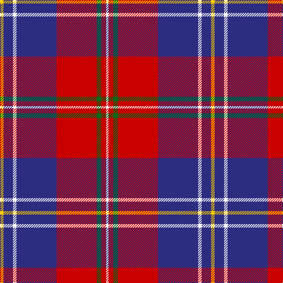

This page is one **sett** — a single exact thread-count. It belongs to the [tartan](/tartans/y3db8w3db34r34g4r4w2/)
(the same proportion at any scale), whose colour order is pattern [WRGRBWBY](/stripes/wrgrbwby/).

Sourced from tartans-authority.  It is a [8 stripe tartan](/stripes/stripes8/).

Original link http://www.tartansauthority.com/tartan-ferret/display/10615/

## Thread count
Y/6 DB16 W6 DB68 R68 G8 R8 W/4

## Palette
Each colour and the base-6 reference it is a variant of.

| Colour | Shade | Base |
|---|---|---|
| DB | <code style="background-color:#2C2C80;">#2C2C80</code> `oklch(35.0% 0.138 276.6)` <small>#2C2C80</small> | B <code style="background-color:#2A418A;">#2A418A</code> |
| G | <code style="background-color:#006818;">#006818</code> `oklch(45.0% 0.142 145.0)` <small>#006818</small> | G <code style="background-color:#006100;">#006100</code> |
| R | <code style="background-color:#C80000;">#C80000</code> `oklch(52.3% 0.215 29.2)` <small>#C80000</small> | R <code style="background-color:#CC0000;">#CC0000</code> |
| W | <code style="background-color:#FCFCFC;">#FCFCFC</code> `oklch(99.1% 0.000 89.9)` <small>#FCFCFC</small> | W <code style="background-color:#F7F7F7;">#F7F7F7</code> |
| Y | <code style="background-color:#FCCC00;">#FCCC00</code> `oklch(86.2% 0.176 91.5)` <small>#FCCC00</small> | Y <code style="background-color:#F2BF00;">#F2BF00</code> |

# Sample pattern

## Nearest tartans

The nearest existing variants by ΔTartan distance, with this tartan at the top so the swatches line up against it.

ΔTartan

Tartan

Sett

—

<a href="/ttd/edit/#slug=ly3db8w3db34r34g4r4w2~x2">Manitoba Masonic (Corporate)</a> <a class="nn-out" href="/setts/s8/ly3db8w3db34r34g4r4w2~x2/" title="open its dictionary page">↗</a>

0.89

<a href="/ttd/edit/#slug=r4db36r35g2r2g8w4~x2">Cherry, John S (Personal)</a> <a class="nn-out" href="/setts/s7/r4db36r35g2r2g8w4~x2/" title="open its dictionary page">↗</a>

0.94

<a href="/ttd/edit/#slug=db24w3db4ly6db4w3db15r52db6">Mercer, James (Personal)</a> <a class="nn-out" href="/setts/s9/db24w3db4ly6db4w3db15r52db6/" title="open its dictionary page">↗</a>

0.95

<a href="/ttd/edit/#slug=db16w2db3ly4db3w2db10r35db4~x2">Mercer Personal Tartan Tartan Number: 3019. Earliest known date: 2004 Sent to House of Tartan by the owner. See products available Copyright © Blair Urquhart, Comrie, 2015</a> <a class="nn-out" href="/setts/s9/db16w2db3ly4db3w2db10r35db4~x2/" title="open its dictionary page">↗</a>

1.16

<a href="/ttd/edit/#slug=db26g11r8k2r2w2r4w1r15~x2">Royal Scottish Assurance (Corporate)</a> <a class="nn-out" href="/setts/s9/db26g11r8k2r2w2r4w1r15~x2/" title="open its dictionary page">↗</a>

1.16

<a href="/ttd/edit/#slug=r25k1ly2k1ly2k1r10b18w2b12~x2">Richardson (Personal?)</a> <a class="nn-out" href="/setts/s10/r25k1ly2k1ly2k1r10b18w2b12~x2/" title="open its dictionary page">↗</a>

1.18

<a href="/ttd/edit/#slug=dt3lo2dt32r28w2r2w2r2w3~x2">Sea Dog Bamse, Pride of Norway</a> <a class="nn-out" href="/setts/s9/dt3lo2dt32r28w2r2w2r2w3~x2/" title="open its dictionary page">↗</a>

1.18

<a href="/ttd/edit/#slug=o4dt36r35g2r2g8w4~x2">Cherry, John S. (Personal)</a> <a class="nn-out" href="/setts/s7/o4dt36r35g2r2g8w4~x2/" title="open its dictionary page">↗</a>

1.18

<a href="/ttd/edit/#slug=dt50r26k9r4w2lo2r10~x2">Java Saint Andrew Society Dress</a> <a class="nn-out" href="/setts/s7/dt50r26k9r4w2lo2r10~x2/" title="open its dictionary page">↗</a>

1.19

<a href="/ttd/edit/#slug=lb12g12k12g24dp75ly4">Widows Sons Scotland Dress</a> <a class="nn-out" href="/setts/s6/lb12g12k12g24dp75ly4/" title="open its dictionary page">↗</a>

1.19

<a href="/ttd/edit/#slug=db5w4r1db26r26w1r8w5k1~x2">Boring and Dull</a> <a class="nn-out" href="/setts/s9/db5w4r1db26r26w1r8w5k1~x2/" title="open its dictionary page">↗</a>

## Neighbour map

Every grey dot is one of 14299 variants placed by the first two principal components of the ΔTartan feature space (44% of its variance). Red is this tartan; blue dots are its nearest — click one to open its page.

<svg viewBox="0 0 640 380" role="img" style="max-width:100%;height:auto;border:1px solid #e0e0e0;border-radius:4px;display:block" xmlns="http://www.w3.org/2000/svg"><image href="/nn/cloud.v1.png" width="640" height="380"/><a href="/setts/s7/r4db36r35g2r2g8w4~x2/"><circle cx="221.1" cy="120.8" r="4" fill="#3465a4"><title>Cherry, John S (Personal)</title></circle></a><a href="/setts/s9/db24w3db4ly6db4w3db15r52db6/"><circle cx="296.7" cy="132.2" r="4" fill="#3465a4"><title>Mercer, James (Personal)</title></circle></a><a href="/setts/s9/db16w2db3ly4db3w2db10r35db4~x2/"><circle cx="301.5" cy="134.6" r="4" fill="#3465a4"><title>Mercer Personal Tartan Tartan Number: 3019. Earliest known date: 2004 Sent to House of Tartan by the owner. See products available Copyright © Blair Urquhart, Comrie, 2015</title></circle></a><a href="/setts/s9/db26g11r8k2r2w2r4w1r15~x2/"><circle cx="243.0" cy="119.7" r="4" fill="#3465a4"><title>Royal Scottish Assurance (Corporate)</title></circle></a><a href="/setts/s10/r25k1ly2k1ly2k1r10b18w2b12~x2/"><circle cx="294.5" cy="109.0" r="4" fill="#3465a4"><title>Richardson (Personal?)</title></circle></a><a href="/setts/s9/dt3lo2dt32r28w2r2w2r2w3~x2/"><circle cx="303.1" cy="128.7" r="4" fill="#3465a4"><title>Sea Dog Bamse, Pride of Norway</title></circle></a><a href="/setts/s7/o4dt36r35g2r2g8w4~x2/"><circle cx="247.0" cy="137.4" r="4" fill="#3465a4"><title>Cherry, John S. (Personal)</title></circle></a><a href="/setts/s7/dt50r26k9r4w2lo2r10~x2/"><circle cx="313.7" cy="134.4" r="4" fill="#3465a4"><title>Java Saint Andrew Society Dress</title></circle></a><a href="/setts/s6/lb12g12k12g24dp75ly4/"><circle cx="298.6" cy="149.7" r="4" fill="#3465a4"><title>Widows Sons Scotland Dress</title></circle></a><a href="/setts/s9/db5w4r1db26r26w1r8w5k1~x2/"><circle cx="289.4" cy="114.1" r="4" fill="#3465a4"><title>Boring and Dull</title></circle></a><circle cx="269.7" cy="125.6" r="5" fill="#c00000"/></svg>

ID: /setts/s8/ly3db8w3db34r34g4r4w2~x2/
