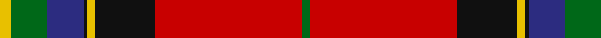
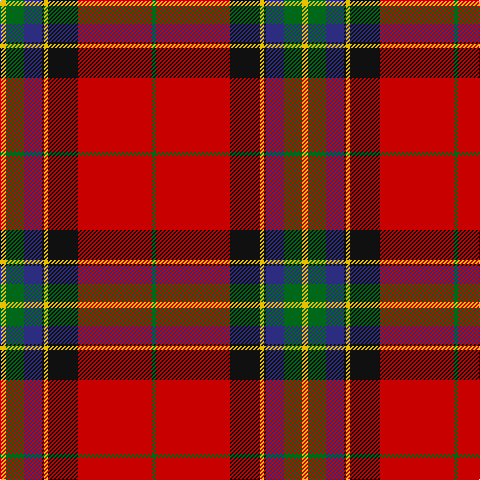

**Bands:** [YGBKYKRG](/stripes/ygbkykrg/) · **Stripes:** [LY G DB K LY K R G](/stripes/stripes8/) LY G DB K LY K R G

This was sourced from register-of-tartans.  It is a [8 band tartan](/bands/bands8/).

Original link https://www.tartanregister.gov.uk/tartanDetails.aspx?ref=2918

## Attestations

This cloth appears in 2 source records; the oldest owns this page.

- 01/01/2003 — Mensah (register-of-tartans, [record](https://www.tartanregister.gov.uk/tartanDetails.aspx?ref=2918))
- 2003 — Mensah (Corporate) (tartans-authority, [record](http://www.tartansauthority.com/tartan-ferret/display/6216/))

## Register references

External register numbers recorded for this tartan.

- Scottish Register of Tartans: [2918](https://www.tartanregister.gov.uk/tartanDetails.aspx?ref=2918)
- Scottish Tartans Authority (ITI): 6216
- Scottish Tartans World Register: 2769

## Thread count
Y/6 G18 DB18 K2 Y4 K30 R74 G/4

## Palette
Each colour and its ΔE from the base-6 reference it is a variant of.

| Colour | Shade | Base | ΔE (OKLab) |
|---|---|---|---|
| DB | <code style="background-color:#2C2C80;">#2C2C80</code> `#2C2C80` | B <code style="background-color:#2A418A;">#2A418A</code> | 0.06 |
| G | <code style="background-color:#006818;">#006818</code> `#006818` | G <code style="background-color:#006100;">#006100</code> | 0.02 |
| K | <code style="background-color:#101010;">#101010</code> `#101010` | K <code style="background-color:#000000;">#000000</code> | 0.17 |
| R | <code style="background-color:#C80000;">#C80000</code> `#C80000` | R <code style="background-color:#CC0000;">#CC0000</code> | 0.01 |
| Y | <code style="background-color:#E8C000;">#E8C000</code> `#E8C000` | Y <code style="background-color:#F2BF00;">#F2BF00</code> | 0.02 |

# Sample pattern

## Nearest tartans

The nearest existing variants by ΔTartan distance.

1. [Clyde Family (Hurleford) (Personal)](/setts/s7/r64k30g30db18w4db2w3/) — ΔT 1.01
1. [MacLeay (Clan)](/setts/s7/r27g4k4g4k4db6lo1~x4/) — ΔT 1.02
1. [Shaw](/setts/s8/lb5k1r30dp15r8dg30r8dp2/) — ΔT 1.03
1. [Clyde (Personal)](/setts/s7/r64k30g30b18w4b2w3/) — ΔT 1.04
1. [Livingstone, MacLay MacLeay](/setts/s7/r28g4k4g4k4t6ly1~x2/) — ΔT 1.05
1. [Rikaco Holiday (Fashion)](/setts/s10/k5db5k2r47k18w2k5dg9db7w3~x2/) — ΔT 1.06
1. [Aberdeen F.C. Corporate Tartan Tartan Number: 2694. Earliest known date: 1997 The Aberdeen Football Club commissioned this design to include the colours of the teams away strip - navy and gold. See products available Copyright © Blair Urquhart, Comrie, 2015](/setts/s8/lo5dt1r2dt4r36dt22w4ly2~x2/) — ΔT 1.07
1. [Livingstone MacLay MacLeay](/setts/s7/r28dg4k4dg4k4t6ly1~x2/) — ΔT 1.09
1. [King (Austria) (Personal)](/setts/s9/w2r2db14g16ly2k2g2r35g1~x2/) — ΔT 1.12
1. [Aberdeen Football Club (1999)](/setts/s8/r5k1r2k4r36k23w4ly2~x2/) — ΔT 1.13

## Neighbour map

Every grey dot is one of 14299 variants placed by the first two principal components of the ΔTartan feature space (44% of its variance). Red is this tartan; blue dots are its nearest — click one to open its page.

<svg viewBox="0 0 640 380" role="img" style="max-width:100%;height:auto;border:1px solid #e0e0e0;border-radius:4px;display:block" xmlns="http://www.w3.org/2000/svg"><image href="/nn/cloud.v1.png" width="640" height="380"/><a href="/setts/s7/r64k30g30db18w4db2w3/"><circle cx="230.8" cy="117.4" r="4" fill="#3465a4"><title>Clyde Family (Hurleford) (Personal)</title></circle></a><a href="/setts/s7/r27g4k4g4k4db6lo1~x4/"><circle cx="325.9" cy="120.6" r="4" fill="#3465a4"><title>MacLeay (Clan)</title></circle></a><a href="/setts/s8/lb5k1r30dp15r8dg30r8dp2/"><circle cx="275.5" cy="129.9" r="4" fill="#3465a4"><title>Shaw</title></circle></a><a href="/setts/s7/r64k30g30b18w4b2w3/"><circle cx="230.0" cy="119.5" r="4" fill="#3465a4"><title>Clyde (Personal)</title></circle></a><a href="/setts/s7/r28g4k4g4k4t6ly1~x2/"><circle cx="310.0" cy="107.1" r="4" fill="#3465a4"><title>Livingstone, MacLay MacLeay</title></circle></a><a href="/setts/s10/k5db5k2r47k18w2k5dg9db7w3~x2/"><circle cx="264.1" cy="99.6" r="4" fill="#3465a4"><title>Rikaco Holiday (Fashion)</title></circle></a><a href="/setts/s8/lo5dt1r2dt4r36dt22w4ly2~x2/"><circle cx="328.4" cy="94.5" r="4" fill="#3465a4"><title>Aberdeen F.C. Corporate Tartan Tartan Number: 2694. Earliest known date: 1997 The Aberdeen Football Club commissioned this design to include the colours of the teams away strip - navy and gold. See products available Copyright © Blair Urquhart, Comrie, 2015</title></circle></a><a href="/setts/s7/r28dg4k4dg4k4t6ly1~x2/"><circle cx="325.1" cy="110.2" r="4" fill="#3465a4"><title>Livingstone MacLay MacLeay</title></circle></a><a href="/setts/s9/w2r2db14g16ly2k2g2r35g1~x2/"><circle cx="289.5" cy="76.8" r="4" fill="#3465a4"><title>King (Austria) (Personal)</title></circle></a><a href="/setts/s8/r5k1r2k4r36k23w4ly2~x2/"><circle cx="316.6" cy="87.8" r="4" fill="#3465a4"><title>Aberdeen Football Club (1999)</title></circle></a><circle cx="280.4" cy="97.3" r="5" fill="#c00000"/></svg>

ID: /setts/s8/ly3g9db9k1ly2k15r37g2~x2/
