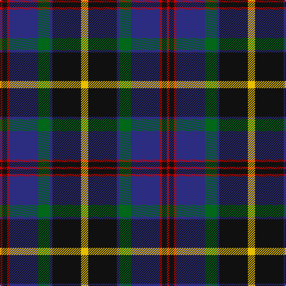

**Bands:** [RKRBGBKY](/stripes/rkrbgbky/) · **Stripes:** [R K R DB G DB K LY](/stripes/stripes8/) R K R DB G DB K LY

This was sourced from register-of-tartans.  It is a [8 band tartan](/bands/bands8/).

Original link https://www.tartanregister.gov.uk/tartanDetails.aspx?ref=3650

## Attestations

This cloth appears in 2 source records; the oldest owns this page.

- 01/07/2006 — Sandberg of Greenock (Personal) (register-of-tartans, [record](https://www.tartanregister.gov.uk/tartanDetails.aspx?ref=3650))
- 2006 July — Sandberg of Greenock (Personal) (tartans-authority, [record](http://www.tartansauthority.com/tartan-ferret/display/6974/))

## Register references

External register numbers recorded for this tartan.

- Scottish Register of Tartans: [3650](https://www.tartanregister.gov.uk/tartanDetails.aspx?ref=3650)
- Scottish Tartans Authority (ITI): 6974

## Thread count
R/4 K8 R4 DB48 G20 DB4 K48 Y/12

## Palette
Each colour and its ΔE from the base-6 reference it is a variant of.

| Colour | Shade | Base | ΔE (OKLab) |
|---|---|---|---|
| DB | <code style="background-color:#2C2C80;">#2C2C80</code> `#2C2C80` | B <code style="background-color:#2A418A;">#2A418A</code> | 0.06 |
| G | <code style="background-color:#006818;">#006818</code> `#006818` | G <code style="background-color:#006100;">#006100</code> | 0.02 |
| K | <code style="background-color:#101010;">#101010</code> `#101010` | K <code style="background-color:#000000;">#000000</code> | 0.17 |
| R | <code style="background-color:#C80000;">#C80000</code> `#C80000` | R <code style="background-color:#CC0000;">#CC0000</code> | 0.01 |
| Y | <code style="background-color:#E8C000;">#E8C000</code> `#E8C000` | Y <code style="background-color:#F2BF00;">#F2BF00</code> | 0.02 |

# Sample pattern

## Nearest tartans

The nearest existing variants by ΔTartan distance.

1. [Scotch House 2000, antique](/setts/s8/db22r3db2r3db2k17o18dg4~x2/) — ΔT 0.57
1. [MacRae Hunting #2](/setts/s9/g14k2g4r2g4k14dp15k1w3~x2/) — ΔT 0.60
1. [Genet, Citizen (Commem)](/setts/s7/r2k9g12db8r1db1w1~x4/) — ΔT 0.67
1. [Watson (Name)](/setts/s10/db24k2db2r2db2k20g16ly2g2ly3~x2/) — ΔT 0.77
1. [MacLeod Small Clan Tartan Tartan Number: 15833. Earliest known date: See products available Copyright © Blair Urquhart, Comrie, 2015](/setts/s7/ly1k1db10k5g7k1r1~x2/) — ΔT 0.78
1. [McWilliams Wedding (Personal)](/setts/s9/g2db1k1db14k2db1k12g10r2~x2/) — ΔT 0.80
1. [Colquhoun (Clan)](/setts/s7/db5k10db48k72w12dg48r5/) — ΔT 0.80
1. [Curry (Personal)](/setts/s8/r3g2r6g20k15g3db18w2~x2/) — ΔT 0.81
1. [Ofally, County](/setts/s10/r6db2g5db18g10db2k28db2g10lo3~x2/) — ΔT 0.86
1. [MacDonald of Borrodale (Clan)](/setts/s8/r6db3r3db32k30g30ly3r3~x2/) — ΔT 0.87

## Neighbour map

Every grey dot is one of 14313 variants placed by the first two principal components of the ΔTartan feature space (44% of its variance). Red is this tartan; blue dots are its nearest — click one to open its page.

<svg viewBox="0 0 640 380" role="img" style="max-width:100%;height:auto;border:1px solid #e0e0e0;border-radius:4px;display:block" xmlns="http://www.w3.org/2000/svg"><image href="/nn/cloud.v1.png" width="640" height="380"/><a href="/setts/s8/db22r3db2r3db2k17o18dg4~x2/"><circle cx="167.7" cy="174.0" r="4" fill="#3465a4"><title>Scotch House 2000, antique</title></circle></a><a href="/setts/s9/g14k2g4r2g4k14dp15k1w3~x2/"><circle cx="183.7" cy="165.5" r="4" fill="#3465a4"><title>MacRae Hunting #2</title></circle></a><a href="/setts/s7/r2k9g12db8r1db1w1~x4/"><circle cx="170.8" cy="183.1" r="4" fill="#3465a4"><title>Genet, Citizen (Commem)</title></circle></a><a href="/setts/s10/db24k2db2r2db2k20g16ly2g2ly3~x2/"><circle cx="193.8" cy="154.1" r="4" fill="#3465a4"><title>Watson (Name)</title></circle></a><a href="/setts/s7/ly1k1db10k5g7k1r1~x2/"><circle cx="196.2" cy="194.4" r="4" fill="#3465a4"><title>MacLeod Small Clan Tartan Tartan Number: 15833. Earliest known date: See products available Copyright © Blair Urquhart, Comrie, 2015</title></circle></a><a href="/setts/s9/g2db1k1db14k2db1k12g10r2~x2/"><circle cx="197.3" cy="165.8" r="4" fill="#3465a4"><title>McWilliams Wedding (Personal)</title></circle></a><a href="/setts/s7/db5k10db48k72w12dg48r5/"><circle cx="207.5" cy="181.8" r="4" fill="#3465a4"><title>Colquhoun (Clan)</title></circle></a><a href="/setts/s8/r3g2r6g20k15g3db18w2~x2/"><circle cx="163.5" cy="187.8" r="4" fill="#3465a4"><title>Curry (Personal)</title></circle></a><a href="/setts/s10/r6db2g5db18g10db2k28db2g10lo3~x2/"><circle cx="171.7" cy="163.8" r="4" fill="#3465a4"><title>Ofally, County</title></circle></a><a href="/setts/s8/r6db3r3db32k30g30ly3r3~x2/"><circle cx="138.3" cy="167.3" r="4" fill="#3465a4"><title>MacDonald of Borrodale (Clan)</title></circle></a><circle cx="188.1" cy="169.7" r="5" fill="#c00000"/></svg>

ID: /setts/s8/ly3k12db1g5db12r1k2r1~x4/
