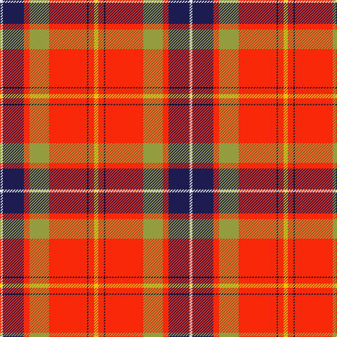

**Bands:** [WBRYRKRY](/stripes/wbryrkry/) · **Stripes:** [W DB R LY R K R LY](/stripes/stripes8/) W DB R LY R K R LY

This was sourced from tartans-authority.  It is a [8 band tartan](/bands/bands8/).

Original link http://www.tartansauthority.com/tartan-ferret/display/7723/

## Attestations

This cloth appears in 2 source records; the oldest owns this page.

- pre 2008 — Dalmagarry (Corporate) (tartans-authority, [record](http://www.tartansauthority.com/tartan-ferret/display/7723/))
- undated — Dalmagarry (Personal) (register-of-tartans, [record](https://www.tartanregister.gov.uk/tartanDetails.aspx?ref=5709))

## Register references

External register numbers recorded for this tartan.

- Scottish Register of Tartans: [5709](https://www.tartanregister.gov.uk/tartanDetails.aspx?ref=5709)
- Scottish Tartans Authority (ITI): 7723

## Thread count
LN/4 DB30 R8 LT28 R54 K2 R8 Y/6

## Palette
Each colour and its ΔE from the base-6 reference it is a variant of.

| Colour | Shade | Base | ΔE (OKLab) |
|---|---|---|---|
| DB | <code style="background-color:#1C1C50;">#1C1C50</code> `#1C1C50` | B <code style="background-color:#2A418A;">#2A418A</code> | 0.14 |
| K | <code style="background-color:#101010;">#101010</code> `#101010` | K <code style="background-color:#000000;">#000000</code> | 0.17 |
| LN | <code style="background-color:#E0E0E0;">#E0E0E0</code> `#E0E0E0` | W <code style="background-color:#F7F7F7;">#F7F7F7</code> | 0.07 |
| LT | <code style="background-color:#949C40;">#949C40</code> `#949C40` | Y <code style="background-color:#F2BF00;">#F2BF00</code> | 0.18 |
| R | <code style="background-color:#F82808;">#F82808</code> `#F82808` | R <code style="background-color:#CC0000;">#CC0000</code> | 0.10 |
| Y | <code style="background-color:#E8C000;">#E8C000</code> `#E8C000` | Y <code style="background-color:#F2BF00;">#F2BF00</code> | 0.02 |

# Sample pattern

## Nearest tartans

The nearest existing variants by ΔTartan distance.

1. [Unidentified Travelling costume](/setts/s9/r8ly1dg20r29k2r29w20r2db7~x2/) — ΔT 0.97
1. [Unidentified, Travelling costume](/setts/s9/r8ly1g20r29k2r29w20r2db7~x2/) — ΔT 1.01
1. [MacQueen of Dalmagarry (Clan?)](/setts/s8/g3r4k1r26y14r4dp16w2~x2/) — ΔT 1.20
1. [Hogeboom (Personal)](/setts/s9/t4g3t9dt14ly8dt2r35r2r3~x2/) — ΔT 1.25
1. [Perthshire, or Drummond](/setts/s9/r41w2p5ly2g21r9p5db3w2~x2/) — ΔT 1.25
1. [Round Table Sweden](/setts/s8/ly3dt6r30w2dt6g4lo15r3~x2/) — ΔT 1.27
1. [Kings Mountain 1780](/setts/s9/ly9k1n4k1r30k1t4g9ly3~x2/) — ΔT 1.28
1. [Tartan Army Whisky](/setts/s8/r26g5dg7r2do9lo1lo1dg4~x2/) — ΔT 1.32
1. [Drummond Relic](/setts/s12/r26w1k8ly1dg13k1w4k1ly2k4t3r8~x4/) — ΔT 1.33
1. [Virginia Military Institute, New Market](/setts/s9/ly6r30y2k3y30g3y2r25w6~x2/) — ΔT 1.33

## Neighbour map

Every grey dot is one of 14313 variants placed by the first two principal components of the ΔTartan feature space (44% of its variance). Red is this tartan; blue dots are its nearest — click one to open its page.

<svg viewBox="0 0 640 380" role="img" style="max-width:100%;height:auto;border:1px solid #e0e0e0;border-radius:4px;display:block" xmlns="http://www.w3.org/2000/svg"><image href="/nn/cloud.v1.png" width="640" height="380"/><a href="/setts/s9/r8ly1dg20r29k2r29w20r2db7~x2/"><circle cx="290.9" cy="98.2" r="4" fill="#3465a4"><title>Unidentified Travelling costume</title></circle></a><a href="/setts/s9/r8ly1g20r29k2r29w20r2db7~x2/"><circle cx="289.0" cy="101.2" r="4" fill="#3465a4"><title>Unidentified, Travelling costume</title></circle></a><a href="/setts/s8/g3r4k1r26y14r4dp16w2~x2/"><circle cx="272.3" cy="112.7" r="4" fill="#3465a4"><title>MacQueen of Dalmagarry (Clan?)</title></circle></a><a href="/setts/s9/t4g3t9dt14ly8dt2r35r2r3~x2/"><circle cx="236.9" cy="103.9" r="4" fill="#3465a4"><title>Hogeboom (Personal)</title></circle></a><a href="/setts/s9/r41w2p5ly2g21r9p5db3w2~x2/"><circle cx="309.5" cy="94.9" r="4" fill="#3465a4"><title>Perthshire, or Drummond</title></circle></a><a href="/setts/s8/ly3dt6r30w2dt6g4lo15r3~x2/"><circle cx="230.5" cy="120.1" r="4" fill="#3465a4"><title>Round Table Sweden</title></circle></a><a href="/setts/s9/ly9k1n4k1r30k1t4g9ly3~x2/"><circle cx="248.9" cy="59.2" r="4" fill="#3465a4"><title>Kings Mountain 1780</title></circle></a><a href="/setts/s8/r26g5dg7r2do9lo1lo1dg4~x2/"><circle cx="237.5" cy="76.6" r="4" fill="#3465a4"><title>Tartan Army Whisky</title></circle></a><a href="/setts/s12/r26w1k8ly1dg13k1w4k1ly2k4t3r8~x4/"><circle cx="230.0" cy="67.5" r="4" fill="#3465a4"><title>Drummond Relic</title></circle></a><a href="/setts/s9/ly6r30y2k3y30g3y2r25w6~x2/"><circle cx="274.6" cy="122.7" r="4" fill="#3465a4"><title>Virginia Military Institute, New Market</title></circle></a><circle cx="255.4" cy="92.4" r="5" fill="#c00000"/></svg>

ID: /setts/s8/ly3r4k1r27ly14r4db15w2~x2/
