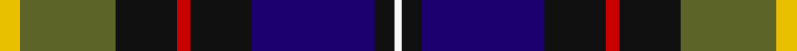

In pattern [WKBKRKGY](/stripes/wkbkrkgy/).

This was sourced from register-of-tartans.  It is a [8 stripe tartan](/stripes/stripes8/).

Original link https://www.tartanregister.gov.uk/tartanDetails.aspx?ref=150

## Attestations

This cloth appears in 2 source records; the oldest owns this page.

- 01/11/2004 — Ayre (Personal) (register-of-tartans, [record](https://www.tartanregister.gov.uk/tartanDetails.aspx?ref=150))
- 2004 Nov — Ayre (Personal) (tartans-authority, [record](http://www.tartansauthority.com/tartan-ferret/display/6305/))

## Register references

External register numbers recorded for this tartan.

- Scottish Register of Tartans: [150](https://www.tartanregister.gov.uk/tartanDetails.aspx?ref=150)
- Scottish Tartans Authority (ITI): 6305

## Thread count
Y/6 G28 K18 R4 K18 DB36 K6 W/2

## Palette
Each colour and the base-6 reference it is a variant of.

| Colour | Shade | Base |
|---|---|---|
| DB | <code style="background-color:#1C0070;">#1C0070</code> `oklch(26.3% 0.162 277.1)` <small>#1C0070</small> | B <code style="background-color:#2A418A;">#2A418A</code> |
| G | <code style="background-color:#5C6428;">#5C6428</code> `oklch(48.3% 0.084 116.0)` <small>#5C6428</small> | G <code style="background-color:#006100;">#006100</code> |
| K | <code style="background-color:#101010;">#101010</code> `oklch(17.3% 0.000 89.9)` <small>#101010</small> | K <code style="background-color:#000000;">#000000</code> |
| R | <code style="background-color:#C80000;">#C80000</code> `oklch(52.3% 0.215 29.2)` <small>#C80000</small> | R <code style="background-color:#CC0000;">#CC0000</code> |
| W | <code style="background-color:#F8F8F8;">#F8F8F8</code> `oklch(97.9% 0.000 89.9)` <small>#F8F8F8</small> | W <code style="background-color:#F7F7F7;">#F7F7F7</code> |
| Y | <code style="background-color:#E8C000;">#E8C000</code> `oklch(81.9% 0.168 93.7)` <small>#E8C000</small> | Y <code style="background-color:#F2BF00;">#F2BF00</code> |

# Sample pattern

## Nearest tartans

The nearest existing variants by ΔTartan distance.

1. [Leung (Personal)](/setts/s9/m4k7m2db25k19w2g13k2ly3~x2/) — ΔT 0.87
1. [Sey (Name)](/setts/s8/r2k8ly1k8g13db13lo1r2~x2/) — ΔT 0.88
1. [MacNeil - 1840 (Chief's sett)](/setts/s7/w2r3db33k33g33k6ly2~x2/) — ΔT 0.96
1. [Froben, Christian (Personal)](/setts/s8/k2w2k8lo8db24dg13k3m1~x2/) — ΔT 0.99
1. [Ferguson - 1830 of Atholl (Clan)](/setts/s7/db18k10g6r4g6k1w2~x2/) — ΔT 0.99
1. [MacRae Hunting #2](/setts/s9/g14k2g4r2g4k14dp15k1w3~x2/) — ΔT 1.04
1. [Harvey of Cornwall (Personal)](/setts/s7/w10k52db52dg24ly10dg5r5/) — ΔT 1.06
1. [Loch Awe](/setts/s9/ly3k2r3db20k24g20r3k2lb3~x2/) — ΔT 1.13
1. [Souza Nery (Personal)](/setts/s7/ly4g22r3k17r3db37w3~x2/) — ΔT 1.14
1. [St Columba](/setts/s8/db60t5w4o12g42p12t5p12/) — ΔT 1.17

## Neighbour map

Every grey dot is one of 14299 variants placed by the first two principal components of the ΔTartan feature space (44% of its variance). Red is this tartan; blue dots are its nearest — click one to open its page.

<svg viewBox="0 0 640 380" role="img" style="max-width:100%;height:auto;border:1px solid #e0e0e0;border-radius:4px;display:block" xmlns="http://www.w3.org/2000/svg"><image href="/nn/cloud.v1.png" width="640" height="380"/><a href="/setts/s9/m4k7m2db25k19w2g13k2ly3~x2/"><circle cx="152.4" cy="147.8" r="4" fill="#3465a4"><title>Leung (Personal)</title></circle></a><a href="/setts/s8/r2k8ly1k8g13db13lo1r2~x2/"><circle cx="148.0" cy="169.1" r="4" fill="#3465a4"><title>Sey (Name)</title></circle></a><a href="/setts/s7/w2r3db33k33g33k6ly2~x2/"><circle cx="182.4" cy="160.5" r="4" fill="#3465a4"><title>MacNeil - 1840 (Chief's sett)</title></circle></a><a href="/setts/s8/k2w2k8lo8db24dg13k3m1~x2/"><circle cx="187.9" cy="130.5" r="4" fill="#3465a4"><title>Froben, Christian (Personal)</title></circle></a><a href="/setts/s7/db18k10g6r4g6k1w2~x2/"><circle cx="189.6" cy="175.7" r="4" fill="#3465a4"><title>Ferguson - 1830 of Atholl (Clan)</title></circle></a><a href="/setts/s9/g14k2g4r2g4k14dp15k1w3~x2/"><circle cx="183.8" cy="165.5" r="4" fill="#3465a4"><title>MacRae Hunting #2</title></circle></a><a href="/setts/s7/w10k52db52dg24ly10dg5r5/"><circle cx="123.6" cy="167.4" r="4" fill="#3465a4"><title>Harvey of Cornwall (Personal)</title></circle></a><a href="/setts/s9/ly3k2r3db20k24g20r3k2lb3~x2/"><circle cx="145.2" cy="144.4" r="4" fill="#3465a4"><title>Loch Awe</title></circle></a><a href="/setts/s7/ly4g22r3k17r3db37w3~x2/"><circle cx="176.3" cy="155.4" r="4" fill="#3465a4"><title>Souza Nery (Personal)</title></circle></a><a href="/setts/s8/db60t5w4o12g42p12t5p12/"><circle cx="166.6" cy="137.6" r="4" fill="#3465a4"><title>St Columba</title></circle></a><circle cx="159.5" cy="153.5" r="5" fill="#c00000"/></svg>

ID: /setts/s8/ly3y14k9r2k9db18k3w1~x2/
