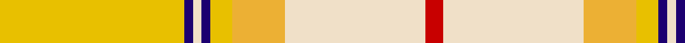
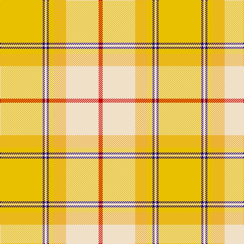

**Bands:** [RWYYBWBY](/stripes/rwyybwby/) · **Stripes:** [R W LY LY DB W DB LY](/stripes/stripes8/) R W LY LY DB W DB LY

This was sourced from tartans-authority.  It is a [8 band tartan](/bands/bands8/).

Original link http://www.tartansauthority.com/tartan-ferret/display/7606/

## Also known as

This cloth is also recorded under:

- Comrie, Gold

## Attestations

This cloth appears in 3 source records; the oldest owns this page.

- March 2008 — Comrie, Gold (Dance) (tartans-authority, [record](http://www.tartansauthority.com/tartan-ferret/display/7606/))
- undated — Comrie Gold (register-of-tartans, [record](https://www.tartanregister.gov.uk/tartanDetails.aspx?ref=5630))
- undated — Comrie Gold Fashion Tartan Tartan Number: 7606. Earliest known date: March 2008 One of a series of dancer's tartans for the House of Edgar's in-house collection designed by Kirsty Anderson. See products available Copyright © Blair Urquhart, Comrie, 2015 (house-of-tartan, [record](http://www.house-of-tartan.scotland.net/house/TartanViewjs.asp?colr=Def&tnam=7606))

## Register references

External register numbers recorded for this tartan.

- Scottish Register of Tartans: [5630](https://www.tartanregister.gov.uk/tartanDetails.aspx?ref=5630)
- Scottish Tartans Authority (ITI): 7606

## Thread count
Y/84 DB4 W4 DB4 Y10 Ya24 W64 R/8

## Palette
Each colour and its ΔE from the base-6 reference it is a variant of.

| Colour | Shade | Base | ΔE (OKLab) |
|---|---|---|---|
| DB | <code style="background-color:#1C0070;">#1C0070</code> `#1C0070` | B <code style="background-color:#2A418A;">#2A418A</code> | 0.14 |
| R | <code style="background-color:#C80000;">#C80000</code> `#C80000` | R <code style="background-color:#CC0000;">#CC0000</code> | 0.01 |
| W | <code style="background-color:#F0E0C8;">#F0E0C8</code> `#F0E0C8` | W <code style="background-color:#F7F7F7;">#F7F7F7</code> | 0.07 |
| Y | <code style="background-color:#E8C000;">#E8C000</code> `#E8C000` | Y <code style="background-color:#F2BF00;">#F2BF00</code> | 0.02 |
| Ya | <code style="background-color:#ECB034;">#ECB034</code> `#ECB034` | Y <code style="background-color:#F2BF00;">#F2BF00</code> | 0.05 |

# Sample pattern

## Nearest tartans

The nearest existing variants by ΔTartan distance.

1. [Glen Talloch](/setts/s11/lo32r2ly3k3r2lo3ly3lo3ly3lo3ly32~x2/) — ΔT 1.45
1. [de Meuron Dress (Family)](/setts/s7/lb40dp5lb6ly26o13lb9dy3~x2/) — ΔT 1.79
1. [Wcwm 969-2](/setts/s12/lb12lo1dy1lo1lo22lo1dy6lo4dy3lo2lo12lo2~x4/) — ΔT 1.88
1. [Llama (Fashion)](/setts/s10/y2w19lr2w2y3w3y3lr6ly25w2~x2/) — ΔT 1.90
1. [Shenzhen (Sports)](/setts/s11/k3o29lo2o2lo4o2lo20ly1lo2ly10w3~x2/) — ΔT 2.09
1. [Rutlin (Personal)](/setts/s9/y6db2y1w17y1db2y16lo27dg2~x2/) — ΔT 2.18
1. [Sakura (Japanese Four Seasons)](/setts/s14/lp6w2lp25dy2w9lg2lg4lg2w9lg2lg15dy2lg2dy4~x2/) — ΔT 2.33
1. [Gift of Life Michigan](/setts/s7/r2lt1r1lt11lg16g1w1~x2/) — ΔT 2.34
1. [Delta Dental Association (Corporate)](/setts/s13/g4o1lo29o6w13o13w6o13w13o6lo29o1t4~x2/) — ΔT 2.35
1. [Connacht (District) (Smith)](/setts/s11/lo15g6lo1r1lo1g6lo15y2lo1y6w1~x4/) — ΔT 2.38

## Neighbour map

Every grey dot is one of 14299 variants placed by the first two principal components of the ΔTartan feature space (44% of its variance). Red is this tartan; blue dots are its nearest — click one to open its page.

<svg viewBox="0 0 640 380" role="img" style="max-width:100%;height:auto;border:1px solid #e0e0e0;border-radius:4px;display:block" xmlns="http://www.w3.org/2000/svg"><image href="/nn/cloud.v1.png" width="640" height="380"/><a href="/setts/s11/lo32r2ly3k3r2lo3ly3lo3ly3lo3ly32~x2/"><circle cx="285.4" cy="103.2" r="4" fill="#3465a4"><title>Glen Talloch</title></circle></a><a href="/setts/s7/lb40dp5lb6ly26o13lb9dy3~x2/"><circle cx="286.5" cy="166.4" r="4" fill="#3465a4"><title>de Meuron Dress (Family)</title></circle></a><a href="/setts/s12/lb12lo1dy1lo1lo22lo1dy6lo4dy3lo2lo12lo2~x4/"><circle cx="323.1" cy="146.5" r="4" fill="#3465a4"><title>Wcwm 969-2</title></circle></a><a href="/setts/s10/y2w19lr2w2y3w3y3lr6ly25w2~x2/"><circle cx="265.8" cy="155.7" r="4" fill="#3465a4"><title>Llama (Fashion)</title></circle></a><a href="/setts/s11/k3o29lo2o2lo4o2lo20ly1lo2ly10w3~x2/"><circle cx="303.1" cy="101.7" r="4" fill="#3465a4"><title>Shenzhen (Sports)</title></circle></a><a href="/setts/s9/y6db2y1w17y1db2y16lo27dg2~x2/"><circle cx="252.3" cy="128.0" r="4" fill="#3465a4"><title>Rutlin (Personal)</title></circle></a><a href="/setts/s14/lp6w2lp25dy2w9lg2lg4lg2w9lg2lg15dy2lg2dy4~x2/"><circle cx="194.4" cy="136.1" r="4" fill="#3465a4"><title>Sakura (Japanese Four Seasons)</title></circle></a><a href="/setts/s7/r2lt1r1lt11lg16g1w1~x2/"><circle cx="307.6" cy="154.4" r="4" fill="#3465a4"><title>Gift of Life Michigan</title></circle></a><a href="/setts/s13/g4o1lo29o6w13o13w6o13w13o6lo29o1t4~x2/"><circle cx="252.3" cy="128.2" r="4" fill="#3465a4"><title>Delta Dental Association (Corporate)</title></circle></a><a href="/setts/s11/lo15g6lo1r1lo1g6lo15y2lo1y6w1~x4/"><circle cx="362.6" cy="156.3" r="4" fill="#3465a4"><title>Connacht (District) (Smith)</title></circle></a><circle cx="300.3" cy="130.2" r="5" fill="#c00000"/></svg>

ID: /setts/s8/ly42db2w2db2ly5ly12w32r4~x2/
