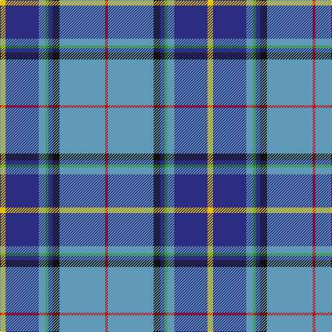

In pattern [RBKBGBBY](/stripes/rbkbgbby/).

This was sourced from register-of-tartans.  It is a [8 stripe tartan](/stripes/stripes8/).

Original link https://www.tartanregister.gov.uk/tartanDetails.aspx?ref=2223

## Register references

External register numbers recorded for this tartan.

- Scottish Register of Tartans: [2223](https://www.tartanregister.gov.uk/tartanDetails.aspx?ref=2223)
- Scottish Tartans Authority (ITI): 6071

## Thread count
Y/8 DB48 B10 G4 DB6 K10 B66 R/4

## Palette
Each colour and the base-6 reference it is a variant of.

| Colour | Shade | Base |
|---|---|---|
| B | <code style="background-color:#6098B8;">#6098B8</code> `oklch(65.3% 0.076 234.7)` <small>#6098B8</small> | B <code style="background-color:#2A418A;">#2A418A</code> |
| DB | <code style="background-color:#2C2C80;">#2C2C80</code> `oklch(35.0% 0.138 276.6)` <small>#2C2C80</small> | B <code style="background-color:#2A418A;">#2A418A</code> |
| G | <code style="background-color:#289C18;">#289C18</code> `oklch(60.6% 0.191 141.6)` <small>#289C18</small> | G <code style="background-color:#006100;">#006100</code> |
| K | <code style="background-color:#101010;">#101010</code> `oklch(17.3% 0.000 89.9)` <small>#101010</small> | K <code style="background-color:#000000;">#000000</code> |
| R | <code style="background-color:#C80000;">#C80000</code> `oklch(52.3% 0.215 29.2)` <small>#C80000</small> | R <code style="background-color:#CC0000;">#CC0000</code> |
| Y | <code style="background-color:#E8C000;">#E8C000</code> `oklch(81.9% 0.168 93.7)` <small>#E8C000</small> | Y <code style="background-color:#F2BF00;">#F2BF00</code> |

# Sample pattern

## Nearest tartans

The nearest existing variants by ΔTartan distance.

1. [Heirloom Blue Alba (Fashion)](/setts/s9/t4lo2t34db10lr4db4dp4db23w3~x2/) — ΔT 0.70
1. [Peterson, Oren (Name)](/setts/s6/w1db15r1o10g2lp1~x4/) — ΔT 0.88
1. [Queensferry High (School)](/setts/s9/lr5lb3lb7lr5lb27b8dt43w3lb3/) — ΔT 0.96
1. [Blue Ridge Highlands Heritage](/setts/s8/t27db9lb3g6db33lb3dr3ly2~x2/) — ΔT 0.98
1. [McCartney (Night)](/setts/s11/db4g2db24g8b2r2b2ly2b10db2w3~x2/) — ΔT 0.99
1. [Shearer (2016)](/setts/s6/k4n4dt32r4t17w2~x2/) — ΔT 1.00
1. [O'Donohue Personal)](/setts/s10/b24w2b6g9r6b3r6g35k2ly2~x2/) — ΔT 1.01
1. [McCartney (Evening/Night)](/setts/s11/db4g2db24g8t2r2t2ly2t10db2w3~x2/) — ΔT 1.01
1. [Kruenaegel and Schropp](/setts/s8/b20m1w3dt1w2dt8g3w1~x4/) — ΔT 1.07
1. [Scotia](/setts/s9/w4db58g28o4w18db14r3db8ly4/) — ΔT 1.07

## Neighbour map

Every grey dot is one of 14299 variants placed by the first two principal components of the ΔTartan feature space (44% of its variance). Red is this tartan; blue dots are its nearest — click one to open its page.

<svg viewBox="0 0 640 380" role="img" style="max-width:100%;height:auto;border:1px solid #e0e0e0;border-radius:4px;display:block" xmlns="http://www.w3.org/2000/svg"><image href="/nn/cloud.v1.png" width="640" height="380"/><a href="/setts/s9/t4lo2t34db10lr4db4dp4db23w3~x2/"><circle cx="238.0" cy="130.4" r="4" fill="#3465a4"><title>Heirloom Blue Alba (Fashion)</title></circle></a><a href="/setts/s6/w1db15r1o10g2lp1~x4/"><circle cx="270.1" cy="149.8" r="4" fill="#3465a4"><title>Peterson, Oren (Name)</title></circle></a><a href="/setts/s9/lr5lb3lb7lr5lb27b8dt43w3lb3/"><circle cx="196.9" cy="122.1" r="4" fill="#3465a4"><title>Queensferry High (School)</title></circle></a><a href="/setts/s8/t27db9lb3g6db33lb3dr3ly2~x2/"><circle cx="263.6" cy="146.0" r="4" fill="#3465a4"><title>Blue Ridge Highlands Heritage</title></circle></a><a href="/setts/s11/db4g2db24g8b2r2b2ly2b10db2w3~x2/"><circle cx="231.3" cy="128.8" r="4" fill="#3465a4"><title>McCartney (Night)</title></circle></a><a href="/setts/s6/k4n4dt32r4t17w2~x2/"><circle cx="249.5" cy="150.3" r="4" fill="#3465a4"><title>Shearer (2016)</title></circle></a><a href="/setts/s10/b24w2b6g9r6b3r6g35k2ly2~x2/"><circle cx="241.6" cy="122.9" r="4" fill="#3465a4"><title>O'Donohue Personal)</title></circle></a><a href="/setts/s11/db4g2db24g8t2r2t2ly2t10db2w3~x2/"><circle cx="226.5" cy="130.5" r="4" fill="#3465a4"><title>McCartney (Evening/Night)</title></circle></a><a href="/setts/s8/b20m1w3dt1w2dt8g3w1~x4/"><circle cx="282.4" cy="132.5" r="4" fill="#3465a4"><title>Kruenaegel and Schropp</title></circle></a><a href="/setts/s9/w4db58g28o4w18db14r3db8ly4/"><circle cx="274.1" cy="116.9" r="4" fill="#3465a4"><title>Scotia</title></circle></a><circle cx="251.2" cy="128.4" r="5" fill="#c00000"/></svg>

ID: /setts/s8/ly4db24t5g2db3k5t33r2~x2/
